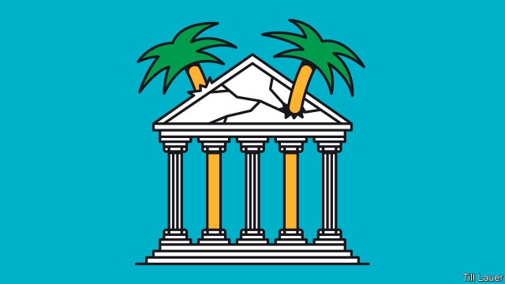

###### Banyan

# Why politics in the south Pacific are so precarious 

 

> print-edition iconPrint edition | Asia | Nov 9th 2019 

THIS WEEK the president of the Micronesian state of Kiribati, Taneti Maamau, lost his governing majority when 13 of his MPs crossed the floor. The defectors claim they are unhappy that in September the atoll nation of 110,000 souls, spread over 3.5m km² of the south Pacific, severed diplomatic ties with Taiwan and initiated them with China instead. Something similar may be about to happen in the more populous Solomon Islands. Its government has also just switched allegiance to China. The opposition reckons that it will soon be able to peel off eight government MPs to win a vote of no-confidence over the decision. If so, it would be the fourth time Manasseh Sogavare has been unseated as prime minister. His latest stint in the job began only in April. 

Why such instability? Don’t overplay the China factor. Mr Maamau complains the defectors never even raised their grievances with him. In the Solomon Islands, China hardly featured in the election campaign earlier this year. That, of course, is one of the reasons pro-Taiwan MPs are crying foul. But relations with China have not destabilised two governments in the region because they are a burning issue. It just does not take much to destabilise Pacific governments. 

In the Solomon Islands, only a single government has survived a full term, and that was under the auspices of RAMSI, an Australian-led international policing mission that concluded in 2017. Especially in the Melanesian states of Papua New Guinea (PNG), the Solomon Islands and Vanuatu, governments are plagued by chronic instability. Ministers show little loyalty. The business of government is driven by the exigencies of holding together fragile coalitions. 

After each general election in the Solomon Islands, a “second election” takes place as MPs establish camps in the main hotels in the capital, Honiara, and wait for offers of ministerial portfolios or “refund of campaign expenditures”. Parties lack discipline (and policies). Mr Sogavare’s Ownership, Unity and Responsibility (OUR) Party had little force or numbers this year until the second election. At times like this “yo-yo” politicians, the most opportunist or feckless, can exert great influence, as can the logging companies who often bankroll rival factions. Nor does it take much to whip up an angry mob. One trashed the hotel in which Mr Sogavare was forming a government in 2006. 

OUR Party’s discipline is about to be tested. Ministers and MPs are miffed, the opposition claims, that the 2m Solomon dollars ($242,000) they were each allegedly supposed to receive two days after the switch to China has not materialised. That will help the opposition in the no-confidence vote, although a majority that relies on yo-yos is always fragile. 

In many respects, the instability is unsurprising. The Solomon Islands was never quite the failed state that Australian politicians claimed when RAMSI was set up. But it has always been a threadbare one, with weak institutions and feeble central authority. The country is extraordinarily diverse, with 70 languages spoken across a swathe of often thickly forested islands. Many of its 50 parliamentary constituencies are rural and remote. Party affiliation is irrelevant—more important are promises of corrugated iron for roofs. When MPs move to Honiara, they take pains to conceal their mobile number from wantoks (“one-talks”—people who speak the same language or come from the same place) to ward off endless requests for financial assistance. 

Both the Solomon Islands and PNG have adopted laws to strengthen party discipline and thus end instability. They have backfired. In PNG they encouraged a proliferation of microparties; in the Solomon Islands politicians simply adjusted by running as independents. Perhaps Westminster-style parliamentary systems simply don’t fit the region, many conclude. 

Here, Kiribati is an outlier. First, it has a presidential rather than a parliamentary system. Moreover, if the president is removed from office by parliament, parliament is dissolved too. That will make MPs think twice before booting out Mr Maamau. 

Yet elsewhere democracy stumbles on. It helps that judiciaries are usually independent and the press unconstrained. Would-be authoritarians, Mr Sogavare among them, struggle to retain power in the face of the threat of defection and resistance to central authority. As bad as the constant churn is for Pacific democracies, a more authoritarian system is unlikely to be any better.■ 

