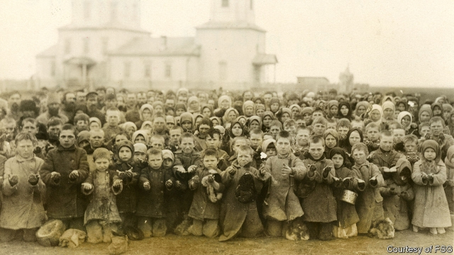

###### Forgotten histories

# A century ago America saved millions of Russians from starvation 

 

> print-edition iconPrint edition | Books and arts | Nov 9th 2019 

The Russian Job. By Douglas Smith.Farrar, Straus and Giroux; 320 pages; $28. Picador; £25. 

TO MOST PEOPLE shaped by the cold war—and today’s icy relations—Russia and America may seem always to have been sworn enemies. When the Soviet Union collapsed in 1991 America celebrated victory. When Vladimir Putin set out to avenge history and make Russia great again, he whipped up anti-American hysteria and scorned Washington’s overreach. For his part, Donald Trump—who thinks America has in the past been a soft touch—in effect concurred with Mr Putin’s criticism, pledging to put narrow American interests first. 

In recounting America’s biggest ever humanitarian effort—to save millions of lives in the nascent Soviet state a century ago—“The Russian Job” by Douglas Smith repudiates the modern mythologies of both countries, and their leaders’ twisted histories. Already ravaged by wars and revolution, in 1920-22 Russia was hit by droughts and faced one of Europe’s worst ever famines. It was partly self-induced: terrorised by the Red Army and threatened with requisitions and executions, Russian peasants drastically reduced the land under cultivation, sowing the minimum required for their own survival. 

Acutely aware that food meant power, Vladimir Lenin abandoned War Communism in favour of a new economic policy that replaced requisition with taxes and made some concession to capitalism. But it was too late. By the end of 1921, the vast territory along the Volga succumbed to starvation and cannibalism. 

Having come to power on the promise to provide bread and end war, the Bolsheviks confronted the prospect of being swept away by hunger. Unable to feed their own people, the leaders of the proletarian revolution turned to the West for help. Maxim Gorky, a Bolshevik writer who had once demonised American capitalism, appealed to “all honest European and American people” to “give bread and medicine”. 

The appeal struck a chord with Herbert Hoover, founding chief of the American Relief Administration (ARA). The future president responded not out of sympathy for the “murderous tyranny” of the Bolshevik regime, but from faith in America’s mission—and ability—to improve the world. If children were starving, America was obliged to ease their suffering. “We must make some distinction between the Russian people and the group who have seized the government,” Hoover argued. 

The ARA’s insistence on complete autonomy made the Soviet government suspicious, as did its pledge to help without regard to “race, creed or social status”. After all, the regime had liquidated entire classes of citizens and nationalised not only private property but human life. Still, given a choice between losing face or losing the country, the Bolsheviks conceded the ARA’s conditions—while putting the operation under surveillance by the secret police. 

Mr Smith’s book is not a political history, however. It is principally a reconstruction of the lives of those ARA men, many from military backgrounds, who over two and a half years in effect took over the functions of civil government in Russia, feeding some 10m people. In the Volga region, where residents were driven by hunger to boil and eat human flesh, the ARA organised kitchens and transport, distributed food and rebuilt hospitals. 

The misery they encountered in Russia strained their nerves to the point of breakdown and despair, but also imbued their careers with meaning. “It is only by being of service that one can be happy,” an ARA officer wrote. “The help given by the Americans can never be forgotten, and the story of their glorious exploit will be toldby grandfathers to their grandchildren,” grateful Russians told them. 

Yet the duplicity and paranoia of the Soviet government haunted the ARA’s operation to the very end. While publicly Bolshevik leaders showered the Americans with praise and thanks, the secret police instructed local officials: “Under no circumstances are there to be any large displays or expressions of gratitude made in the name of the people.” No sooner was the Russian job done than the authorities began to expunge all memory of America’s help. 

The edition of the Great Soviet Encyclopedia of 1950 described the ARA as a front “for spying and wrecking activities and for supporting counter-revolutionary elements”. Modern Russian textbooks barely mention the episode. But it is not just Russia that needs to be reminded of this story—so does America, which derived much of its 20th-century greatness from its values rather than military power. As Gorky told Hoover: “The generosity of the American people resuscitates the dream of fraternity among people at a time when humanity needs charity and compassion.” ■ 

