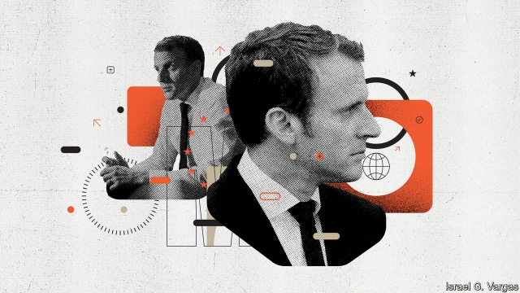
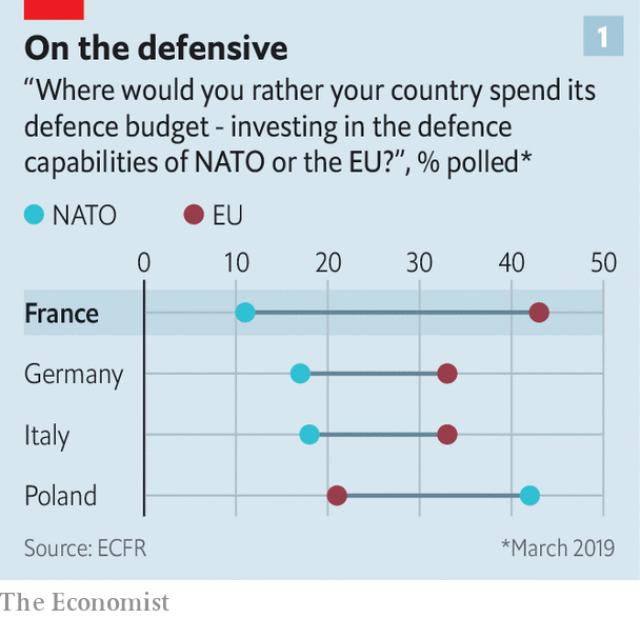
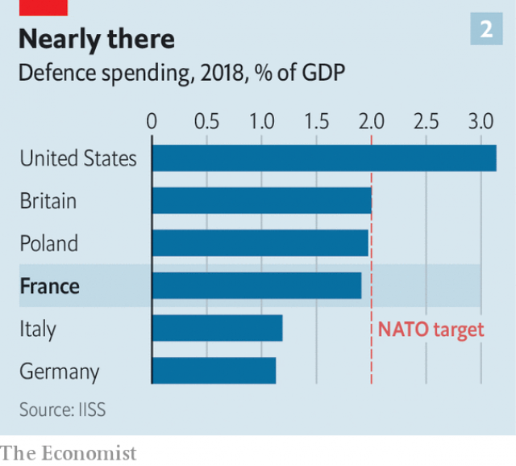
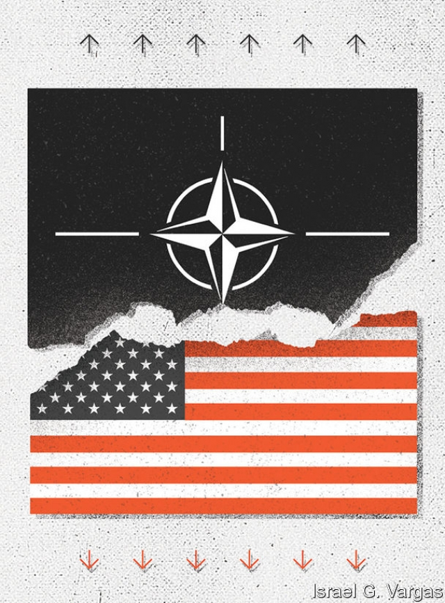

###### Macron’s view of the world

# Emmanuel Macron on Europe’s fragile place in a hostile world 

 

> print-edition iconPrint edition | Briefing | Nov 7th 2019 

WHEN EMMANUEL MACRON stepped from his presidential plane onto the red carpet at the airport in Shanghai on November 4th, two flags were fluttering in the warm air: one Chinese, the other the French tricolore. This was only to be expected for a visiting French president, whom President Xi Jinping treated to two banquets and a private dinner, in two different cities. Yet the absence of a European Union flag was a small visual reminder of the scale of the diplomatic challenge Mr Macron has set himself. For the French president went to China this week not just to speak for France, but for Europe. 

Mr Macron’s message was carefully calibrated. When Germany’s Chancellor Angela Merkel jetted off to China in September, she took with her a large delegation of German chief executives. Mr Macron also flew French businessmen with him to China, and pushed hard for better access to Chinese markets for French stuff. To make the point, Mr Macron and Mr Xi tasted high-end Bordeaux and morsels of French beef together at the Shanghai trade fair. 

Yet the French president also went “to show that Europe has a unified face”. He brought with him an Irish European commissioner and a German minister, and included a clutch of German business bosses in the French delegation. In a speech on trade, Mr Macron framed the stakes as European, and scarcely mentioned la France. With China ready to exploit the slightest European division, Mr Macron hoped to show that a common, strategic, pan-European policy might be possible. 

Shortly before his China trip, Mr Macron laid out this vision of a more “strategic” and “sovereign” Europe in a candid interview with The Economist. The conversation took place late in the evening on October 21st at the Elysée Palace in the president’s gilt-decorated office, the salon doré, where Charles de Gaulle used to work. In the interview, Mr Macron is as bleak about the perils facing the continent as he is radical about his prescriptions. 

“Look at what is happening in the world. Things that were unthinkable five years ago,” the French president declares. “To be wearing ourselves out over Brexit, to have Europe finding it so difficult to move forward, to have an American ally turning its back on us so quickly on strategic issues; nobody would have believed this possible.” Europe is on “the edge of a precipice”, he says. “If we don’t wake up…there’s a considerable risk that in the long run we will disappear geopolitically, or at least that we will no longer be in control of our destiny. I believe that very deeply.” 

Since the 1990s, says Mr Macron, the European Union has progressively lost its political purpose. Its focus on market expansion and regulation, underpinned by the American defence guarantee, provided an illusion of eternal stability. America’s gradual retreat from Europe and the Middle East, which he dates to before the election of President Donald Trump, combined with its new protectionism, has exposed Europe’s vulnerability. 

“But we find ourselves for the first time with an American president who doesn’t share our idea of the European project,” Mr Macron notes, and whose attitude to the risk of jihadist prisoners on the loose in Syria is that they will “be escaping to Europe”. When Mr Trump tells the French president that “it’s your neighbourhood, not mine”, says Mr Macron, what he is really saying is: “Wake up!” With America turning its back, China rising, and authoritarian leaders on the EU’s doorstep, the result is “the exceptional fragility of Europe”, Mr Macron concludes, “which, if it can’t think of itself as a global power, will disappear.” 

“What we are currently experiencing,” he declares, with reference to the withdrawal of troops from Syria, is “the brain-death of NATO”. Pressed to explain, he argues: “You have no co-ordination whatsoever of strategic decision-making between the United States and its NATO allies. None. You have an unco-ordinated aggressive action by another NATO ally, Turkey, in an area where our interests are at stake.” Did this mean that Article Five—the idea that if one NATO member were attacked the others would come to its aid, which underpins the alliance’s deterrence—is still functional? “I don’t know,” he replies. “But what will Article Five mean tomorrow?” 

 

The underlying message is brutal: Europe has to stop judging these times a historical anomaly, start asking whether NATO is fit for purpose, and get its act together. This is a view broadly shared by his countrymen (see chart 1). “Even if we don’t want to hear it,” he says, “we cannot in all responsibility fail to draw the conclusions, or at least begin to think about them.” 

Mr Macron, a philosophy graduate as well as a former investment banker, is considered to be more of a thinker than most world leaders. He tries to read for an hour or two each day. In Shanghai he slipped off for a private lunch with Chinese artists to muse about freedom. Mr Macron’s deliberations have led him to conclude that what is needed is “European sovereignty”: the collective ability to defend Europe’s interests—over security, privacy, artificial intelligence, data, the environment, industry, trade and so forth—in a strategic way. 

During his interview, Mr Macron roams across topics, moving from a psychological portrait of Vladimir Putin one moment to the perils of a low-interest-rate economy the next. Europe faces an almost-existential moment, he argues, as the world shifts from a global order based on rules to one determined by muscular power politics. Yet he does not seem to be daunted. He has a more engaging manner than his aloof public persona, which has led to a reputation for haughtiness, would suggest. Moments such as when Mr Macron told off a teenager for not calling him “Monsieur” in 2018, or when he said in 2017 that railway stations were places where “one crosses people who succeed, and people who are nothing”, have added to this impression that he is arrogant and removed. And, indeed, the bleakness of Mr Macron’s analysis is matched by an uncanny—and no doubt excessive—confidence in his own ability to do something about it. 

But can he? French Fifth-Republic presidents are fond of laying out sweeping visions of the world that appeal to the country’s grandeur. Over the years, when French leaders have called for a Europe puissance (European power), this has often sounded suspiciously like code for French hegemonic ambitions. Such efforts in the past have been dismissed in London or Washington as quaint, or dangerously undermining of NATO, or both. In 2003 during the Iraq war, when France, Germany, Belgium and Luxembourg held talks on such matters, their get-together was dismissed as a second-rate “chocolate summit”. 

Yet there are new reasons to try to understand the thinking in Paris. Mr Macron is an energetic diplomat, keen to shape the events he sees unfolding. For at least the next year, and possibly beyond, he will be the only ambitious leader of a liberal democracy who is also at the head of a nuclear power, with a military presence that reaches from Europe to the Pacific, a UN Security Council seat, strong executive powers and a robust parliamentary majority. Compare this with the agonies of Brexit Britain, Germany’s dysfunctional coalition and faltering economy, or the political paralysis of Italy and Spain. 

The result could be that leadership in Europe could pivot to France. By default as well as inclination, says Benjamin Haddad of the Atlantic Council in Washington, DC, Mr Macron is well placed to become Europe’s new diplomatic leader. 

For sure, Mr Macron cannot compete with Mrs Merkel on experience. But, midway through his term, the 41-year-old French president has built up ties to many world leaders. Since taking office, Mr Macron has made 101 trips to over 50 different countries, including places (from Nigeria to India) outside France’s traditional sphere. His China trip was his second there as president. On his watch, Mr Trump has been four times to France. Even Mr Macron’s domestic standing has started to recover, having taken a bruising soon after coming into office. After the searing social unrest led by the gilets jaunes (yellow jackets) a year ago, his approval rating—still very low, at 34%—is at least back up to where it was before the protests began. (Mr Trump’s is at 41% and over the past three years has not slipped below 36%.) 

Moreover, despite some clumsy footwork, Mr Macron has manoeuvred a number of France-friendly appointees into top EU jobs. They include Ursula von der Leyen, the new head of the European Commission; Charles Michel, the incoming European Council president; and Christine Lagarde, who now runs the ECB. And France has secured a hefty new commission portfolio spanning the single market, industrial policy, digital, defence and space—although he failed to secure Sylvie Goulard for the job, after she became the first French candidate to be rejected by MEPs in Brussels for being unfit to take office. 

Some of the language in Europe has started to shift in Mr Macron’s direction, at least. Mrs von der Leyen says she wants to run a “geopolitical” commission. Mark Rutte, the Dutch prime minister, has argued that “the EU needs a reality check; power is not a dirty word.” Mrs Merkel has told Europeans that, when it comes to their collective security, “the times when we could rely on others are over.” 

By the third day of his trip, French officials were pleased that a deal to protect regional European food labels—such as Roquefort blue cheese—in China, and vice versa, had been signed and that China seemed supportive on climate change. But they were also candid about how difficult it all is. 

China is a good test of whether Mr Macron can get Europe to speak as one voice, and whether Europe wants that voice to be Mr Macron’s. He has been outspoken about “China’s real diplomatic genius for playing on our divisions and weakening us”. He says he wants fellow Europeans to be less naive; he has argued it was “stupid” to sell essential infrastructure in southern Europe to the Chinese. He also wants the EU to insist on reciprocity in trade and market access, and to guard against technology transfer. To back this up with a show of limited muscle, France sails at least twice a year through the South China Sea. 

The need for a credible common policy sounds sensible. Trying to forge one is a lot more difficult. Take the construction in Europe of 5G telecoms networks. “You have to grasp the sensitivity of what we’re talking about,” Mr Macron argues, the pitch of his voice rising. Europe, he laments, has focused its technology policy almost exclusively on market issues, such as roaming or competition, at the expense of strategic thinking. He thinks Europeans should be worried that they cannot guarantee that sensitive technology will be neither Chinese nor American. France is taking a cautious approach to screening investment in its 5G network roll-out. Despite a warning from the head of its own foreign-intelligence service, Germany has taken a less restrictive approach. 

In some matters, the EU may become more willing to act in what Mr Macron considers to be a strategic fashion. The new European Commission could be more sympathetic to French desires to apply a global measure of market power to evaluate industrial mergers, which would enable pan-European champions to emerge. The idea of a sales tax on tech firms, which France introduced in July, prompting Mr Trump to tweet angrily about “Macron’s foolishness”, is gaining ground in other countries. France has persuaded Germany to consider the idea of a European carbon border tax. 

The really tough part of Mr Macron’s vision, however, would involve a step change for Europe that is extremely difficult to see happening in a hurry. It would mean converting a bloc that uses the heft of its market to apply rules and standards—and deploys its defence capability primarily for the purposes of crisis management—into one that can project power and act collectively as a military force. “It is very tough,” Mr Macron concedes, acknowledging that “Europe hasn’t demonstrated its credibility yet.” But, he insists, “we’re making progress” and that “attitudes are changing.” 

The French president cites his pet project, the European Intervention Initiative, a coalition of countries (including Britain), ready to act together in crises, as well as the German-favoured EU defence co-operation agreement, known as PESCO. He also points to the hefty new €13bn ($14bn) European Defence Fund to finance research and equipment, and a Franco-German agreement for a joint future-generation tank and fighter plane. All of these, Mr Macron insists, are “designed to be complementary to NATO”. France knows full well from its counter-terrorism operations in the Sahel the depth of its reliance on America. 

But is Europe really ready to undertake such a transformation? “I’ve been hearing about European strategic autonomy for so long,” sighs Philip Gordon of the Council on Foreign Relations, and formerly an adviser to Barack Obama. Part of the problem is defence spending (see chart 2). If Europe’s NATO members are to meet their commitment to spend 2% of GDP on defence by 2024, this would mean spending an extra $102bn—some 40% more than they currently do. 

 

Tougher still is the need for a change of mindset. Germany remains a defender of the status quo. This is the case on budgetary orthodoxy, which Mr Macron has failed to influence, as well as the post-cold-war order, where he detects some change. Germany is “very unambitious on the world scene, and so a very difficult partner for France,” says Claudia Major, of the German Institute for International and Security Affairs, a think-tank. “We constantly feel that [the French] want something from us, and that this is so annoying.” 

Germany is not alone. In other European capitals there is unease at the prospect of French leadership, and a feeling that Mr Macron is all for co-operation, as long as it is on French terms. Such misgivings were exposed by his recent veto over the start of accession talks with North Macedonia and Albania. Fellow Europeans roundly condemned this as exactly the sort of failure of geostrategic thinking that Mr Macron accuses others of. 

This view infuriates the president. Enlargement without reform of the EU and of its accession rules, he says, is “absurd”. It prevents Europe from acting as a more integrated bloc. “Half” of the other EU countries agree with him on Albania, he claims, but hide behind France. And he rejects the idea that his veto leaves them vulnerable to rival powers, pointing to growing Russian and Chinese influence in Serbia, which is an accession candidate. If Europe reformed first, says Mr Macron, he would be “ready to open negotiations”. 

 

Or consider Mr Macron’s Russia policy. He has long argued that rogue powers are more dangerous when isolated. To this end, he has hosted Vladimir Putin at both Versailles, near Paris, and Brégançon, on the Mediterranean. But his call for a “rapprochement” with Russia, in order to keep it out of China’s arms, has alarmed Poland and the Baltics. “My idea is not in the least naive,” argues Mr Macron. He insists that any movement would be conditional on respect for the Minsk peace accords in Ukraine. He has not called for sanctions to be lifted. And he sees this as a long-term strategy, that “might take ten years”. Mr Macron’s belief is that, eventually, Europe will need to try to find common ground with its near neighbour. Not doing so would be “a huge mistake”. 

The rest of the world is still not quite sure what to make of the French president. There is a dizzying amount of diplomatic activity now coming out of Paris. This has already led to false hopes, such as the prospect of a Macron-brokered meeting between the Iranians and Americans. Promises of four-way talks between Russia, Ukraine, France and Germany this autumn have yet to materialise. Not unlike Mr Macron’s global showmanship and his theatrical handshakes with other world leaders, his foreign policy is generating both interest and disquiet in almost equal measure. 

It may be that despite all this energetic effort, Mr Macron’s ambitions for “European sovereignty” are frustrated from within by a combination of European divisions, Brexit, German inertia and lingering suspicions of the French. Or that his imperious behaviour curtails his influence. “Macron has everything in place to build a French-focused Europe,” says Ulrich Speck, of the German Marshall Fund. “Strategically he’s right about so much, but operationally he doesn’t work enough with other partners.” Nor is it even clear that Europe needs to fill its leadership gap. 

Yet, as Mr Macron displayed in China this week, he will seize the mantle if he can. The French president may overpromise and underdeliver. But he is unfazed by those who accuse him of being pushy or difficult, judging this to be the inevitable result of trying to upend the rules. “I’m trying to understand the world as it is, I’m not lecturing anyone. I may be wrong,” he insists, in a tone that hints he does not believe it for a second. The leader who describes such a bleak outlook for Europe is going to try to do something about it, whether others like it or not. As one of his advisers puts it, Mr Macron “is a realist, and a pragmatist, and he exposes himself by taking risks. But that’s how he is. That’s how he became president.” ■ 

Dig deeper 

Leader (November 7th): “A continent in peril”Transcript: Emmanuel Macron in his own wordsThe Intelligence podcast: “He talked about Europe in almost apocalyptic terms”— Macron's interview 

