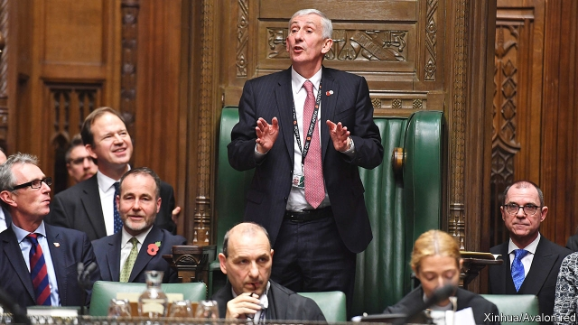

###### A new order

# Don’t expect MPs to make less trouble under Lindsay Hoyle 

 

> print-edition iconPrint edition | Britain | Nov 9th 2019 

THE MOST famous face in recent Brexit debates may have been that of the Speaker of the Commons, John Bercow. But he has now quit and MPs have picked his deputy, Sir Lindsay Hoyle, to replace him. Since he won by a large margin, including strong cross-party support, Sir Lindsay can expect to be confirmed after the election. 

The Speaker’s job is merely to preside and keep order. Yet as a noisy Remainer, Mr Bercow upset fellow Tories with his choices of when to allow debates and what amendments to call. Boris Johnson spoke for many when he said the tennis-loving Mr Bercow had not just been an umpire but a player in his own right. Although Sir Lindsay is a Labour MP, lots of Tories want him to rein in their colleagues. 

Sir Lindsay has promised to change the Commons for the better. And unlike Mr Bercow, he refuses to say if he is pro- or anti-Brexit. Yet those wishing backbenchers to be more subservient may be disappointed. Alice Lilly of the Institute for Government, a think-tank, notes that MPs have come to enjoy the extra powers of scrutiny given to them by Mr Bercow, the longest-serving post-war Speaker. Emergency debates, urgent questions and high-profile select committees are here to stay. 

This will be especially true if the election result is tight or produces another hung parliament. Many Tories blame Mr Bercow for obstructing Brexit, but the real culprit was their lack of a reliable majority. If that persists under a new Speaker, MPs will continue to cause lots of trouble—no matter who is in government. ■ 

