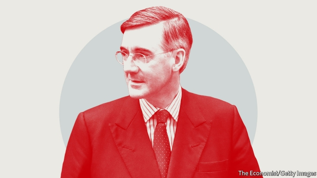

###### Speakers’ Corner

# The best quotes from the second week of Britain’s election campaign 

 

> print-edition iconPrint edition | Britain | Nov 9th 2019 

Tower of compassion“I think if either of us were in a fire, whatever the fire brigade said, we would leave the burning building. It just seems the common-sense thing to do, and it is such a tragedy that that didn’t happen.”Jacob Rees-Mogg, the Conservative leader of the House of Commons, on how he would have survived the Grenfell Tower fire. LBC  

With friends like these“We want very clever people running the country…that’s a by-product of what Jacob is. And that’s why he is in a position of authority…Jacob is not from that background [Grenfell Tower]. He is very, very well educated.”Fellow Tory MP Andrew Bridgen rushes to Mr Rees-Mogg’s aid, and makes things worse. BBC  

Recipe for success“They’ll slash food standards to match those of the United States, where what are called acceptable levels of rat hairs in paprika and maggots in orange juice are allowed, and they’ll put chlorinated chicken on our supermarket shelves.”Jeremy Corbyn, Labour leader, paints a picture of a trade deal with America 

Anyone but him“I’m absolutely categorically ruling out Liberal Democrat votes putting Jeremy Corbyn into Number 10.”Jo Swinson, Lib Dem leader, promises no deal with Labour—at least under current management 

Who wants to be a billionaire?“I don’t think that anyone in this country should be a billionaire.”Lloyd Russell-Moyle, a Labour MP, kicks off a heated debate (see article). BBC 

Labour blues“Jeremy Corbyn is completely unfit to lead our country, completely unfit to lead the Labour Party.”Ian Austin, a Labour MP in 2005-19, urges “decent people” to vote Conservative. BBC  

New slogan needed“The absolute bantz of the Tories using the tag line #BritainDeservesBetter after being in Government for 9 years. You’re not wrong lads.”Jess Phillips, a Labour MP, reacts to the Conservatives’ election slogan 

