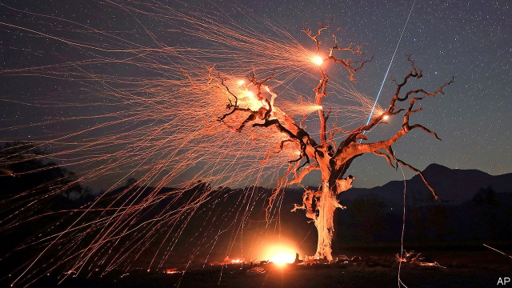
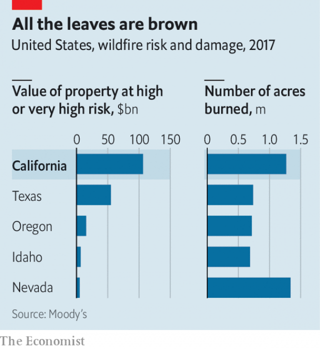

###### Sparks fly

# A three-way battle over control of PG&E 

 

> print-edition iconPrint edition | Business | Nov 9th 2019 

LOCAL UTILITIES’ predictable businesses and steady dividends have earned them the moniker “widow-and-orphan shares”. Not in California. Pacific Gas & Electric Company (PG&E), its biggest electric utility, declared bankruptcy in January, citing $30bn of potential liabilities arising from its role in causing deadly wildfires. Its share price is down by nearly 90% since 2017. It recently shut off power to millions of Californians to prevent its installations from sparking new blazes. Customers and politicians fumed. Meanwhile, a battle for control of the firm rages on. 

PG&E’s management is backed by big funds (notably Abrams, Redwood and Knighthead) that hold just over half its shares. Its restructuring plan favours current shareholders. It proposes raising both new debt and equity. A rival bid by bondholders (among them big asset managers such as Elliott, Apollo and PIMCO) would virtually wipe out current equity. This scheme appeals to fire victims, for it offers them more compensation than the management’s plan. 

Bondholders appeared to have the upper hand. Then the politicians waded in. On November 4th the mayors of Oakland, San Jose and other municipalities said they want to buy PG&E and turn it into a co-operative. They are pushing Gavin Newsom, California’s governor, and state regulators to back their proposal. If approved, it would enable PG&E to take advantage of rules which exempt Californian municipal utilities, such as those in Los Angeles and Sacramento, from federal tax, allow them to set their own tariffs and also let them tap cheaper capital than is available to private utilities. If PG&E is not restructured by a deadline of June 30th, Mr Newsom, who is critical of the management, has threatened a state takeover. 

 

Meanwhile, PG&E will continue to teeter. After years of underinvestment its grid needs a massive upgrade. Stephen Byrd of Morgan Stanley, a bank, calculates that burying its transmission and distribution lines in the most vulnerable areas underground to reduce fire risk would cost $100bn. Lawrence Makovich of IHS Markit, a consultancy, points out that the utility is saddled with another cost. A state law passed last year requires that half of electricity come from renewables by 2025, up from about a third in 2017. So like other utilities, PG&E has signed some expensive contracts for clean energy. Walking away from those which charge a premium over dirtier power could save it $1.4bn a year as part of the restructuring, estimates Moody’s, a rating agency—but California’s hyper-green politicians and activists would probably block such a move. 

Then there is California’s “inverse condemnation”: an idiosyncratic state law holds utilities liable for damage caused by their equipment during fires even if they followed safety rules and were not negligent. Reckless expansion of housing into fire-prone areas has put nearly $110bn in property at high risk in California. Climate change is only making dry weather drier and wildfires fiercer. By creating untold potential liabilities the statute has made utilities virtually uninsurable. 

Last July the state created a $21bn wildfire-insurance fund, to be financed equally by private utilities and customers. Helpfully, the scheme pools risk. But it is too small. It limits the pool to California, notes Joseph Scalise of Bain, a consultancy. States in which utilities have access to insurers and reinsurers can spread risk globally. 

The hapless utility could yet be hit with huge fire-related expenses this dry season, which ends in December. These could wipe out its remaining equity. Bondholders may then back out of promised capital injections. Government may be left on the hook. Whoever wins the battle for control of PG&E, ordinary Californians will pay—through taxes or higher electricity bills. ■ 

