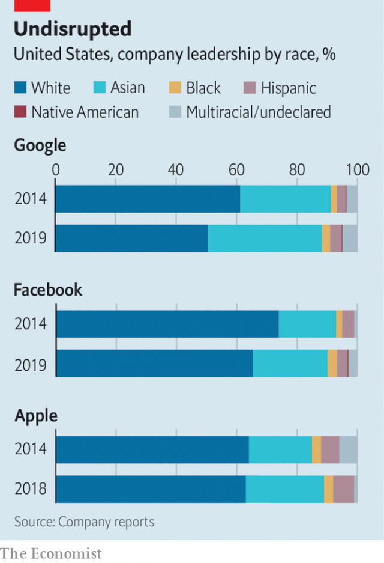

###### Diversity memo

# How to make your firm more diverse and inclusive 

 

> print-edition iconPrint edition | Business | Nov 9th 2019 

To: CEOcc: PASubject: A hard-headed guide to corporate diversity 

Dear David, 

YOU FACE pressure to “do something” about diversity in your company—not only from your wife and woke children. Corporate clients increasingly demand it in your supply chain. Regulators, who use a “stable” or “inclusive” culture as a proxy for low risk, are breathing down your neck. Governments like Britain’s, which now mandates pay-gap reporting, insist on making more of your sensitive data public. And employees, including former ones, can air their complaints on social media. 

Small wonder that 87% of your fellow bosses told consultants at PwC that diversity is a business priority. I’m sure you did, too. After all, you recently posted a job opening for a diversity manager. You were not alone; the number of such offers in Britain has doubled in the past year, say analysts at Glassdoor, a recruitment website. Since June 2017 more than 800 American CEOs have signed a pledge to “advance diversity and inclusion in the workplace”. 

That is where we are: lots of talk, plenty of initiatives, little change on the ground. Between 2015 and 2018 the share of female executives at large (mostly) American and British firms went from 12% to 14%; for ethnic minorities it moved from 12% to 13%. The FTSE 100 has fewer female CEOs (six) than it does bosses who share your name (seven). In American companies with over 100 employees, the share of black men in management was 3.4% in 2017, half their share in the population as a whole—and virtually unchanged from 3% in 1985. White women make up 25% of executives and senior managers, compared with 60% for white men. Something is clearly amiss. 

In the past this letter would have gone straight to your legal department. Since the term “diversity” entered the corporate lexicon in the 1960s it has been code for avoiding lawsuits—especially in America, where companies have coughed up billions in fines for discrimination over the years. The financial sector still treats it mostly as a compliance issue. 

Now you are no doubt tempted to forward it to someone in HR, almost certainly a woman with an arts degree, a sound moral compass and too little power. Don’t. This is your problem. Without your leadership it is unlikely to be solved soon. 

Deep inside, you may be wondering if anything really needs solving. The short answer is: it does. With that in mind, you should ask yourself three things. 

First, why does diversity matter to your firm? Is your reputation in trouble, as it was for Uber, Nike, Lloyd’s of London and others scarred by #MeToo? Do you, like consumer giants such as P&G, hope that more diversity makes for better products? Are you concerned about attracting and retaining bright sparks? You would be in good company: 97% of executives fret about increased competition for talent (according to Mercer’s HR consultants). 

Or are you hoping that diversity will boost the bottom line? To be perfectly honest, I have no idea if it does. It is hard to tell if diversity helps firms do well, or if successful firms are also more enlightened on other matters. But variety has been linked to innovation, productivity and, for example in diverse teams of surgeons, fewer mistakes. Lack of it breeds groupthink—which in turn can lead to disasters. The Bay of Pigs invasion and the Lehman Brothers collapse stemmed from narrow-mindedness. And employees who believe their firm cares about gender diversity are 40% more likely to be satisfied at work—and possibly more productive as a result. 

Once you have sorted out the why, consider where you want to get to. Some firms, like Facebook, Nike or P&G, say they wish to mirror their customer base. Others are keen not to recruit from an artificially thin talent pool. Goldman Sachs claims its new entry-level recruitment targets—50% female and, in America, 14% Hispanic and 11% black—are based on things like graduation rates. Clear goals make it easier to assess if you are on track. But make them attainable. Qantas’s goal of 40% of its pilot intake to be female by 2028 is as admirable as it looks unrealistic: today just one in 20 pilots worldwide is a woman. 

The third question concerns barriers that stop diverse talent from flourishing at your firm. Mapping how it flows through your organisation and where the blockages and leaks happen is a start. A McKinsey study of more than 300 companies identified the second step of the career ladder, from entry level to manager, as the “broken rung”: for every 100 men only 72 women (and just 68 Hispanic and 58 black ones) earned that critical early promotion. When Google was losing women in disproportionate numbers it homed in on maternity as the principal cause; the technology giant increased maternity leave and support for mothers returning to work. 

Staff surveys can help, provided they are large and comprehensive enough. After its #MeToo moment, Lloyd’s, an insurance market, found that 45% of staff felt unable to raise concerns about improper conduct. Employees are now encouraged to speak up, including through a bullying-and-harassment helpline. A “culture dashboard” tracking progress on survey metrics will be published with the Lloyd’s annual report. 

Now you’ve got your diversity-and-inclusion priorities straight and diagnosed what needs fixing. Good. Before you order a rainbow float for a Pride parade and send staff on a micro-aggression avoidance course, here is what not to do. 

American firms spend billions a year on training. Half of large ones have unconscious-bias seminars. Most of these “D&I” programmes are a waste. Or worse: recent research from America shows that diversity statements can put off minorities, possibly because they perceive them as tokenism. Often, firms do D but forget I, which is about ensuring that the workforce is not just diverse, but thriving. Too many try to fix people instead of procedures. Training women to be more assertive in asking for a promotion or pay rise is pointless; they are just as likely to ask for these but also likelier to be seen as pushy when they do. Ushering your managers onto the “Check Your Blind Spots bus”, currently touring America as part of the CEOs’ drive, is unlikely to do much. “Days of understanding”, popular in American offices, risk causing “diversity fatigue”. It is hard to beat bias out of individuals—easier to root it out of systems. 

Take Silicon Valley. Big Tech has splurged on D&I to little effect. Representation of blacks and Hispanics has been flat (see chart). Girls Who Code, an industry-sponsored NGO, found that a quarter of young women who applied for internships at tech firms said they were asked inappropriate or biased questions. Others reported being flirted with or demeaned. It’s no use hiring diverse coders if the message then is: wear a hoodie and pretend to be a guy, or this is no place for you. They will underperform—or flee, leaving you as undiverse as before. Firms that do not change their ways beyond recruitment see high attrition rates of diverse talent. A lack of diversity is a symptom of deeper problems that a few diversity hires won’t mend. 

 

At this point the how should be relatively clear. In a nutshell, it is all about creating a level playing field. When recruiting, software can mute biases by concealing giveaways to a candidate’s gender or ethnic identity. These include names but also less obvious hints like the sports they play. If only the usual suspects apply, look harder. Specialised recruitment drives, such as visiting “black” colleges or advertising in women’s forums, appear to work. The Bank of England no longer visits the Russell group of top universities, whose graduates apply in spades anyway, and focuses instead on less elite schools. BHP, an Anglo-Australian mining giant, broadened its search for female miners by recruiting from professions, such as nursing, with some similar skills. 

In an effort to find trainees from different backgrounds, British law firms are trying “contextual recruitment”. An applicant with Bs from a school where everyone got Cs may be more impressive than one with As from a place full of A* pupils. Rare, a recruitment firm, has developed software which screens candidates for disadvantage and gauges their outperformance against the average for their school. 

Once in the workplace, the clearer your criteria for professional advancement, the better. Informality is the enemy of women and minorities. It perpetuates bias. Surveys of American engineers and lawyers found that female workers were nearly twice as likely as their male peers to be saddled with “office housework”, like setting up meetings and conference calls. White men were likelier to be given careerenhancing tasks such as client meetings. 

Sponsorship schemes are an effective way to ensure traditionally sidelined groups get a fair shot. PayScale, a pay-comparison site, found that employees with a sponsor made 11.6% more than those without. The Bank of England has offered most of its sponsorship places to ethnic-minority women. Staff surveys, if bite-sized but regular, can bring clarity to fuzzy inclusion metrics. “Psychological safety”, lingo for an environment where people feel free to speak their mind, can be tracked with questions like “are your ideas regularly attributed to someone else?” or “are you regularly interrupted in meetings?” Rotating who chairs a meeting, or a firm word with loudmouths who dominate it, can help. 

Many employers—yourself included—would be horrified to learn that they implicitly require employees who want to be considered leadership material to adjust their behaviour. Women shouldn’t need to “act like a man”, gay employees to “act straight” or people with frizzy hair to treat it to “look professional” (ie, white). Let grievances fester and your workers will lose motivation or simply leave. 

That is a lot to take in. But unless you do, your most valuable resource—workers—will not be as good as it could be. Best to get ahead of the problem. It isn’t that hard. And it can pay off mightily. 

Yours,Shareholder■ 

