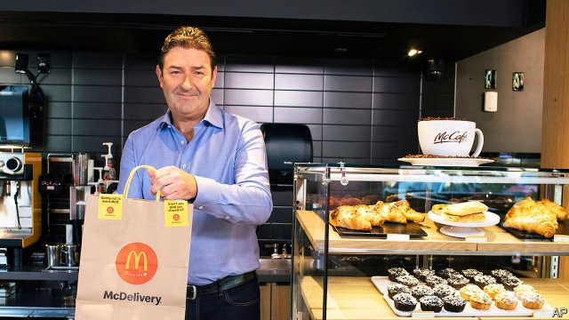

###### Too much lovin’

# McDonald’s fires its boss over a workplace romance 

 

> print-edition iconPrint edition | Business | Nov 9th 2019 

THE SWIFTNESS of Steve Easterbrook’s exit from McDonald’s matched that of Don Thompson, his predecessor, in 2015. Mr Thompson was pushed out for poor performance. Not Mr Easterbrook, who was widely admired for doubling the American fast-food giant’s share price. On November 3rd the company announced it was sacking its British-born boss because of “a recent consensual relationship with an employee”. Chris Kempczinski, who runs its domestic business, takes over. 

Bill George of Harvard Business School called Mr Easterbrook’s departure a “tragedy” for McDonald’s. In Europe ousting a capable CEO drew bemusement. Süddeutsche Zeitung, a German daily, commented that, “luckily”, German labour law would bar such a move. In 2005 a court in Düsseldorf ruled that the German subsidiary of Walmart, an American retailer, could not ban its employees from flirting. Critics of restrictions on workplace romance warn that they can backfire. To them, Walmart’s hotline for anonymous tips on office indiscretions is a recipe for backbiting. 

In America Mr Easterbrook’s sacking was, pace Mr George, broadly applauded. #MeToo has highlighted the perils of romantic workplace liaisons between people with unequal power. The powerful “find it hard to recognise the coercive nature of their influence” over subordinates, says Vanessa Bohns of Cornell University. She has found that bosses making romantic advances towards colleagues have no idea how uncomfortable the targets of their affection feel rejecting them. 

Mr Easterbrook is not the first company boss booted out over a dalliance at work—and unlikely to be the last. In 2018 Intel’s chief executive, Brian Krzanich, resigned after the chipmaker discovered a similar affair. One in three American adults are or have been in a workplace romance, according to a poll this year by the Society for Human Resource Management, an association of HR professionals. 

Mr Kempczinski will emulate Mr Easterbrook’s strategy of switching to healthier fare and digitising operations. Investors seem to think the new boss can pull it off; he helped devise it. The firm’s share price has rebounded after dipping on the news. Mr Kempczinski calls Mr Easterbrook a “patient and helpful mentor”. His predecessor’s parting lesson will no doubt stay with him for a while. ■ 

