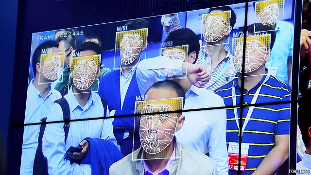

###### The first face-off

# A lawsuit against face-scans in China could have big consequences 

 

> print-edition iconPrint edition | China | Nov 9th 2019 

GUO BING, a legal academic in the eastern city of Hangzhou, likes to spend his leisure time at a local safari park. But when the park informed season-pass holders like him that admission would require a face-scan, Mr Guo objected. Late last month he filed a lawsuit, claiming the new rules violated his privacy. Facial-recognition technology is widely used in China. Doubtless to the relief of the government which makes extensive use of it, there has been little public debate about it. State media, however, seized on Mr Guo’s case, trumpeting it as the first of its kind to be lodged in a Chinese court. Netizens have been hailing Mr Guo as a champion of consumer rights. A thread about his suit has garnered 100m views on Weibo, a social-media platform. 

It is surprising that it has taken so long for the judiciary to get involved. Some 300 tourist sites in China use facial recognition to admit visitors. The safari park says doing so can shorten queues. Many office workers in Beijing’s main financial district clock in and out of work by scanning their faces. Some campuses and residential buildings use facial-recognition cameras to screen people entering. WeChat, a messaging and digital-wallet app, allows users to pay with their faces at camera-equipped vendors. Facial-recognition systems are ubiquitous at traffic intersections, in railway stations and airports (visitors to a public-security expo are pictured being scanned). 

But even the government recognises that the proliferation of this technology may lead to abuses. It does not want discussion of its own intrusions into privacy, such as the use of facial recognition to spy on millions of Uighurs, a mostly Muslim group, in the western region of Xinjiang. But poor protection of facial and other personal data by Chinese firms could impede the country’s rise as a global tech giant. On November 4th the websites of Xinhua, a state news agency, and People’s Daily, a Communist Party mouthpiece, republished an article in a Hangzhou newspaper describing the lawsuit as a “very good opportunity” to spur “public debate”. People’s Daily has started an online opinion poll about the “ever-increasing” number of venues using facial recognition. It is due to publish the results on November 11th. 

In China’s social media, many of the thousands of commentators on Mr Guo’s case have expressed fears about the sale of personal information to third-party marketers. “In China there is no protection of privacy!” said one comment on Weibo that was “liked” more than 1,500 times. China’s consumer-rights law requires consent from consumers before personal information can be collected and stored. If the court in Hangzhou sides with Mr Guo, other Chinese firms will need to pay heed. 

By encouraging such discussion, the government may be betting that any ire will not be redirected at the state’s use of the technology. But a few commentators have hinted at their disquiet about more than just the lax attitudes of businesses towards privacy. “There’s a feeling that everything you say and do is being monitored. It’s terrifying,” said one. Another simply wrote: “1984”. Mr Guo, however, has said he is happy to submit to facial scans by the government that are in the public interest. All he wants is his money back on his season ticket. ■ 

