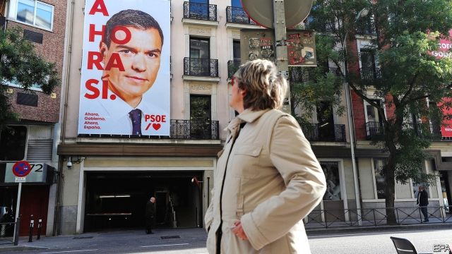
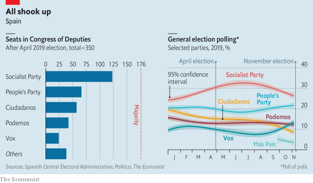

###### Fourth time lucky?

# Spain goes to the polls for the fourth time in four years 

 

> print-edition iconPrint edition | Europe | Nov 7th 2019 

THE CAPITAL of Visigothic Spain and later of Castile, famous for its mudéjar churches and El Greco paintings, the medieval city of Toledo has succumbed to mass tourism. But the surrounding province is a representative slice of modern Spain, from dormitory exurbs of Madrid to struggling industrial towns along the Tagus valley and rolling hills of vineyards and olive groves. It is also the kind of place where Spain’s general election on November 10th—the fourth in as many years—will be decided. 

A week before the vote, amid the housing estates of Toledo’s bland new town there was palpable frustration at the country’s politicians. “Are we going to vote so that they can’t agree again?” asked Lidia Ribeiro, a student who says she won’t vote this time. “They are grown-ups. They should come to an agreement on a government.” Since votes are now split among five national parties and several regional ones, that is not going to be easy. 

The previous election, in April, was won by the Socialists of Pedro Sánchez, the acting prime minister, but with only 123 of the 350 seats in congress. The Socialists did even better in local and European elections a month later. But Mr Sánchez proceeded to fritter away such advantage as he had. It did not help that Albert Rivera, the leader of Ciudadanos, a centre-right party with 57 seats, refused even to discuss an alliance. During the summer Mr Sánchez offered, and then withdrew, a coalition to Podemos, a radical-left party, which rejected his terms anyway. His advisers were confident that a fresh election would see the Socialists bag an extra 20 seats or so. Yet events and voter fatigue have turned the election into a desperately uncertain affair. Mr Sánchez may end up with a Pyrrhic victory. 

 

In April he managed to make the vote about his chosen issues of creating a fairer society in the wake of Spain’s economic slump of 2008-13 and stopping Vox, a new far-right nationalist party. That prompted a high turnout of 76%, which tends to favour the left. This time is different. The main issue has become Catalonia, after the Supreme Court last month imposed harsh prison sentences on nine Catalan separatist leaders for sedition over their role in the illegal referendum and declaration of independence in October 2017. 

That prompted several days of big and sometimes violent protests in Barcelona with nightly images of burning barricades. Some 600 people were injured, many of them police, and €10m ($11.1m) of damage was done. The government is braced for attempts to disrupt voting in Catalonia. 

Such disorder, and the threat of secession in Catalonia, benefits the right elsewhere in Spain. Polls now suggest the Socialists might get slightly fewer seats than in April. The conservative People’s Party (PP), which governed from 2011 until Mr Sánchez ousted it in a censure motion in 2018, is set to improve on its poor result in April. Its leader, Pablo Casado, having veered right in the spring, has grown a beard and moved back towards the centre. 

But the PP’s recovery is threatened by rising support for Vox. While Vox’s leader, Santiago Abascal, criticises illegal immigration, his main pitch is to recentralise government, ban separatist parties and crack down on the Catalan regional administration. His presence in a televised election debate on November 4th gave him unprecedented visibility. At the other extreme, Mr Sánchez “thought we would sink and he could govern alone,” says Pablo Iglesias, Podemos’s leader. The polls suggest Mr Iglesias’s support is resilient. 

Mr Sánchez defines the Catalan problem as one of restoring peaceful coexistence between supporters of independence and the majority in the region who oppose it. To uphold law and order, the government is doing “everything that’s necessary, but only what’s necessary”, according to José Manuel Albares, an adviser to the prime minister. Mr Sánchez refuses to talk to Quim Torra, the separatist president of the Catalan government, until he condemns violence and drops his threat to repeat a unilateral referendum. But the prime minister has also ignored calls from the right to impose direct rule. In the debate he promised to loosen the separatists’ control over Catalan public television and radio. The Socialists insist that sooner or later the Catalan conflict requires a political solution. 

The election is unusually open and the polls hard to read. Turnout is likely to fall. Three parties—Podemos, Ciudadanos and Vox—are clustered between 9% and 14%. In many less populated provinces the electoral system punishes smaller parties. Take Toledo. Long monopolised by the PP and the Socialists, since 2015, Toledo has been a four- and this year a five-way fight. On November 10th Ciudadanos looks set to lose the seat it won in April, though to whom is not clear. 

Voters seem, rightly, to heap most of the blame for the lack of a government on Mr Rivera. The best chance of the strong reformist government that Spain needs to tackle slowing growth, a dysfunctional labour market, plunging consumer confidence and the Catalan conflict was a coalition between the Socialists and Ciudadanos. It looks too late for that. Instead a Socialist minority government is the most likely outcome, although victory for the right is not impossible. In another way, too, Spanish politics is more fraught than in April. “Vox is now something structural in Spain, and that means we can’t have a conservative government without the far right,” says Mr Albares. 

The deadlock is the result not just of fragmentation but also of other trends. “Novelty has been a big advantage in Spanish politics in the past few years,” notes Kiko Llaneras, a psephologist. That benefited Podemos, then Ciudadanos and now, perhaps, Vox and a tiny new left-wing party, Más País. It has also thrust politics into the hands of a cohort of young and inexperienced leaders. If Mr Sánchez does a lot better than he did in April, it will be a personal triumph. If he doesn’t, he will have only himself to blame. ■ 

