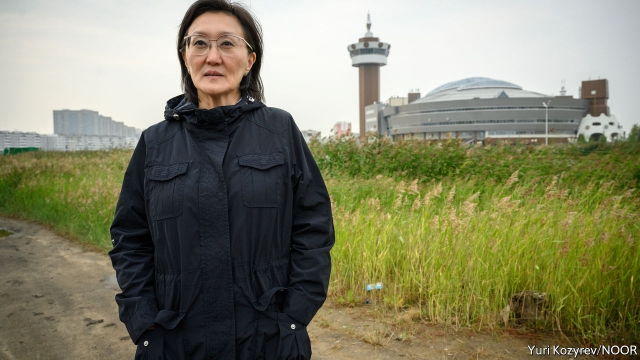

###### The Camry in the gold mine

# The sudden popularity of a Russian mayor who lives modestly 

 

> print-edition iconPrint edition | Europe | Nov 9th 2019 

THE TYPICAL Russian big-city mayor exhibits several traits. He is male and middle-aged. He lives more opulently than his neighbours. He represents the ruling United Russia party. And he won his post not at the ballot box, but by appointment. 

Sardana Avksentieva, the mayor of Yakutsk, the regional capital of Russia’s far eastern republic of Sakha, cuts a different image. She defeated a United Russia candidate in an insurgent campaign during regional elections last autumn. When billboard owners refused to run her campaign ads, she hired a fleet of trucks, plastered them with her likeness, and parked them across town. She pitched herself as “The People’s Mayor”, and voters rewarded her. Ms Avksentieva’s popularity hints at the kind of leadership voters might prefer, if they had a real choice. “I’m a harbinger,” she sighs, “though I don’t want to be.” 

Her message has focused on providing services and on greater transparency—an oddity in a country where fewer than a tenth of all regional capitals elect their mayors directly. “People should understand and feel that their opinion means something, and that their demands can be fulfilled,” she says. “Nothing should be decided behind closed doors, no decisions should be adopted by a small cabal of people.” She live-streams city planning meetings. She argues that the capital of a region with vast mineral wealth—Yakutia is Russia’s gold-mining centre—ought to be able to provide good roads and sufficient housing for its people. 

Ms Avksentieva is not a complete outsider. Before taking office, she had served in local and national government, including as deputy mayor. Her rise would have been impossible without the backing of Vladimir Fyodorov, a powerful local businessman whose own attempt to run for mayor was foiled. 

Yet her populist posturing goes down well with voters. She opposed the government’s raising of the pension age earlier this year, calling for a referendum on the plan, even though she has no say over federal policy. She has auctioned off several luxurious SUVs that belonged to the mayor’s office; she also cut down on the international travel and lavish receptions that had become commonplace. She denounced immigration from Central Asia earlier this year amid protests following the rape of a Yakut woman by a Kyrgyz labourer. In contrast to regional bosses who often flaunt their bling, she boasts about her modest lifestyle. “I drive a simple Toyota Camry,” she says. 

Her most effective communication has come on social media, where the mayor has become an unlikely star. She has some 123,000 followers on Instagram, more than any Russian mayor except Sergei Sobyanin, Moscow’s boss. The account features Ms Avksentieva in a range of poses: clad in traditional Yakut garb for a local festival; striding confidently in a hard hat while inspecting a local power station; and smiling beside a local pensioner who taught the mayor how to fry up pirozhki (buns stuffed with tasty things). The comments on her photos are adulatory. “Every time I read Sardana Vladimirovna’s posts, I want to cry: there are actually conscientious officials out there,” reads one typical entry. “How I envy you, citizens of Yakutsk.” ■ 

