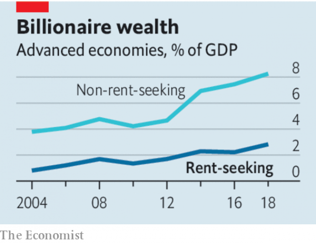

###### Squeezing the rich

# Billionaires are only rarely policy failures 

 

> print-edition iconPrint edition | Leaders | Nov 9th 2019 

BASHING BILLIONAIRES is gaining popularity—especially among candidates to be America’s president. Elizabeth Warren wants to take up to 6% of their wealth in tax every year. Bernie Sanders says they “should not exist”. “Every billionaire is a policy failure,” goes a common left-wing slogan. In Britain’s election, too, the super-rich are under fire. Jeremy Corbyn, the leader of the Labour Party, says that a fair society would contain none. On October 31st he vowed to “go after” Britain’s plutocrats, singling out five individuals and bemoaning a “corrupt system”. 

Left-wingers blasting inequality is nothing new. But the idea that vast personal fortunes are made possible only when government goes wrong is a more novel and serious idea. It is also misguided. Personal wealth is at best an unreliable signal of bad behaviour or failing policies. Often the reverse is true. 

The left’s charge is based on a kernel of truth. When competition is fierce and fair, persistently high profits should be difficult to sustain. Yet on both sides of the Atlantic too many companies crank out bumper profits in concentrated markets. Some billionaires have thrived where competition has failed. Facebook and Google dominate online advertising; Warren Buffett likes firms with “moats” that keep rivals out. Meanwhile America’s political system is riddled with lobbyists cheerleading for incumbents. About a fifth of America’s billionaires made their money in industries in which government capture or market failure is commonplace (see article). 

Yet many others operate in competitive markets. The retailers owned by Mike Ashley, one of Mr Corbyn’s targets, are known for low prices and ruthless competition (as well as questionable working conditions), not rent-seeking. For every Mark Zuckerberg, the boss of Facebook, there are several technology entrepreneurs with lots of rivals. Think of Anthony Wood, who created Roku, a video-streaming platform; or Tim Sweeney, co-founder of the firm behind “Fortnite”, a video game. Nobody can seriously accuse these innovators of having sewn up their markets or of depending on state favours. The same goes for sportsmen such as Michael Jordan or musicians like Jay-Z, billionaires both. Even hedge funds face ferocious competition for investors’ funds, which is why so many are throwing in the towel. 

When capitalism functions well, competition whittles profits away for some but also produces them for others as entrepreneurs seize markets from sleepy incumbents. Their success will eventually set off another cycle of disruption, but in the meantime fortunes can be made. The founders of MySpace, a social-media website, got rich when they sold it to News Corp; Facebook subsequently ate its lunch. Blockbuster, a video-rental store, helped make Wayne Huizenga a billionaire; then Netflix arrived. This process creates vast benefits for society. According to estimates by William Nordhaus, an economist, between 1948 and 2001 innovators captured only 2% of the value they created. Perhaps that is why billionaires are tolerated even by countries with impeccable social-democratic credentials: Sweden and Norway have more billionaires per person than America does. 

 

Taxes should be levied progressively. But that does not justify limitless redistribution or punitive levies. Ms Warren’s proposed wealth tax has already doubled once during her campaign. Thomas Piketty, an economist behind many of the most-cited inequality statistics, wants a wealth tax of up to 90% on the richest billionaires. Such expropriation would surely chill incentives to innovate and to allocate capital efficiently. An economy with fewer entrepreneurs might have fewer billionaires but would ultimately be less dynamic, leaving everyone worse off. 

Wealth is worrying when it becomes entrenched or shielded from disruptive forces. Where that decay has set in, governments should tackle it directly. Whatever Mr Corbyn says, Britain is hardly corrupt by global standards—bribery is rare, for example. But it does have a problem with inherited wealth, the source of one-fifth of billionaires’ fortunes. Higher inheritance taxes would be welcome there and in America, where it is too easy to pass wealth between the generations. 

A broader agenda of attacking rents while maintaining dynamism would weaken excessive intellectual-property and copyright protections, which often last too long. (Selling Lucasfilm more than three decades after the first “Star Wars” film should not have netted George Lucas $4bn.) It would shake up antitrust enforcement to promote competition in old and new industries alike. Most important, it would fix America’s campaign-finance laws to rid its political system of corporate capture at both state and federal level. 

Doing all this would achieve much more than an indiscriminate attack on the rich—and without the associated damage. By all means, correct policy failures. But billionaires are usually the wrong target.■ 

