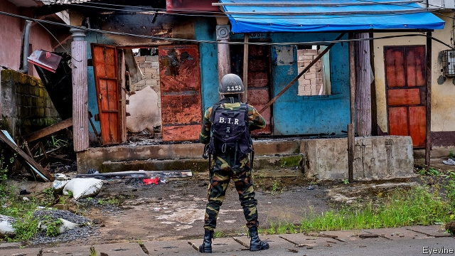

###### Words and weapons

# How to stop Cameroon collapsing into a full-fledged civil war 

 

> print-edition iconPrint edition | Leaders | Nov 9th 2019 

FOR 37 YEARS one man has ruled Cameroon, a staggeringly corrupt, oil-rich state in central Africa. President Paul Biya is an old-fashioned autocrat. When democracy swept across Africa after the cold war ended, he called it a “distasteful passing fetish”. Then he realised he would attract less foreign criticism if he quietly intimidated opponents and rigged elections instead of banning them. He has done so ever since, and kept on good terms with Western powers by posing as a champion of stability in a fissile region. His troops, trained and equipped by France, Israel and America, battle the jihadists of Boko Haram and Islamic State around Lake Chad. They also regularly don blue helmets to keep peace in countries such as the Central African Republic. Yet Mr Biya cannot keep the peace at home. 

Instead, a country that was once seen as an exporter of security is now being wrenched apart. A secession struggle rages in its English-speaking regions. Government forces are burning villages, shooting young men and raping women (see article). The conflict has killed thousands and forced more than 500,000 people from their homes. 

The strife began as a series of peaceful protests in 2016. Anglophones were aggrieved at their marginalisation in a country dominated by French-speakers. Cameroon is too rigidly centralised to satisfy minorities: only 1% of government spending is locally controlled, compared with more than 50% in neighbouring Nigeria. Strikes and demonstrations over the erosion of English-style common law and the dominance of Francophone officials have since mutated into what looks like a civil war. It could get much worse, as chaos grows, armed separatists kill and soldiers inflict horrors on civilians. 

The outside world has barely noticed this disaster unfolding. Appeals for emergency assistance have attracted less than one-fifth of their target: less than half the people who have lost their homes have been given the two pieces of plastic and rope that make up the UN’s shelter kit. Cameroon’s main backers have looked away, hoping Mr Biya’s government would quell the rebellion and get back to fighting jihadists in the Sahel. Instead of corralling the warring parties, the African Union and UN Security Council have stood aside, rousing themselves only to “welcome” and “praise” Mr Biya’s “national dialogue”, a sham to which key separatist leaders were not invited. 

This is a disgrace. The conflict, although bloody, is not intractable. Most people in Cameroon’s two English-speaking regions are probably moderate and would be happy with some more autonomy and an end to the fighting. They could find common ground with those on the government side who might be willing to give a bit more power to the regions. 

The longer the fighting persists, the harder it will be to resolve. With the army and separatists in stalemate on the battlefield, peace can come only through talks. For those to happen, both sides need to build trust. The separatists should start by lifting the ruinous ban they enforce on children going to government schools in the areas they control, which threatens to create a lost generation of illiterates. Rebel leaders abroad should tone down their inflammatory talk of secession. The government should release political prisoners and prosecute soldiers responsible for abuses. 

Outsiders should press Mr Biya to make peace. President Donald Trump has rightly scaled back military assistance because of atrocities committed by the army. He has also kicked Cameroon out of a programme which grants duty-free access to the US market to African countries that respect human rights. European governments should also turn the screws, especially France, Mr Biya’s closest ally. The ageing strongman once said that only one-party rule could hold Cameroon together. In fact, his overcentralised autocracy has created pressures that could blow it apart. Only dialogue and devolution can save it. ■ 

