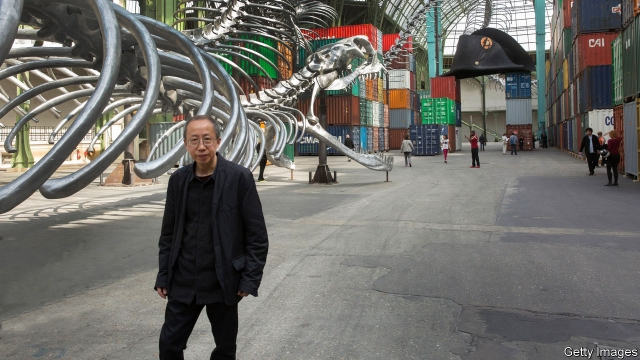

###### Giant of the Chinese avant-garde

# Obituary: Huang Yong Ping died on October 20th 

 

> print-edition iconPrint edition | Obituary | Nov 9th 2019 

CREEPY CRAWLIES intrigued him. Beetles, centipedes, cockroaches, crickets, geckos, toads and snakes. The way they devoured each other while at the same time providing sustenance for their fellow creatures was symbolic of humans’ existence on Earth, he felt, and he poured them into “Theatre of the World”, one of his best-known works. Best of all were the snakes. Where the River Loire empties into the Bay of Biscay in his adopted France, you can see one of his colossal shimmering serpents emerge from the water as the tide recedes; at times it looks like a sea snake, at others an earthly reptile. He made one for the Shanghai Power Station of Art, and another for a show in Queensland, Australia. Both were skeletons of creatures big enough to have devoured others, yet it was their own flesh that had withered to nothing. In 2016 he made his biggest serpent yet, a 254-metre-long beast (pictured) that coiled and roiled over islands of sea containers stacked around the nave of the Grand Palais in Paris, its unhinged jaw open so wide it looked as if it could swallow the world. 

The chaos of power, the fragility of empires, the tottering precariousness of globalisation—devour or be devoured—these were the themes he returned to again and again. Nothing was certain, save for uncertainty. In the West the snake was temptation, sexuality, the crusher of children. In China it represented good luck, prosperity and rebirth in its ability to shed its skin. As an artist, Mr Huang loved its multiple symbolisms; as a philosopher, he found himself drawn to its ambiguities. His artistic ideas were a fusion of East and West, ever more so as he grew older. 

And yet that connection might never have been formed had he not been displaced himself. On May 18th 1989, the day the Chinese government made the secret decision, implemented 48 hours later, to impose martial law and crush the protests in Beijing’s Tiananmen Square, he was in Paris, 10,000km from his home town of Xiamen. It was the same day that “Magiciens de la Terre” opened at the Pompidou Centre. The original global contemporary-art show, “Magiciens” showed Western artists for the first time alongside artists from across the world, and changed art history forever. Mr Huang was the first Chinese artist chosen to take part. 

He had left China shortly before with little other than the skipping rope he always carried in his pocket. After “Magiciens” he was advised it would not be safe to go home, so he stayed on in France, squatting in cheap artists’ studios, living on grants and residencies offered by friendly curators and travelling on a laissez-passer from the French foreign ministry. The seventh of eight children of a middle-class family of tea merchants in Fujian who, like many Chinese, lost their business when it was nationalised after the Communists took control in 1949, and whose schooling was disrupted by the tumult of the Cultural Revolution, he was used to being self-sufficient. He carried everything he needed in his head. He had absorbed Zen Buddhism and Taoist cosmology and magic as easily as he would later read Foucault and Wittgenstein; books were the only thing he liked to spend money on. 

He had learned early on about Duchamp and the Dadaist movement through a few photocopied pages of a Taiwanese version of Pierre Cabanne’s “Dialogues with Marcel Duchamp”, which convinced him that art could not be detached from real life, but should instead take a stand on everything. When he revolted against the painting curriculum at the Zhejiang Academy of Fine Arts and was told to be a high-school teacher rather than an approved artist, he founded Xiamen Dada, a revolutionary artists’ co-operative. In 1986 the group put on an exhibition of their recent work, some of which, inspired by Duchamp, was made of objects they had found in the street. At the end of the show, the group set their artworks on fire, believing that only destruction would prove that it was the ideas rather than the objects that were the real works of art. 

Mr Huang was lucky to come of age just as the Chinese avant-garde, known as the ’85 New Wave, was taking off. He was lucky too to fetch up in France, where artists and artistic theories were part of mainstream culture. In 1999 he represented France at the Venice Biennale, and on the day it opened Catherine Trautmann, the culture minister, handed the artist his first French passport. Becoming French cost him his Chinese citizenship and should logically have made him persona non grata in China. Yet the opposite proved true. 

In 2000 he returned home for the first time in over a decade. Where once his works were collected almost exclusively by Western buyers such as François Pinault and Bernard Arnault, now he was sought out by Chinese museums, including M+, which will open in Hong Kong next year, and the Red Brick Art Museum on the outskirts of Beijing. Like the serpents he loved making, he was able to slip silently across frontiers, making works that were deeply political yet never dissident. For the 2000 Shanghai Biennial, he created “Bank of Sand, Sand of Bank”, a 20-tonne replica of the British-designed former HSBC Bank, which became a Communist government building after 1949 and in the 1990s was the headquarters of the Pudong Development Bank. Made of sand, thinly laced with cement, the work was designed to crumble away. In France it was seen as a critique of dog-eat-dog capitalism; in China as a comment on the weak heart of colonialism. He revelled in the ambiguity, which is why when he died suddenly of a brain haemorrhage, both France and China claimed him as their own.■ 

