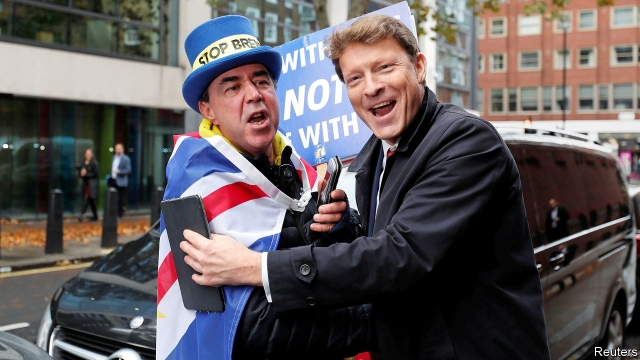
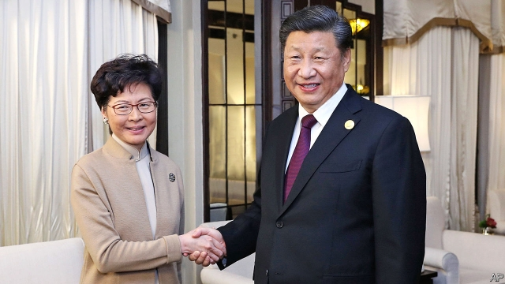

###### The future of the EU

# Politics this week 

 

> Nov 9th 2019 

As the British general election campaign officially got under way a stream of MPs announced they would not stand again. So far over 70 have stepped down, more than twice the number who chose not to face the electorate in 2017. More than 60 of those supported Remain, and most represented constituencies that voted for Brexit. The Conservatives’ campaign got off to a bad start, with the resignation of a cabinet minister. Polls still give them a double-digit lead over Labour. See article. 

John Bercow stood down as Speaker of Britain’s House of Commons after ten years in the chair. Mr Bercow was known for crying “orderrrr!” and breaking parliamentary conventions. His replacement, Sir Lindsay Hoyle, has hinted at a return to convention and decorum, promising that he will wear the Speaker’s wig “on traditional days”. See article. 

In an attempt to show voters that the government is prepared to toughen up immigration policy, France’s prime minister, Édouard Philippe, announced plans to clear out some migrant tent-camps, as well as to impose quotas for migrant workers and limit migrant access to non-urgent health care. 

A much-hyped Brazilian auction of rights to drill for offshore oil was a disappointment. Two of the four deepwater deposits got no bids at all. Observers blamed the high fees set by the government, and uncertainty about the future of both Brazil’s policies and global oil demand. 

Colombia’s defence minister said he would resign amid accusations that the army has committed atrocities. One senator accused the minister of covering up the alleged bombing of a guerrilla camp in which children were killed. 

A drug gang murdered nine members of a Mormon family in Sonora, a state in northern Mexico. Six children and three women died, perhaps because the killers mistook them for rivals. The LeBaron family broke away from the mainstream Mormon church and settled in Mexico in the early 20th century. The victims were American citizens. 

Iran took another step away from the nuclear deal it signed in 2015 by injecting gas into centrifuges at its Fordow facility. The devices could produce enriched uranium to be used for nuclear energy or, if highly enriched, a bomb. Iran said it would reverse the move if the deal’s other signatories—Britain, China, France, Germany and Russia—provide economic relief. See article. 

Anti-government protests continued in Iraq and Lebanon. Demonstrators in both countries are seeking big changes to political systems dominated by an old elite and riddled with corruption. In Iraq the authorities have responded with violence. More than 260 people have been killed since the unrest began last month. Adel Abdul-Mahdi, the prime minister, has said he is willing to resign if a replacement is found. 

The government of Yemen reached a power-sharing deal with southern separatists. The two are meant to be on the same side in a civil war that pits the Saudi-backed government against Houthi rebels, but they have been fighting each other recently. Saudi Arabia, which hosted the talks, said it hoped the deal would lead to a broader agreement ending the war. 

America’s Justice Department charged two former employees of Twitter with supplying personal information on dissidents to Saudi Arabia. 

Jihadists linked to Islamic State killed more than 50 soldiers in Mali in an attack on an army base, a month after a similar assault in which more than 40 soldiers were killed. The two attacks are among the worst since 2013, when French forces pushed jihadists out of the towns in the north of Mali. 

The International Criminal Court sentenced a former rebel chief in the Democratic Republic of Congo to 30 years in prison for war crimes. Bosco Ntaganda was known as “The Terminator”. His army forcibly recruited children and committed mass rape. His sentence was the longest yet imposed by the court. 

 

In the 22nd consecutive weekend of unrest in Hong Kong, protesters attacked the office building of Xinhua, a news agency owned by the Chinese government. A Chinese newspaper, Global Times, accused them of deliberately provoking the mainland’s authorities. Xi Jinping met Hong Kong’s embattled chief executive, Carrie Lam, in Shanghai and reiterated his support for her. See article. 

Deadly smog engulfed much of northern India, thanks in part to farmers burning stubble and to revellers letting off firecrackers to celebrate Diwali, a Hindu holiday. The government of Delhi closed all the city’s schools and instituted sweeping measures to limit traffic, to little avail. 

An attack on a checkpoint in southern Thailand killed 15 people; it was the worst in the region for years. The attackers were militants fighting what they see as the oppression of ethnic Malays in Thailand. 

Rodrigo Duterte, the president of the Philippines, put the vice-president, Leni Robredo, in charge of his campaign against drug dealers, during which thousands of suspects have been summarily shot dead. The president and vice-president are elected separately in the Philippines, and Ms Robredo is a staunch critic of Mr Duterte. 

America formally notified the UN of its intention to withdraw from the Paris agreement to combat climate change, through which countries have pledged (with varying degrees of sincerity) to cut greenhouse-gas emissions. The Trump administration argues that the accord would hurt American businesses. The decision can be undone if a Democrat wins the presidential election. 

Elizabeth Warren, one of the leading candidates to be the Democratic presidential candidate, unveiled details of her ambitious health-care plan. Ms Warren wants to spend $20.5trn over a decade to transform America’s private market for health insurance into a government-run programme. To raise this extraordinary sum, she would hike taxes, especially on companies and the rich. See article. 

Beto O’Rourke dropped out of the Democratic race. Once the darling of the left, Mr O’Rourke struggled to make an impact in a crowded field. 

The Democrats did well in a smattering of elections, winning the governor’s race in Kentucky and taking control of the state legislature in Virginia for the first time in 20 years. The Republicans held on to the governor’s mansion in deep-red Mississippi. See article. 

