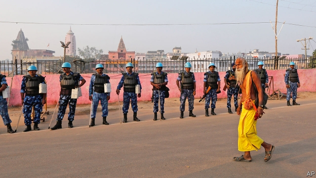

###### Ram rod

# The Supreme Court hands India’s biggest communal flashpoint to Hindus 

 

> print-edition iconPrint edition | Asia | Nov 16th 2019 

IT WAS A decision that had been decades in the making, yet was still a messy fudge. On November 9th India’s Supreme Court granted Hindus possession of a site in the city of Ayodhya that is claimed as the birthplace of Rama, an incarnation of the god Vishnu. A 16th-century mosque had stood there until a fanatical mob demolished it in 1992, sparking a decade of sporadic nationwide violence that left several thousand dead, most of them Muslims. The court called the demolition “an egregious violation of the rule of law”. It also fulfilled the mob’s goals by ordering the government to create a trust that may build a Hindu temple on the site. Muslims are to be compensated with land nearby for the construction of a replacement mosque. 

Fears that the verdict would spark renewed violence had prompted schools and offices to close in parts of northern India, amid security precautions that included colossal police deployments, instructions to media to avoid incitement and the suspension of the internet in parts of the country. Politicians of all stripes, as well as spiritual leaders of both faiths, called for calm and acceptance of the court’s verdict. But simple exhaustion with the dispute, which has festered for nearly as long as India has been independent, may have been the main reason for the generally muted public response. 

It helped, too, that the five judges on the Supreme Court bench ruled unanimously. Aside from offering five acres (two hectares) of land in compensation for the 2.8 lost, their ruling gave solace to Muslims through the indignant language it used to describe the destruction of the Babri Masjid. That may inject some energy into the separate criminal trial of Hindu nationalist leaders charged with provoking the attack on the mosque, which has lingered in lower courts for decades. 

Zafaryab Jilani, a lawyer for the Muslim plaintiffs, said they would respect the ruling, but were “not satisfied” and noted “several contradictions” in the judges’ logic. It is hard to understand why the Muslim charity that ran the mosque before its demolition would not be considered the owner of the land on which it stood. “The court seems to set great store in a lack of documentary evidence that prayers were held in the mosque before 1857, yet finds no trouble in the lack of evidence that any Hindu services were held there, either,” says a lawyer who prefers to remain anonymous, owing to the sensitivity of the case. Commentary on social media has been less circumspect. “Possession is nine-tenths of ownership, but demolition is the whole thing,” read one sarcastic tweet. “Realised today that ‘If you break it, you own it’ applies outside of retail as well!” another disgruntled netizen quipped. 

Most Indians, however, seem broadly relieved that the saga has finally come to an end. Shekhar Gupta, an experienced and canny commentator, described the ruling as “wonderfully nuanced” and predicted it would put the controversy to rest. The opposition Congress party welcomed the court’s judgment. It not only opens the way for construction of a temple, said Randeep Surjewala, a party spokesman, but also prevents the ruling Bharatiya Janata Party (BJP) and its Hindu chauvinist allies from seeking to capitalise on the issue any more. 

Perhaps, but for now prime minister Narendra Modi and his party are basking in satisfaction. The promise to build a giant temple at the purported site of Lord Rama’s birth has been a rallying cry for Hindu nationalists since the 1980s, and a fixture of the BJP’s election manifestos since 1996. Having won a second five-year term in May by a landslide, Mr Modi has fulfilled a string of promises to his Hindu nationalist base, including splitting Jammu & Kashmir, India’s only Muslim-majority state, into two parts, and stripping it both of its special status under the constitution and of statehood. 

Will this triumphant end to the BJP’s long crusade now allow the prime minister to focus on more pressing issues, such as a faltering economy? And will it cool the fervour of Hindu extremists enough to soothe communal relations, which have grown increasingly strained under Mr Modi? Some Hindu hardliners are already pushing for more, claiming that other mosques, and even perhaps the Taj Mahal, the famous tomb of a Muslim emperor and his wife, are built atop ancient temples. Happily, the likelihood of mobilising a large chunk of Hindu opinion in support of a fresh agitation is probably limited. The campaign to demolish and replace the Babri Masjid began 70 years ago with the surreptitious planting of a Hindu idol in 1949. The ensuing lifetime of strife is not a price that many Indians will be willing to pay again. ■ 

