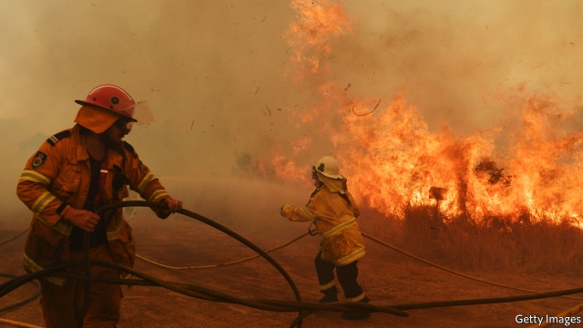

###### Spring flames

# Unprecedented Australian bushfires stoke a debate about climate change 

 

> print-edition iconPrint edition | Asia | Nov 16th 2019 

EVEN FOR A country accustomed to bushfires, the scenes look apocalyptic. Swathes of eastern Australia have burned. As The Economist went to press, more than 129 fires were raging in the states of New South Wales and Queensland. Together they have swallowed more than 2.5m acres (1m hectares), producing smoke so thick that it can be seen from space. At least 200 homes have been incinerated and four people killed in the inferno. 

Never before have bushfires struck Australia on such a scale. Many people have been surprised by their ferocity. The blazes have reached the outer suburbs of Sydney, a city of over 5m people (the police are investigating whether some of the fires that threatened it were lit on purpose). They were also edging towards Noosa, a popular beach resort in Queensland, where residents were evacuated. “We are used to floods, not flames,” says Denise Knight, the mayor of Coffs Harbour, a city on the northern coast of New South Wales, close to one of the biggest blazes. 

Bringing such fast-moving fires under control is difficult and dangerous. Firefighters have flown in from other parts of Australia and from New Zealand to help battle the conflagration. The armed forces have deployed helicopters. Schools have been closed, as evacuation centres fill up. Houses are being doused in a pink potion that slows the advance of flames. But firefighters fear the worst is not over. 

The kindling was laid by the drought that has been ravaging eastern Australia for two years. It has killed trees and dried turf which would normally be too damp to burn, creating what Martin Rice of the Climate Council, an NGO, calls “tinderbox conditions”. The fires have been fanned by strong winds and scorching temperatures. In New South Wales, 300 new blazes started on November 12th alone—“and it isn’t even summer yet”, observes Matt Sun of the state’s Rural Fire Service. 

Such horrors are looking ever less like an anomaly, however, and more like the rule. Fire seasons, once confined to the hot summer, are growing longer—something many scientists ascribe to climate change. Average temperatures in Australia have risen by over 1°C since 1910. Heatwaves are increasingly common and winter rains are becoming less heavy. This is a recipe for infernos, says Mr Rice. Many Australians worry about such changes. Claire Pontin, deputy mayor of New South Wales’s MidCoast Council, has seen her “damp, green land transform in a matter of years”. Her council declared a climate crisis weeks before the fires started closing in. 

The conservative government coddles Australia’s coal industry, however. It attacked the opposition Labor Party’s plans to cut emissions at elections earlier this year and won. The prime minister, Scott Morrison, has refused to say whether a link may be drawn between the fires and climate change. Instead he has offered “thoughts and prayers” to the victims. 

Other members of his coalition are more vociferous. A former deputy prime minister, Barnaby Joyce, reasoned that Greens were partly to blame, since they have campaigned against controlled “back-burning”, which clears the bush of dried-out undergrowth. “We’ve had fires in Australia since time began,” said his successor, Michael McCormack. He dismissed attempts to link them to global warming as “the ravings of some pure, enlightened, woke capital-city greenies”. ■ 

