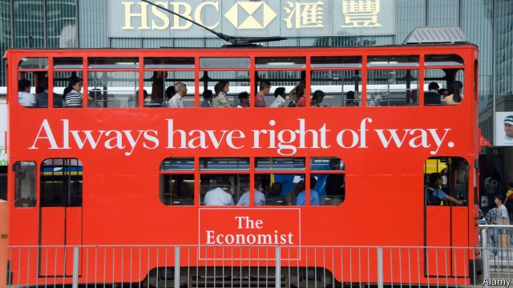

###### A severe contest

# Has The Economist made history, as well as reporting it? 

 

> print-edition iconPrint edition | Books and arts | Nov 14th 2019 

Liberalism at Large: The World According to the Economist. By Alexander Zevin. Verso; 544 pages; $34.95 and £25. 

“I AM NOT a dedicated reader of The Economist,” confessed Roy Jenkins, a British statesman who died in 2003; it is “essentially a journal for foreigners”. Luckily for the newspaper, most people are foreigners. This may be one reason why it thrives at the age of 176, with a larger print circulation than it had before the internet. 

According to Alexander Zevin, a historian at the City University of New York, The Economist is not merely a spectator of global affairs but an actor in them. It “shaped the very world its readers inhabit”, because of its links to politicians and financiers. “Liberalism at Large: The World According to the Economist” is based on his doctoral dissertation, which examined the weekly from its birth in 1843 to 1938. It supplements and updates Ruth Dudley Edwards’s more-or-less official account, “The Pursuit of Reason: The Economist 1843-1993”. 

Yet the two authors tell very different tales. Ms Dudley Edwards identified The Economist’s creed as the belief that governments are more imperfect than markets. Mr Zevin is more oblique. He aims to present the annals of The Economist as “a history of liberalism”. The paper, he argues, has been guided by “the universal virtues of capital and…necessities of empire”. Since this brand of “liberal” thought has, he says, been the most consequential one, The Economist’s history is also that of “actually existing liberalism”—a nod to a Marxist term for the ugly realities of capitalism. 

Ms Dudley Edwards thought The Economist’s main defects were “arrogance, priggishness, absence of doubt, frequent failures of imagination and too-clever-by-halfery”. Mr Zevin’s judgment is harsher. The result of following The Economist’s advice about the Irish famine of the 1840s was “on par with the better-known holocausts of the twentieth century”. A decade later, the paper was “just as ruthless with Indians as with the Irish or Chinese”. And after championing light regulation in the late 20th century, its response to the crash of 2008 was “breathtakingly unrepentant”. Mr Zevin does not actually say the post-war Economist has been a market-fundamentalist lickspittle of Western intelligence agencies, but that is the politely expressed drift. 

If The Economist has ever got anything right, readers don’t hear much about it. Nor is there much acknowledgment that markets ever work—for example, by delivering a seismic drop in global poverty since the 1980s. A parodic gibe at globalisation’s critics from an editorial in 2003 springs to mind: “Show us an economic miracle, and we will show you the failure of capitalism.” 

Given its heartless perfidy, it is perhaps odd that The Economist is read by anyone outside the ermined ranks of “the aristocracy of finance”, to quote Marx’s description of its audience in 1852. Yet it is. And according to the Pew Research Centre, an American think-tank, its readership in its largest market skews left. Pew classifies 18% of American readers as mostly or consistently conservative, and 59% as mostly or consistently “liberal” (in the American sense, left-wing in the British one). 

“Ideas have mattered most” to The Economist’s success, Mr Zevin believes. That is questionable. Engaging with its editorials is no doubt part of its appeal. Yet they account for only around 5% of articles; what most distinguishes the rest is their way of dealing with the news. Brevity abounds. So do charts. Dispatches from 21 foreign bureaus are, in a good week, put in a global and historical context. There are, in short, more facts per square inch than in perhaps any other weekend reading matter. 

Mr Zevin is not the first to tie himself in knots trying to define liberalism. The Economist sometimes does the same. He is to be thanked for a critique of the paper which, though skewed, pays it the compliment of taking it very seriously. ■ 

Anthony Gottlieb We identify the reviewers of books connected to The Economist or its staff. Anthony Gottlieb worked at the paper from 1984 to 2006 and is the author of a multi-volume history of philosophy. 

