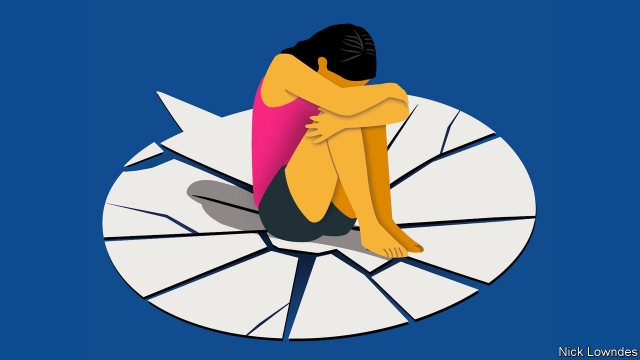

###### Johnson

# How to talk about unspeakable things 

 

> print-edition iconPrint edition | Books and arts | Nov 14th 2019 

IT IS A cliché that three topics should stay off-limits in polite company: politics, religion and sex. But there are times for hard conversations, and the language used to talk about sex, and particularly sexual misdeeds, remains wrapped in a gauze of misdirection and euphemism that risks contributing to harm, even when intentions are good. 

A recent case in Barcelona illustrates the power of language. Five men who gang-raped an unconscious 14-year-old girl were convicted of mere “sexual abuse”—not the graver “sexual assault”, because technically they had not used violence or intimidation, as required by the statute. 

The furious protesters who turned out in Barcelona and other cities were not angry about the court’s leniency per se: the rapists received fairly long prison sentences. Rather they are demanding that the law be changed so that “sexual assault” reflects the absence of consent, rather than the use of force. In other words, they are asking politicians to redefine that term.  

There is an irony in their protest. Demonstrators shouted “No es abuso, es violación” (it’s not abuse; it’s rape). But the Spanish word “violación” itself clearly displays its etymological link to “violence”, the lack of which was at the heart of the controversy. Other European languages also reflect a historical belief that rape is, by definition, violent: Vergewaltigung in German includes Gewalt, violence, for instance. 

Or consider the English word. Coming from Latin rapere, its oldest sense involves neither sex nor bodily harm; it means to take something by force (as in the adjective, “rapacious”). This represents the attitude of many centuries in which rape was considered a property crime against a husband or father, robbing them of a woman’s virginity or chastity, which were the father’s to give away to a spouse. It was not something done to the woman herself. 

Fortunately, feminists long ago succeeded in placing the woman’s experience at the heart of the matter. But “rape” is now such a powerful and painful word that English-speakers have developed a hazier vocabulary to talk about and around it instead. “Sexual assault” rose in prominence in the 1970s. Its adoption reflected the fact that there were many ways to commit, and experience, traumatic sexual violence; the kind that could rob a woman of her virginity was only one, and need not always be privileged over others. Numerous American states and Canada, for example, no longer have a crime called “rape” on the statute books, but rather varying degrees of sexual assault. 

The breadth of the label “sexual assault” has its uses—for example, when statisticians want to aggregate different offences. It can convey the sense of violation that comes with all its manifestations. It gives women who have suffered different kinds of harms an umbrella of solidarity. Finally, victims who use “sexual assault” may themselves not want to be more specific. 

But there are unintended consequences. Sexual assault is usually defined (for example, by American and British authorities) as sexual contact without consent. This means that the gamut runs widely, from groping to the most savage rapes. That can make it hard for those not directly involved to understand the gravity of individual cases. It might even let the most vicious rapists take advantage of a perception that perhaps they committed a lesser crime. 

And the old words are often the most powerful. Activists have berated newspapers which reported that Jeffrey Epstein, a disgraced and now-dead financier, “cavorted” with “underage women”; he raped and trafficked teenage girls. Similarly, some want to ditch the term “child pornography”, since it refers to a heinous criminal enterprise, not consenting performances as in the adult kind. It sometimes seems people cannot talk about sexual violence except in terms adapted from consensual relations. 

Now feminists are saying “we need to talk about rape”, as Deborah Cameron, a linguist, does in a recent post on her blog, “Language: a feminist guide”.Applying the right vocabulary to a crime will not curtail it, but the abstractions and legalese common in the media and politics can drain the task of urgency, by making the scourge seem less acute. Just as “murder” should not be routinely dressed up as “homicide”, nor “torture” consigned to the catch-all bin of “human-rights abuses”, so it is with the vocabulary of sexual abuse. It is hard to tackle a problem you are afraid to name. 

