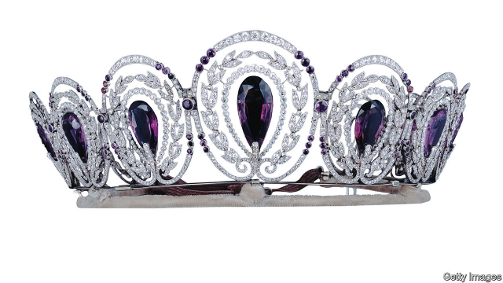
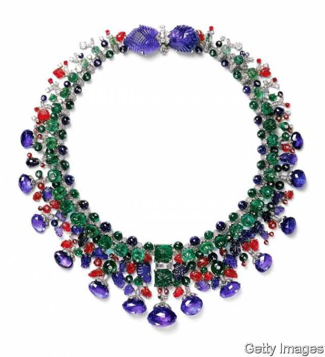

###### Diamond geezers

# The glittering rise of the Cartiers 

 

> print-edition iconPrint edition | Books and arts | Nov 14th 2019 

The Cartiers. By Francesca Cartier Brickell. Ballantine Books; 656 pages; $35. 

BY THE AGE of 40, Louis-François Cartier had not only risen from poverty to open his own jewellery shop in Paris, he had seen it through revolution and a coup d’état, economic doldrums and a fire. Fiscal prudence and pragmatism were vital virtues, he considered, and he instilled them in his son and grandsons. He also imparted a less routine lesson: “Be very kind.” 

Francesca Cartier Brickell—Louis-François’s great-great-great-granddaughter—has drawn on a forgotten cache of family correspondence to string together a dynamic group biography studded with design history and high-society dash. Its stars are the founder’s grandsons, who, during the first half of the 20th century, transformed Maison Cartier into an international luxury brand with a clientele as glittering as its bejewelled wares, pulling off feats of social climbing as they went. 

The brothers faced their own challenges, including two world wars, the Great Depression and an inexorable drift towards more casual fashions. Their strength lay in their closeness and complementary talents. Louis, the eldest, could be hot-headed: he once challenged a Rothschild baron to a duel over a snub. But his creativity fuelled innovations such as the use of platinum for more delicate settings and Cartier’s famous “mystery clocks” (their hands appeared to hover in thin air as if “woven from moonbeams”). J.P. Morgan was a fan. 

Pierre, meanwhile, had an innate grasp of markets and motivation. He allowed undecided clients to take jewels home with them for a few days, confident that they would find it hard to return them—even when the piece in question was the legendary Hope Diamond. In 1916 he traded a pearl necklace for the town house on Fifth Avenue that remains the company’s American headquarters. The youngest brother, Jacques, who had yearned to become a Catholic priest, travelled to India and the Persian Gulf, expanding the firm’s reach. 

 

From gem-hunting expeditions to a heist, theirs is a dramatic saga. It is further enlivened by the jewel-encrusted maharajahs, mistresses and movie stars who paraded through the Cartier showrooms. For sheer zaniness, the most memorable is Alberto Santos-Dumont, the Brazilian coffee heir and aviation nut who held aerial dinner parties (waiters had to be agile), and bar-hopped across fin de siècle Paris in a tiny airship. He later inspired Louis-François to pioneer wristwatches—previously a feminine accessory—for men. 

The jewels themselves are stupendous: gems the size of birds’ eggs, rope upon rope of perfectly matched pearls, whimsical creations such as the panthers that became synonymous with the Duchess of Windsor. Ms Cartier Brickell is alert to their diverse connotations, from love letter to grovelling apology to glaring status symbol. In occupied France, a brooch depicting a caged bird sat as a protest statement in Cartier’s flagship shop in Rue de la Paix. For all that, as many an exiled Romanov princess came to appreciate when forced to sell her purchases back to Cartier, a jewel is first and foremost a portable store of wealth. 

What took three generations to build was quickly dismantled by a fourth. Cartier passed from the founding dynasty’s hands in the 1960s and 1970s, but the jewellery created under the brothers still surfaces at royal weddings and auctions, where it often smashes reserve prices. (At Sotheby’s in London in 2010 Wallis Simpson’s panther bracelet became the world’s most expensive bangle.) It is tempting to look back on the firm’s heyday as a more graceful era; yet as Ms Cartier Brickell intimates, the only real difference between the excess-loving courtesan or scheming Gilded Age hostess who was the first owner of a Cartier bauble, and the reality-television star who snaps it up at auction, is an Instagram account. 

Not that the author dwells on the comparison; discretion is among the ways in which her meticulous, elegantly wrought narrative bears the Cartier hallmark. She is also kind to her subjects, a quality as beneficial in storytelling as Louis-François found it to be in business. ■ 

