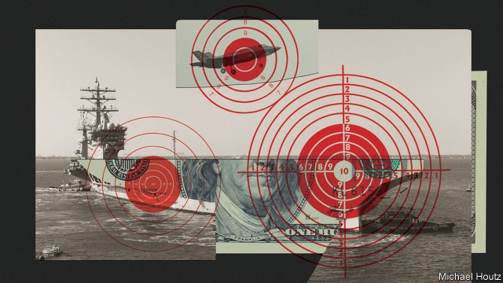
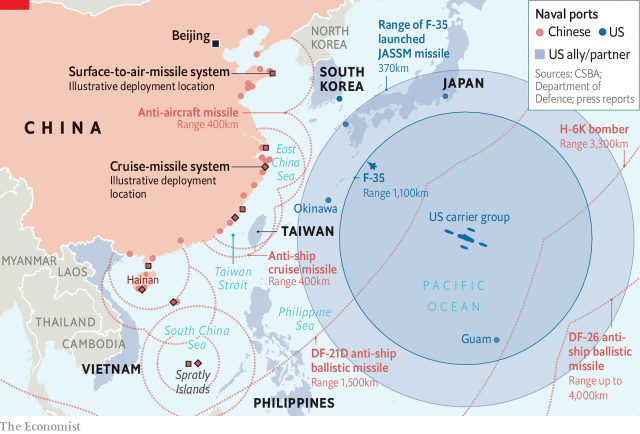
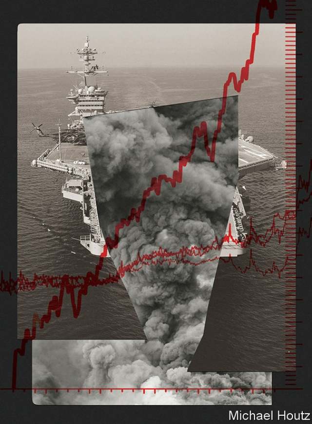

###### Military kit

# Aircraft-carriers are big, expensive, vulnerable—and popular 

 

> print-edition iconPrint edition | Briefing | Nov 16th 2019 

IN 2016 THE Admiral Kuznetsov, Russia’s sole aircraft-carrier, spluttered north through the English Channel belching thick black smoke. She was returning from an ignominious tour of duty in the Mediterranean. One of the 15 warplanes with which she had been pounding Syria had crashed into the sea; another had lurched off the deck after landing. When she finally docked near Murmansk a 70-tonne crane smashed into her deck. 

The hapless Kuznetsov “is largely a white elephant with no real mission,” in the words of Michael Kofman, an expert on Russia’s armed forces. So why bother paying for the refit she has been undergoing ever since? “For the appearance”, says Mr Kofman, “of being a major naval power.” 

Floating runways have signified naval seriousness for most of the past century. Originally seen as a way to provide air cover for other ships, the second world war saw aircraft-carriers and their air wings become the main way that fleets fought with each other. That role was largely lost after 1945, as the Soviet Union was not a naval power; the heart of the cold war lay on central Europe’s plains and in third-world hinterlands. But despite the lack of a high-seas competitor America made its carriers mightier still, using them to establish air superiority wherever it chose. 

Carrier planes flew 41% of America’s combat sorties in the Korean war and more than half of its raids on North Vietnam. In the first three months of the Afghan war in 2001, carrier-based jets mounted three-quarters of all strike missions. Two years later, when Turkey and Saudi Arabia refused to allow their territory to be used for attacks on Iraq, America deployed the combined might of five aircraft-carriers to mount 8,000 sorties in the first month of its invasion. When Islamic State blitzed through Iraq in 2014 the USS George H.W. Bush rushed from the Arabian Sea to the Gulf. For more than a month the only air strikes against IS were launched from its four catapults. 

The 11 supercarriers that America’s navy is required by law to have on its books make it a power like no other, able to fly fighters, bombers and reconnaissance aircraft wherever it likes without the need for nearby allies to provide airbases. The other countries with carriers capable of launching jet aircraft—Britain, China, France, India, Italy, Russia and Spain—make do with smaller and less potent vessels. But their numbers are increasing. Britain, India and China are all getting new carriers ready. Britain is settling for two; India aspires for three; China plans to have six or so by 2035. Japan is joining the club. In December 2018 it announced that it would convert its two Izumo-class destroyers to carry jets. 

Is this fashion for flat-tops well advised? Carriers have long been threatened by submarines. During the Falklands war Argentina’s navy kept its only carrier skulking in port for fear of British submarines. Now they are increasingly threatened above the waterline, too, by ever more sophisticated land- and air-launched anti-ship missiles. To remain safe, carriers must stay ever-farther out to sea, their usefulness dropping with every nautical mile. Missile improvements also threaten the ability of the carriers’ air wings to do what is required of them, nibbling away at their very reason for being. 

“The queen of the American fleet...is in danger of becoming like the battleships it was originally designed to support: big, expensive, vulnerable—and surprisingly irrelevant to the conflicts of the time,” writes Jerry Hendrix, a retired American navy captain. Are the countries devoting vast sums to their carrier fleets making a colossal mistake? And if so, what does that mean for the way America projects its power and protects its allies? 

Americans like their aircraft-carriers large, like their cars and restaurant servings. They also insist on them being good. This makes them very expensive. When it was commissioned in 2017, the 100,000-tonne USS Gerald R. Ford, the first in a new class of carriers, became the priciest warship in history at $13bn. That is about what Iran spends on its entire armed forces each year, and almost twice what the George H.W. Bush, the last of the earlier Nimitz class of carriers, had cost a decade earlier. 

And that is before you sail or fly anything. In 1985, while he was making “Top Gun”, a jingoistic and intriguingly homoerotic paean to naval aviation, Tony Scott, a film director, was told that a single manoeuvre he wanted the USS Enterprise to make in order to get the perfect lighting would cost his studio $25,000. The annual cost of operating and maintaining a Nimitz-class carrier is $726m, not least because each has 6,000 people on board, almost twice as many as serve in the Danish navy. The planes cost a further $3bn-$5bn to procure and $1.8bn a year to operate. 

Thriftier countries do have other options. The 65,000-tonne HMS Queen Elizabeth (“‘Big Liz’, as we affectionately call her,” according to Britain’s defence minister in June), currently exercising with its F-35 jets in the North Atlantic, cost Britain under £5bn ($6.2bn) to build. The next in its class, HMS Prince of Wales, not yet commissioned, is said to be coming in a fifth cheaper. There is also a second-hand market for those willing to accept a few scuffs on the paintwork. China’s debut carrier, the Liaoning, began life as the half-built hulk of the Kuznetsov’s sister ship. It was sold by Ukraine to a Hong Kong-based tycoon for a paltry $20m. He shelled out a further $100m to move it to China. 

Yet even modestly sized carriers will inevitably soak up a good proportion of stretched military budgets. The capital cost of the Ford amounts to less than 2% of America’s annual defence budget; the Queen Elizabeth represents about 15% of Britain’s. General Sir David Richards, who served as Britain’s chief of defence staff from 2010 to 2013, urged the government to cancel the Prince of Wales because “We could have had five new frigates for the same money.” Sir David’s successor, General Nick Houghton, complained in May that Britain would “rue the day” it had splashed out on both. “We cannot afford these things. We will be able to afford them only with detriment to the balance of the surface fleet.” 

It is one thing to be expensive. It is another to be expensive and fragile. In 2006 a Chinese Song-class diesel-electric submarine stalked the USS Kitty Hawk, a carrier, so silently while she was off Okinawa in the East China Sea that the first the Americans knew of it was when it surfaced just about 8,000 metres away. Getting that close would be harder in wartime, when the ships, subs and aircraft around a carrier would be more alert to undersea lurkers. But China is fielding ever more submarines. Modelling by the RAND Corporation has found that Chinese “attack opportunities”—the number of times Chinese subs could reach positions to attack an American carrier over a seven-day period—rose tenfold between 1996 and 2010. 

Submarines do not have to get that close to do harm; they, like surface ships and aircraft, can also launch increasingly sophisticated anti-ship missiles from far afield. China’s H-6K bomber, for instance, has a range of 3,000km and its YJ-12 cruise missiles another 400km. This July, General David Berger, the head of America’s Marine Corps, published new guidelines which acknowledged that long-range precision weapons mean that “traditional large-signature naval platforms”—big ships that show up on radar—are increasingly at risk. 

The most frightening illustration of this threat is a 200-metre platform—roughly the length of a carrier deck—that sits in the Gobi desert. It is thought to be a test target for China’s DF-21D ballistic missile, a weapon that the Pentagon says is specifically designed to kill carriers. The DF-21D is a pretty sophisticated and pricey bit of kit. But Mr Hendrix calculates that China could build over 1,200 DF-21Ds for the cost of just one American carrier. A longer-range version, the DF-26, entered service in April 2018. 

According to a study by CSBA, a Washington think-tank, in future wars American carriers would have to remain over 1,000 nautical miles (1,850km) away from the coastlines of a “capable adversary” like China to stay reasonably safe. Any closer, and they could face up to 2,000 weapons in a single day. 

Carriers are not without defences. Their own aircraft can protect them from incoming bombers. The escort vessels around and below them ward off unfriendly submarines and shoot down incoming missiles. Aboard the USS Carney, a guided-missile destroyer of the sort that escorts carriers, Jamie Jordan, her combat-systems officer, insists that the navy is prepared: “It is instilled in us to train to those worst-case scenarios of saturation attacks.” Among the missiles in its launch tubes are some designed to shoot down incomers. But if faced with missiles launched in salvoes 600 strong, as CSBA suggests, could even the best missile-defence systems keep up? 

What makes things worse is that aircraft range has shrunk just as missile ranges have grown (see chart). The air wings of the Top Gun era had an average range of about 1,700km. The Rafales on board France’s Charles de Gaulle today can still manage something similar. But the F-35s aboard American, British and Italian carriers, designed more for stealth than stamina, can reach nowhere near as far. Even when you add on the 500km range of the JASSM missiles the F-35 is armed with, American carriers attacking China would be well within being-struck range before they got their planes into strike range (see map). In-air refuelling can help, but it cuts the number of sorties a lot. And a repeatedly refuelled F-35 hitting a target almost 4,000km from its carrier could be aloft for 12 hours—the very edge of what its lone human pilot could manage. 

 

This does not mean the age of the carrier is over. “A lot of these [carrier-killing] systems are essentially unproven,” says Nick Childs, an expert at the International Institute of Strategic Studies, a London think-tank. A missile that can fly the distance required is only one part of such a system. You also need eyes that can keep track of the prey. Ground-based radar cannot see targets hundreds of kilometres out to sea. Satellites can help, but they don’t give you data of high enough quality for the necessary precision, says Sidharth Kaushal, an expert at RUSI, another London think-tank. “They can tell you roughly where a carrier is, and possibly its bearing”. Bringing together different sorts of satellite and drone data to update targeting information on the fly will not be easy, not least because the target carrier’s bearing is unlikely to stay steady. Satellites can spot missile launches, too—and the Ford could travel more than four nautical miles in a new direction during the eight minutes it would take a DF-21D to reach it. 

America’s mighty carriers, surrounded by their protective battle groups and watched over by satellites, are more likely to survive a serious assault than the smaller carriers of other nations. This is in part because those smaller nations cannot afford fleets large enough to protect their carriers; trying to do so is already distorting their order of battle. A typical carrier strike group might tie up four or five frigates and destroyers; the Royal Navy only has 19 such ships, the French even fewer. 

Mark Sedwill, Britain’s national-security adviser, says that a shortage of escorts is supportable because in combat the Royal Navy’s new carriers would “inevitably be used in the context of allied operations of some kind” if the threat were high. But, as the defence committee of Britain’s parliament has pointed out, it is not ideal to have flagships the country cannot use on its own: “Operating aircraft-carriers without the sovereign ability to protect them is complacent at best and potentially dangerous at worst.” 

If America is better able to defend its carriers, they are still becoming more vulnerable, and that matters more to America than to any other country. More or less since the Battle of Midway, it has relied on carrier-led naval forces to project power in Asia. In August a detailed report by the University of Sydney concluded that Chinese “counter-intervention systems” had contributed to a dramatic shift in the balance of power: “America’s defence strategy in the Indo-Pacific is in the throes of an unprecedented crisis”. If, in response to Chinese action against Taiwan, outlying Japanese islands or disputed territories in the South China Sea, American carriers looked on from half an ocean away, America’s reputation would crumble. If it steamed in, though, it could conceivably see one sunk. 

One response to the problem of carriers being too large and vulnerable is making them smaller and nimbler. The guidance provided by General Berger of the marines explicitly calls for dispersal. But making the most of that possibility means changing what flies off the top. Stealthy unmanned planes could fly longer and riskier missions than human pilots, and survive higher accelerations. That would allow planes to get up close while their mothership kept well back. 

Alas, a culture that venerates aviators is resistant to change. Next year’s “Top Gun” sequel will not star a carrier-launched X-47B combat drone. It will star Tom Cruise, just as the original did. This is not just because the drone lacks a vulpine grin; the promising X-47B programme was cancelled in 2016. The Navy’s new drone is the MQ-25 Stingray, which will be restricted to demurely refuelling jets with pilots. “This is as short-sighted a move as I have seen Washington make on defence strategy decisions,” says Eric Sayers, a former consultant for America’s Indo-Pacific Command. 

 

It is also possible to respond to the vulnerability of carriers by doing more of what carriers used to do with missiles launched from lesser ships. The Tomahawk cruise missiles in the Carney’s vertical tubes can hit targets over 1,600km away. But unlike carriers, such vessels do not come with an air wing to ward off enemy planes. Even if the carrier is no longer doing the lion’s share of power projection, it might still have to protect the ships that take up that mantle. Perhaps in time it might do so with lasers; the nuclear reactors that power American carriers’ catapults and screws could also provide the megawatts that high-power lasers need. But as yet such weapons are aspirational. 

The result of all this is that carriers will only be fully effective against military minnows. “Most of the time, nations aren’t in a high-end fight with a peer competitor,” says Mr Kaushal, “but are competing for influence in third states, perhaps a civil war like Syria.” China appreciates that its own carriers would not survive for long in a scrap with America—but they might come in handy for cowing an Asian neighbour into submission or bombarding irksome rebels on some African coast. 

China also knows all too well that carriers offer an eye-catching way to show resolve. In 1996, when it rained missiles into the Taiwan Strait as a show of force, America sent two carrier groups into the region and one through the strait. That helped end the crisis—and spurred on China’s naval build-up. In recent times France and Britain have wielded their own carriers to demonstrate continued relevance in Asia. In a speech in Australia in 2017, Boris Johnson, then Britain’s foreign minister, declared that “one of the first things we will do with the two new colossal aircraft-carriers that we have just built is send them on a freedom of navigation operation to this area.” 

That suggestion was quickly rowed back by officials; sending a large carrier to contest Chinese claims on the South China Sea would be dim when a smaller ship would do as well. But Mr Johnson’s boast showed the carrier’s continuing role as an embodiment of national prestige on top of its duties as an instrument of war. General Houghton, the former British defence chief, concedes that the Queen Elizabeth and Prince of Wales may be “too totemic to Britain’s sense of place in the world” to be given up. Though Japanese officials say they need carriers to defend their outlying islands, Alessio Patalano, an expert on Japan’s naval forces, says that “alliance integration”—being able to swap planes with American carriers—and “greater status” may matter more. When France dispatched the Charles de Gaulle to bomb IS in Syria in 2015, President François Hollande proclaimed it “an instrument of force and power, the symbol of our independence”. 

Last June, at an annual gathering of military bigwigs in Singapore, France’s defence minister joshed her British counterpart by pointing out that the previous year both had vied to send more frigates to the Shangri-La Dialogue than the other. “So today,” she boasted, “I upped my game and came with a full carrier strike group.” As befits the French navy’s flagship, the Charles de Gaulle houses not just IS-bombing Rafales but also four bars and a boulangerie capable of producing over 1,000 baguettes a day. At a cocktail party on the carrier a beautifully baked bread model of the ship was on display; a symbol of national identity, inside a symbol of national power.■ 

