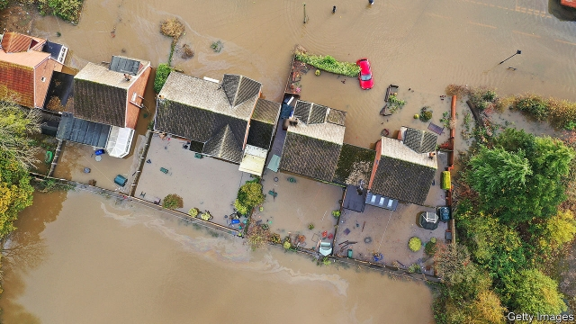

###### Giving it some welly

# Floods hit marginal constituencies in England 

 

> print-edition iconPrint edition | Britain | Nov 16th 2019 

“YOU TOOK YOUR TIME, BORIS!”The prime minister got a mixed welcome when he visited flooding victims in Yorkshire and the East Midlands. More than 800 homes have been inundated, according to the Environment Agency. One village, the unfortunately named Fishlake, was evacuated. There was another reason for Mr Johnson’s visit: the Tories are hoping to win a swathe of seats from Labour in the affected region. The floods, for which some blame poor planning by the government, will make this task no easier.■ 

