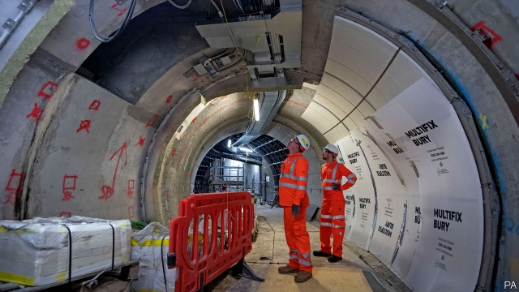

###### Hey big spenders

# Labour and the Tories plan to borrow billions. But can they spend it? 

 

> print-edition iconPrint edition | Britain | Nov 16th 2019 

FOR THE past eight years the bankers, lawyers and asset managers arriving early each morning at Moorgate station have been faced with building works. Much of the area has been cordoned off as the station expands as part of Crossrail, an £18bn ($23bn) east-west transport link across London. Crossrail was supposed to be ready for the Olympic games in 2012. But this week the timetable slipped once again; the line is now due to open “as soon as practically possible in 2021”. 

With British infrastructure in a ropy state, both main parties are promising big increases in capital spending, funded by large increases in borrowing. The people working around Moorgate will determine whether these programmes succeed. Yet the ones to watch are not the pinstriped bankers, but the builders in hi-vis jackets. 

Big spending is back in fashion. Under the Conservatives’ new fiscal rules, public-sector investment would rise from its current level of around 2% of GDP to 3%. Labour would go further, more than doubling investment, to over 4%. Both parties would take government investment to the levels that last prevailed in the late 1970s, spending about three times more on capital projects than was the norm under the governments of Margaret Thatcher and John Major in the 1980s and 1990s. 

With interest rates near historical lows, raising the money is unlikely to be a problem. Economists have been arguing for years that the government should take advantage of negative real interest rates to upgrade the country’s infrastructure. But this may prove to be easier in theory than practice: actually spending the money could turn out to be surprisingly tricky. 

Governments have long struggled to fulfil their capital-spending plans. The Institute for Fiscal Studies, a think-tank, found that the government of the day undershot its capital-spending target almost every year between 1992 and 2015. So endemic is the problem that when the Office for Budget Responsibility, an official watchdog, makes its economic forecasts it assumes the government will fail to meet its investment plans. 

This time there are plenty of reasons to expect a big undershoot. Noble Francis of the Construction Products Association, a trade body, says that “in construction you can spend a little money very quickly, but spending a lot of money is much harder.” Small projects, like getting local councils to fill in more potholes, are easy. But the big programmes that let ministers dress up in a hard hat to announce are not. Schemes like the new railways in the north of England planned by the Tories, or the large-scale homebuilding and investment in green energy promised by Labour, cannot be switched on at will by the chancellor. 

The construction industry is already suffering from the fallout of the Brexit vote. Uncertainty has delayed investment. Weaker sterling has increased the cost of imports; building-material prices have risen by 3% in the past year, twice the rate of inflation. And many migrant workers have left. More than half of Britain’s big contractors report problems hiring tradespeople such as bricklayers and carpenters. Wage growth in building is running at 6% a year, compared with 3.6% in the economy as a whole. The construction workforce, meanwhile, is ageing rapidly. About 500,000 of the industry’s 2.4m workers are due to retire in the next 15 years. Although many construction trades can be learned in under a year, productivity levels of newer workers tend to be lower. 

The splurges that both the Tories and Labour are proposing would require high levels of investment by the industry and a change of approach by the government. Firms will be reluctant to train new workers without some certainty about the future pipeline of work from the government. The National Infrastructure Plan, which includes £500bn-worth of projects, is dismissed by construction bosses as a wishlist, not a plan. 

According to Judy Stephenson of University College London, the industry sees the government as having a “stop-start, ad hoc approach” to infrastructure planning, which makes long-term commitments difficult. She argues that the recent pausing of work on HS2, a high-speed railway between London and the north, to review the business case for the programme, has caused resentment among contractors. With the government seen as an unreliable partner, builders will want to get a risk premium written into their contracts, in case ministers have a change of heart. 

Neither party’s investment plan is wildly out of line with international standards. Spending 3% of GDP on public-sector investment, as the Conservatives propose, would bring Britian up to the average across the OECD, a club of mainly rich countries. Even the 4% or so argued for by Labour would be comparable to some other European countries. The problems will emerge if either party tries to hit its ambitious new target too quickly. Pumping billions of pounds into an industry already short of capacity and experiencing rising costs is more likely to increase inflation than national productivity. ■ 

