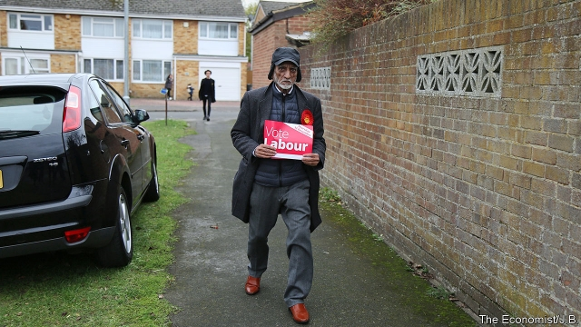
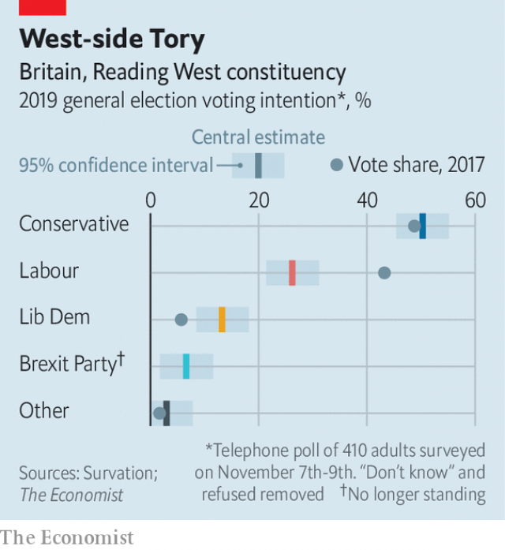

###### Swing seats

# Labour is going backwards in Reading West, a target seat 

 

> print-edition iconPrint edition | Britain | Nov 14th 2019 

ALOK SHARMA could be forgiven for being nervous. The Conservative cabinet minister sits on a small majority of 2,876 in Reading West, one of two constituencies in a town just west of London. A demographic tailwind blows in Labour’s favour, with young families moving from the capital to the town, which has a swish new railway station at its heart. Labour controls the borough council and snatched neighbouring Reading East in 2017. 

Yet Mr Sharma has little cause to worry. Just over 50% of voters says they will back him in the coming election, according to a poll by Survation for The Economist. Support for Labour, meanwhile, has slumped to 26%. A bridgeable six-point lead enjoyed by Mr Sharma in 2017 has turned into a 24-point chasm (see chart). Constituency polling has a large margin of error. But it seems that the Labour-voting coalition that almost made Mr Sharma a casualty of the last election has collapsed. 

 

With its mix of countryside, council estates and commuters, Reading West is a slice of England. Since its creation in 1983, the constituency has always been held by the governing party. It broke 52% to 48% for Leave in the Brexit referendum, like the rest of the country. Mr Sharma’s vote share increased in 2017 (from 48% to 49%) but his majority fell, in a pattern repeated across the country as Labour surged. 

Both Labour and the Conservatives did exceptionally well in terms of vote share in 2017. But in seats like Reading West, the 2017 result is a floor for the Tory vote. For Labour, it risks being a ceiling. The party maxed out its vote in places like Reading West, says James Johnson of JL Partners, a pollster. Smaller parties like the Liberal Democrats were squeezed to the point of collapse. “There is only room for those other parties to grow,” says Mr Johnson. 

While the Lib Dems chomp away at Labour’s vote share, the Brexit Party has stood down in the constituency (after our poll was taken). That should make life easier still for Mr Sharma, as most Brexit Party backers are expected to switch to the Tories. Labour hopes that in time the Lib Dem vote will be eroded, as Remainers realise that, under first-past-the-post, only Labour can beat the Conservatives in seats like Reading West. Labour’s leaflets remind wavering voters that it came within 3,000 votes of displacing the Tories last time, whereas the Lib Dems were 22,000 behind. 

Labour activists now pray for a repeat of the party’s late surge in 2017, hoping that when the party’s manifesto is published more voters will return to the flock. At least opinion of Mr Corbyn cannot get much worse: about 47% in Reading West think Boris Johnson would make the best prime minister, whereas only 13% opt for Mr Corbyn. Labour may benefit from having a local candidate, Rachel Eden, a long-serving councillor. (“I remember when this was fields,” she says of the newish flats surrounding a café in the south of the town. “Well, I say ‘fields’—the remains of a sewage works.”) 

Labour has cause for longer-term optimism about towns like Reading, even if the prospects this time look grim. Demographic change could help it in future, argues Rob Wilson, a former Conservative MP who represented the eastern half of the town in 2005-17. Reading has become more ethnically diverse, while young middle-class professionals (who these days tend to vote Labour) have moved in. Londoners account for 16% of home sales in Reading in the past year, according to Hamptons International, an estate agent. Similar trends across the south-east helped Labour gain seats in places like Brighton in 2017, as well as biting into the “doughnut” of outer-London constituencies that used to vote Tory. 

This time, however, with the Lib Dems polling in the teens—rather than on life-support as they were in 2017—these seats may prove trickier for Labour. And the Conservatives are unlikely to make the same mistakes as in 2017, such as putting out a manifesto with few goodies for voters. In places such as Reading West, Labour climbed a mountain at the last election. But in the past two years, they seem to have slipped back down it.■ 

