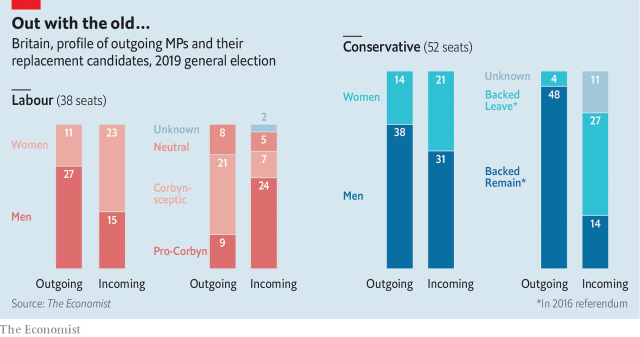

###### Britain’s new political generation

# Meet Parliament’s class of 2019 

 

> print-edition iconPrint edition | Britain | Nov 14th 2019 

SAM TARRY is pounding the streets of Ilford South with an army of Labour activists. The party’s nomination for the safe London seat became free earlier this year after the sitting MP, Mike Gapes, defected to another party in despair at Jeremy Corbyn’s leadership. Mr Tarry, a trade unionist, got his first taste of politics campaigning outside his predecessor’s office against the Iraq war. Mr Gapes “is a warmonger—people in Ilford still haven’t forgiven him for that,” he claims. Labour’s new candidates are quite different from those they are replacing, says Mr Tarry: “We aren’t afraid to say we are socialists.” 

Thirty-eight Labour MPs and 52 Conservatives have stood down or switched party ahead of the election, three times as many as in 2017 (though fewer than in some previous years). Most departing Labour MPs were at best lukewarm towards Mr Corbyn. By contrast, the class of 2019 is closely aligned with the party’s left-wing leader, according to our analysis (see chart). 

The Tories are undergoing a similar makeover. Only four of the departing Tory MPs backed Leave in the referendum of 2016. The new generation seems to be much more Brexity—though we found that some Tories were oddly shy about how they voted three years ago. “I’m not telling you which side I backed in 2016,” says Colonel James Sunderland, who is standing in Bracknell. “The class of 2019 are new blood. We are going to draw a line under the last toxic parliament. We must not think in terms of being Remainers and Leavers.” 

Mr Tarry is representative of the kind of politician who will be arriving on the Labour benches. Gone are the management consultants and solicitors, with 45% of the party’s new candidates in these vacated seats coming from trade-union backgrounds. In Birkenhead the regional secretary of the Unite union, Mick Whitley, is replacing Frank Field, who is running as an independent. “Frank walked away from the party,” says Mr Whitley. “I’m totally opposed to his politics. We need radical solutions for Birkenhead.” 

Both parties have put forward more women, who made up 25 of those stepping down but who number 44 of the candidates running in their place. British Future, a think-tank, finds that if all parties win the same seats as in 2017, there will be 67 ethnic-minority MPs, up from 52 now. 

Unlike Labour, and in spite of their pursuit of blue-collar voters, the Tories have picked most of their candidates from professional backgrounds. Westminster insiders—including five former MPs—make up nearly a third of candidates in vacated seats. “People say, ‘Oh, what a posh twat’,” admits Anthony Mangnall, a former special adviser who is standing in Totnes. “But I’m in debt…Right now, I’m sat in my car overlooking Royal Naval College Dartmouth, and it’s pissing with rain, and I love it—whether or not it’s glamorous.” ■ 

