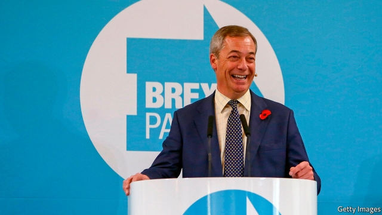

###### Tactical voting

# Nigel Farage’s Christmas present to Boris Johnson 

 

> print-edition iconPrint edition | Britain | Nov 14th 2019 

IT MAY HAVE been the most significant moment of the election campaign. On November 11th Nigel Farage, leader of the Brexit Party, who had talked of fighting 600 seats, said he would not field candidates in the 317 won by the Tories in 2017. He had sought a pact with Boris Johnson, but after being rejected he offered a “unilateral” alliance. His barely credible explanation was that, having denounced Mr Johnson’s Brexit as little better than Remain, he had seen a video in which the prime minister promised a Canada-style free-trade deal and no extension of the transition period beyond December 2020. 

The truth is that Mr Farage was under immense pressure from his financial and political backers not to jeopardise the election by splitting the pro-Brexit vote, thereby risking losing Brexit altogether. Yet almost as important as his decision not to fight Tory incumbents was his insistence that he would still run candidates in other seats. Brexiteers demanded that he go further by standing down in Leave-voting Labour marginals which the Tories need to win. But as we went to press Mr Farage was stubbornly refusing to give way. 

Even so, his decision not to fight the Tories directly is a boost for Mr Johnson. According to Matthew Goodwin of the University of Kent, two-thirds of the most marginal Tory seats voted Leave in 2016. A significant Brexit Party vote might have tipped several the opposition’s way. And the indirect effect of Mr Farage’s announcement may count even more. Chris Hanretty of Royal Holloway, University of London, says the psychological impact on hardline Brexiteers of Mr Farage actively supporting Mr Johnson’s Brexit deal will be profound, encouraging more to vote Tory. 

Yet the Brexit Party could still dent Mr Johnson’s chances of winning Leave-backing Labour marginals. Mr Farage claims that in these seats the party will mostly win over Labour supporters who are unhappy with Jeremy Corbyn’s leadership. But most pollsters reckon it draws at least twice as many votes from the Tories as from Labour. 

Being associated with Mr Farage could cost Mr Johnson some support in pro-Remain areas. As many as 5m Tory voters in 2017 backed Remain in the 2016 referendum. Many will no doubt vote Conservative again, but a few may be put off by Mr Farage’s support of the prime minister’s hard Brexit. Labour is trying to win over even more by linking Mr Johnson and Mr Farage to their mutual American friend, Donald Trump. The president has long called for a pact between the two men. 

If the two most pro-Brexit parties can enter a form of electoral alliance, why can’t the anti-Brexit parties? Three of them—the Liberal Democrats, Greens and Plaid Cymru—have formed a “Unite to Remain” alliance, in which they agree not to run against each other in 60 seats. The Lib Dems have also decided not to oppose Dominic Grieve, a renegade ex-Tory running as an independent in Beaconsfield. The Greens have pulled out of Chingford, to increase Labour’s chances of unseating Iain Duncan Smith, a hardline Tory Brexiteer. 

What would make a real difference is a pact between the Lib Dems and Labour. Yet the parties’ tribal instincts and ingrained hostility stand in the way. Heidi Allen, a former Tory MP turned Lib Dem, says her party approached Labour several times but was rebuffed. Labour insists on running candidates everywhere. The party leadership damns the Lib Dems for joining David Cameron’s (pro-austerity) coalition in 2010. Jo Swinson, the Lib Dem leader, is a fierce critic of Mr Corbyn. This week her party insisted on fielding new candidates in Canterbury and High Peak, upsetting the two existing ones who had both stood down to give Labour a clear run and are now advocating a Labour vote. 

In theory the electorate could do the job by voting tactically for whoever is most likely to defeat the Conservatives. Several websites now offer advice on this, though they do not always agree. But although tactical voting has increased since the 1990s, it is unlikely to be extensive enough to change the result. Mr Goodwin draws an analogy with the 1983 election, which Margaret Thatcher won by a landslide despite losing vote share. The main reason was a divided opposition. ■ 

