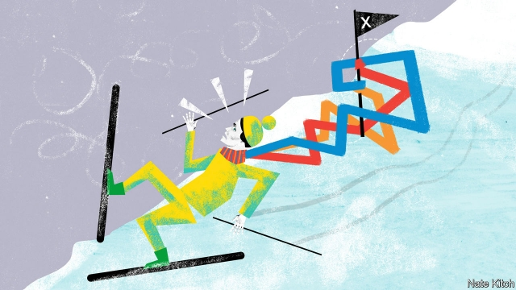

###### Bagehot

# The Party of Davos is the biggest loser in Britain’s election 

 

> print-edition iconPrint edition | Britain | Nov 16th 2019 

THIS ELECTION is the most unpredictable in years. Tribal loyalties are weakening. Party chiefs are campaigning all over the map—Conservatives in Labour heartlands in the north and Labourites in Tory bastions in the south. The Liberal Democrats are a wild card. But one thing is certain in all this confusion. Whoever wins the election, the Party of Davos will lose. This is nothing less than a revolution in British politics. 

The Party of Davos refers to the 3,000 or so people who attend the World Economic Forum in Switzerland each year, and their more numerous ideological bag-carriers. (This columnist admits to attending the forum on several occasions and to carrying a good deal of ideological baggage.) Davosites are defined by their adamantine belief in economic and social liberalism and their position at the top of various global organisations. They support globalisation and multilateral institutions and disdain parochialism and nationalism. They idealise business and loathe nimbyism and restraints on trade. Michael Oakeshott, a philosopher, said that political rationalists place no value on the tried-and-true, and believe that “nothing is to be left standing for want of scrutiny”. Davosites are rationalists par excellence. 

The Party of Davos achieved its greatest success in Britain from 1997 to 2016. Tony Blair and David Cameron may have worn different-coloured rosettes, but they were both paid-up members of the party. Ditto their various comrades-in-arms, such as George Osborne on the right, Peter Mandelson on the left and Nick Clegg in the middle. Under Mr Blair the Labour Party made its peace with Margaret Thatcher’s pro-business philosophy by fawning over businesspeople. Under Mr Cameron the Conservatives made their peace with social liberalism by supporting gay marriage. 

The great purge of the Davosites started on the left, with Jeremy Corbyn’s election to the leadership of the Labour Party in 2015. Out went the likes of Mr Mandelson (who had once declared that “we are intensely relaxed about people becoming filthy rich”). In came hard-leftists who had learned their craft on picket lines rather than ski slopes. Mr Corbyn even advocated putting one of Davos’s heroes, Mr Blair, on trial for war crimes. The purge spread to the Conservative Party this year with the election of Boris Johnson as leader, who expelled 21 senior Tories for disloyalty over Europe. Davosites such as Rupert Harrison, a protégé of Mr Osborne, have been weeded from the Conservative candidates list. 

The Davosites have made several ill-starred attempts to regroup. They briefly supported the idea of a “government of national unity”, only to see the idea fizzle. They invested high hopes in a second referendum, but the “people’s vote” movement collapsed in turmoil when Roland Rudd, the PR entrepreneur who helps to fund it, tried to sack two of its leaders and staff responded by walking out. Exasperated Davosites are now backing the Lib Dems, but so far the polls are moving against them. 

There is no doubt that the Davosites deserve much of what has been hurled at them. They overpromised and underdelivered. Gordon Brown boasted that Britain had abolished the cycle of boom-and-bust under his leadership, only to see the global economy plunged into the worst financial crisis since the 1930s. Mr Blair championed the war in Iraq on the grounds that Saddam Hussein possessed weapons of mass destruction, and that toppling a dictator might bring democracy to the Middle East. They engaged in a pattern of self-dealing that destroyed the bond of trust between the political elites and the masses. Since the financial crisis the likes of Messrs Blair and Osborne have grown “stinking rich” by selling their advice to global companies, while ordinary British workers have seen their wages stagnate. And they failed to learn the lessons of history. Too many Davosites think they need only make corporations a bit more woke and all will be forgiven. 

But even when all that is conceded, British politics is paying a heavy price for the collapse of the Party of Davos. The average IQ of the political class is deteriorating. When Mr Clegg lost his seat in Sheffield Hallam in 2015, he was replaced by Jared O’Mara, a local bar owner who once called for Jamie Cullum, a jazz musician, to be “sodomised with his own piano”. The quality of governance is collapsing. Brexit has distracted attention from urgent problems such as the obesity epidemic and the dismal state of vocational education. The Davosites may have made a bad job of running the country, but the populists on both the left and the right look as if they are going to make an even worse one. 

The Party of Davos needs to apply Oakeshott’s principle of scrutiny to itself if it is to have any chance of regaining its place at the summit of British politics. The Davosites must learn to see themselves as others see them. Appearing on the slopes to make the case for a second referendum, as Mr Rudd once did, or tweeting that Aspen is a great place to hold a discussion on refugees, like David Miliband, a Blairite ex-minister, guarantees political oblivion. They need to recognise that they are the beneficiaries of all sorts of hidden privileges. Davosites have relentlessly championed creative destruction without recognising that the costs of such policies fall disproportionately on people other than themselves. They need to see that they are on a hiding to nothing if they think they can win popular support by advocating a pure diet of economic and social liberalism. If anything, majorities want the opposite. 

This will require a lot of rethinking of lazy verities. Davosites need to think much harder about the importance of things like belonging, dignity and nationalism. It will also require a lot of self-policing. Davosites need to be as hard on self-dealing on their own side, particularly among company bosses who pay themselves ever more for mediocre performance, as they are on that of others. Unless the Party of Davos can reform itself, it will remain on the periphery of British politics—and rightly so. ■ 

