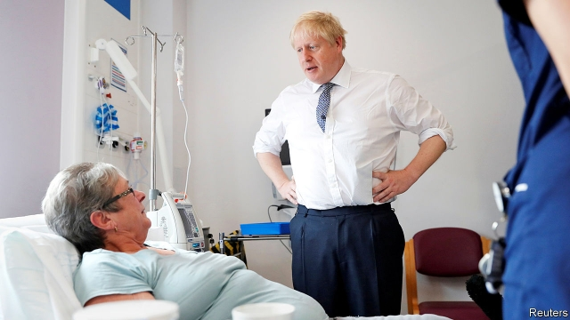
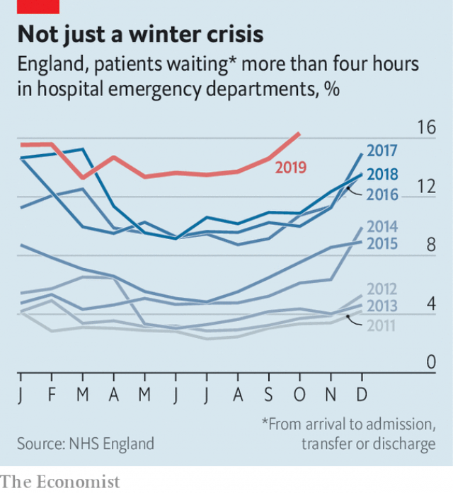

###### Spin doctors

# The Tories want to be the party of the NHS. Will voters buy it? 

 

> print-edition iconPrint edition | Britain | Nov 14th 2019 

THE SUMMER after he ran the Brexit campaign, and two years before he was appointed the prime minister’s chief adviser, Dominic Cummings gave a talk to Nudgestock, a “festival of behavioural science”. At the event, put on by Ogilvy, an advertising agency, his analysis of the “core problems of the Tory party brand” was typically blunt. Almost all British people love the NHS. But most Tory MPs don’t care about it, he said—“and the public kind of has cottoned on to that.” 

Under Mr Cummings’s guidance, Boris Johnson has deployed a combination of money and warm words to show he does care. Last year Theresa May, his predecessor in Downing Street, announced an extra £20bn ($26bn) a year by 2023 for the health service. Since taking charge Mr Johnson has promised £2.7bn more to build six hospitals, £2.4bn to boost primary care, and £1.8bn to refurbish facilities and buy new equipment. These announcements have been enthusiastically promoted. Ninety-six of Mr Johnson’s 659 tweets as prime minister have mentioned the NHS, and he has visited at least half a dozen hospitals. 

A few recent polls show that the Conservatives are now more trusted than Labour on health, the issue voters consider the most or second-most important, depending on the pollster. Richard Sloggett, a former adviser to Matt Hancock, the health secretary, says the Tories will try to cement their lead by emphasising precisely how the new money will improve each voter’s local hospital, be that with a new ward or the latest cancer-screening technology. Labour has long regarded health as home turf, meaning this will be an unusual election: both parties believe they can win by talking about the NHS. 

One place where the battle will be fought is Watford, a Tory-Labour marginal on the northern outskirts of London, and one of the beneficiaries of Mr Johnson’s largesse. The town’s general hospital, a dilapidated 521-bed establishment next to Vicarage Road football stadium, is expected to get the lion’s share of a £400m loan to the trust that runs it. When Mr Johnson visited in October he promised a transformation. “The old Victorian building will go, the Portakabins will go,” he said. “There will be world-class facilities and world-class staff.” Dean Russell, the local Tory candidate, says the NHS will be at the centre of his campaign. 

Labour politicians dismiss the Conservatives’ claims to be the party of the NHS. Even Sir John Major, a former Tory prime minister, has warned that under Mr Johnson and his fellow Brexiteers the health service would be as safe “as a pet hamster would be with a hungry python”. On November 13th Labour announced an “NHS rescue plan”, including a 3.9% annual increase in day-to-day funding (compared with 3.4% growth under the Tories’ plans) and a big rise in capital funding. It has also pledged to undo Tory reforms designed to encourage the internal market, and to end privatisation by bringing contracts in-house when they expire, without yet explaining exactly how this would work. 

 

The party is on firmer ground when criticising the government. Mr Johnson’s promises of new cash have come too late, says Chris Ostrowski, Labour’s candidate in Watford, who points out that plans for the redevelopment of the hospital have been around for at least a decade. “From consultants to porters, the thing you often hear is, ‘It’s never been as bad as this’,” he says. National performance measures back up such reports. Data released on November 14th showed that in October 16% of people visiting accident and emergency departments waited longer than four hours to be seen, more than any month on record (see chart). 

As temperatures drop, the question is how far performance will slip. The British Medical Association, the doctors’ trade union, has warned that the health service is facing its worst-ever winter crisis. Elections are usually held in spring, when the NHS is emerging from its most difficult period. The last one to be held when the health service was on the ropes was in 1987, when its finances were in a bad way, notes Nicholas Timmins, a historian of the welfare state. The difference is that there are now much more data available, making it easier to track how the system is doing. 

Underlying the poor performance is a basic imbalance between demand for services and staffing levels, says Richard Murray, chief executive of the King’s Fund, a think-tank. Staff shortages have been exacerbated by pension rules that deter some clinicians from taking on extra work. The Conservatives’ promise to end free movement from the European Union would cut off another source of workers, though they have promised an “NHS visa” to keep the doctors coming. Labour’s plan to phase in a four-day week could cause an even bigger pinch. 

No amount of emergency meetings between Downing Street and NHS England is likely to improve things much before the election, which could cause problems for the government. As a former Labour adviser observes: “There is no way to spin old people dying on trolleys in waiting rooms.” 

More optimistic Tories point out that the now-standard winter crisis usually becomes apparent at the start of the year. But even if the Conservatives manage to escape blame for the state of the health service, they are likely to take flak on another front. As Mr Cummings discovered during the Brexit campaign, with his promise to give the NHS the £350m a week that would supposedly be recouped from Brussels, linking Brexit to the health service makes for a potent political combination. The Tories’ ambition to do a trade deal with America offers Labour just such an opportunity. Asked about what role the NHS might play in trade negotiations on a visit to London in June, President Donald Trump replied ominously that “everything is on the table”. 

Quite what that means is unclear. Second term or not, Mr Trump will probably be out of office by the time any deal is concluded, and he has since rowed back from his remarks. American companies can already tender for NHS contracts, so long as they have a presence in the EU. Possible demands from America could include making it harder to return such contracts to the public sector, or loosening regulations on drug purchasing, to allow pharmaceutical firms to make greater profits. Perhaps more important than the details, at least as far as the election is concerned, is the idea that under the Tories the NHS would be “up for sale”, as Jeremy Corbyn, Labour’s leader, puts it. 

In reality, any British government would probably resist being forced into making drastic changes to the cherished health service. Senior Conservatives, including Mr Johnson and Mr Hancock, loudly insist that the NHS will not be involved in any trade deal. The trouble, as one Tory MP notes, “is that the more airtime [a potential trade deal] gets, the more it becomes a factor in the electorate’s mind.” Which is why Conservative candidates will do everything they can to talk about the new hospital wards they are building instead. ■ 

