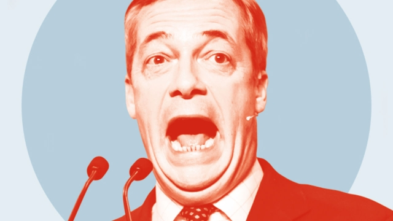

###### Speakers’ Corner

# The best quotes from the third week of Britain’s election campaign 

 

> print-edition iconPrint edition | Britain | Nov 16th 2019 

Farage against the machine“It’s pointless. It doesn’t get us out of anything. It doesn’t work at any level. It is a gigantic con. We should not sell out to this, it’s a Remainer’s Brexit. It’s virtually worse than staying where we are.”Nigel Farage, Brexit Party leader, slams Boris Johnson’s Brexit deal on November 3rd. BBC 

Farage in favour of the machine“I thought to myself overnight, well, that actually sounds a bit more like the Brexit that we voted for. Trade, co-operation, reciprocity with our European neighbours is what we all want…If the prime minister is saying he will make sure we are not part of political alignment, that I think is a significant step.”A week later, Mr Farage explains why he will not run Brexit Party candidates against Tory incumbents after all 

Democratic outrage“I’m dumbfounded that this government won’t release the report about Russian influence, because every person who votes in this country deserves to see that report before your election happens.”Hillary Clinton criticises the government’s refusal to publish an intelligence report on Russian meddling in elections. BBC 

Boris backs free movement“Northern Ireland has got a great deal. You keep free movement. You keep access to the single market.”Mr Johnson defends his deal in Northern Ireland, inadvertently talking up the benefits of EU membership. Manufacturing NI 

Pitch invasion“The UK election takes place in one month. Can things still be turned around?…The only words that come to my mind today are simply, ‘Don’t give up.’ In this match we had added time. Now we are in extra time. Perhaps it will even go to penalties.”Donald Tusk, president of the European Council and football fan, provides some commentary on the contest 

