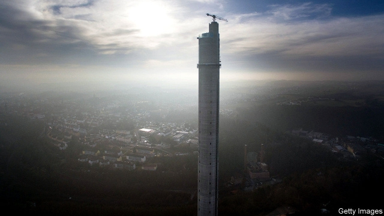
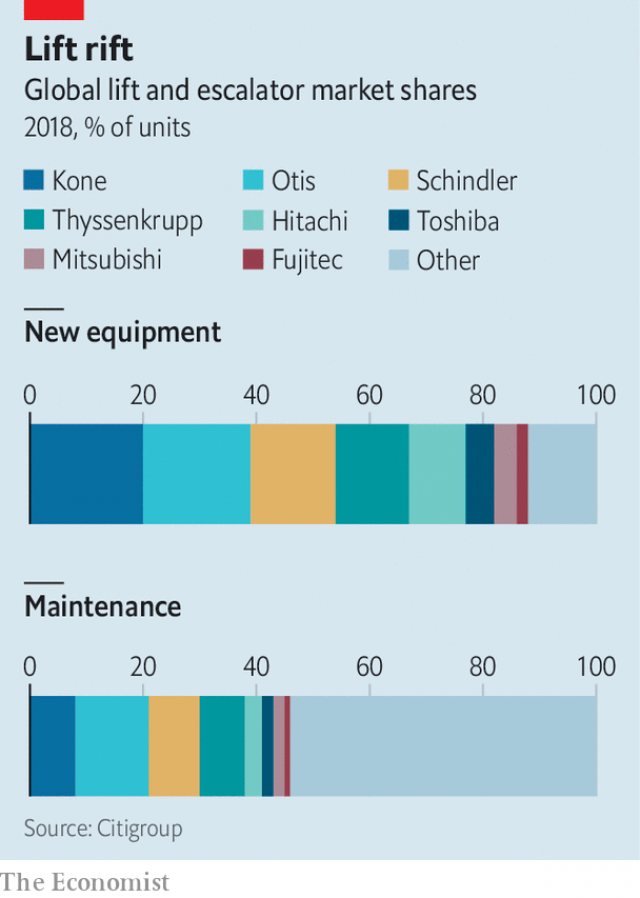

###### Ascending scale

# A huge lift business is up for sale 

 

> print-edition iconPrint edition | Business | Nov 14th 2019 

MODERN CITIES owe their shape to two 19th-century revolutions in personal transportation. For urban sprawl, blame the car. The skyscrapers that shape many of the world’s most recognisable cityscapes would not exist without fast and safe lifts. Whereas the four biggest carmakers sell two-fifths of road vehicles, liftmakers have the market sewn up far more tightly. The top four firms provide over two-thirds of all lifts (see chart). More concentration may be arriving shortly. 

The potential for consolidation comes courtesy of Thyssenkrupp. The struggling German industrial conglomerate needs to raise money as it restructures radically after years of dwindling profits and strategic missteps. Elevator Technology (ET), its lift business, could be worth €15bn-18bn ($17bn-20bn), roughly equivalent to Thyssenkrupp’s market value (including net debt). It plans to sell either a stake in the business or the whole thing. 

 

There are, it appears, plenty of takers willing to jump on Thyssenkrupp lifts. Groups that submitted bids before a deadline on November 8th are said to include some of the world’s biggest private-equity firms, such as 3G, Blackstone and Carlyle. Finland’s Kone, another lift-industry giant, has long coveted ET. Japan’s Hitachi is also likely to have put in a bid. 

Whoever they turn out to be, the bidders are attracted by an industry that has more ups than downs. The global lift market was worth $73bn in 2018 and the share prices of lift companies have comfortably outperformed the capital-goods industry as a whole for years, according to Morgan Stanley, a bank. Lifts are a “great business”, explains Klas Bergelind of Citi, another bank, because half of all revenues are recurring. The cyclical business of selling and installing new lifts is complemented by a steady stream of income from maintaining and modernising existing lifts. 

That part of the business looks poised to gain in importance. Citi expects annual sales of new lifts to grow by around 1% for the next few years. But that still leaves plenty that need maintenance, including the 900,000 or so installed in 2018, double the number a decade earlier. Over 60% of these were built in China, despite its cooling property boom. 

China’s vast servicing market may provide a long-term opportunity that helps the big liftmakers weather the global slowdown in new equipment sales. At the moment maintenance of a worldwide installed base of 16m lifts is a far less concentrated business, largely thanks to a bevy of small Chinese competitors. But as lifts become connected devices, bigger manufacturers could replicate their dominance in the market for new lifts. They have more money than smaller rivals to invest in technologies to diagnose problems remotely in real time, predict failures and prevent breakdowns. 

Which way will ET fall? A sale to a private-equity firm would quickly raise the cash Thyssenkrupp urgently needs. But it would yield none of the economies of scale that a tie-up with another liftmaker could produce. Hitachi, strong in its home market, will see this as its one opportunity to elevate itself into the global big league. And as Jefferies, another bank, observes, Otis and Schindler may not be content to “watch from the sidelines”. 

The firm that has courted ET the longest is Kone. Together the pair would create a firm as towering as the skyscrapers their products make possible. The businesses are geographically complementary: ET is stronger in America, Kone does better in China. Combining their service networks, research and development and the like might save €1bn a year. But overlap in Europe will trouble competition authorities. Thyssenkrupp may prefer a deal with fewer potential regulatory complications. 

Bringing together the world’s two most innovative liftmakers would certainly lift architects’ spirits. ET is testing MULTI, a ropeless system that uses linear motors to allow its lifts to travel up, down and sideways. Kone has developed a carbon-fibre-composite cable that allows ever longer travel heights—and so taller structures. Together these two technologies could reshape the city once again.■ 

