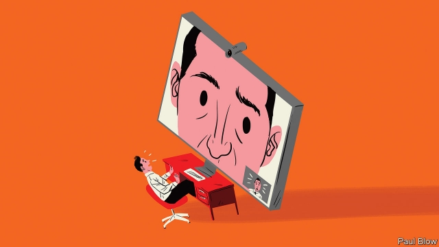

###### Bartleby

# Don’t show, tell 

 

> print-edition iconPrint edition | Business | Nov 14th 2019 

IT WAS ONE of the viral videos of 2017. Robert Kelly, an American academic, was discussing South Korean politics live on BBC World News when his two small children, eager for daddy’s attention, toddled into the room to interrupt him. It was a natural, joyful moment. 

What did not look natural was Mr Kelly’s pose before the interruption. He was being interviewed by video link, staring at his screen, his gaze fixed and glassy. Like most people who use the same technology, he looked as if he was appearing in a hostage video. 

These awkward interactions are a regular feature of 24-hour news channels, with their insatiable appetite for experts, many of whom live far from the studio. Increasingly, they are a regular part of people’s working lives, too. Many meetings now require a video screen so that others can participate from afar—their faces looming large like the villains appearing on the screen of the bridge of the starship Enterprise in an episode of “Star Trek”. 

The future is likely to involve even more screen-based meetings. One survey, published earlier this year, predicted 12% annual growth in global sales of videoconferencing equipment between now and 2023. 

On the plus side, videoconferencing could contribute to combating climate change. A video link is immeasurably cleaner than a long-haul flight. However, it is difficult to find any realistic estimates of how much this will save in terms of carbon emissions. It is helpful if video calls mean people do not drive to the office; less helpful if they simply avoid public transport. 

Some advocates also claim that videoconferencing beats phone calls. It is, they say, easier to establish a rapport with someone if you see them on screen, rather than simply hear their voice. Facial expressions and hand gestures can give a better clue as to the other person’s mood and intentions, which can help avoid misunderstandings. 

Yet in many professional exchanges you may want to disguise your actual state of mind. Even in more intimate settings than the office texting has replaced phone conversations. If being heard makes many people self-conscious, imagine being seen. Bartleby has a face that only a mother could love—which is why, although he occasionally appears on The Economist’s podcasts, he is rightly absent from its films. He has no desire to be seen by the other people with whom he is communicating—or to see himself in a corner of the screen, a process that automatically makes him want to fidget. If a public-relations type suggests a video interview with someone, your columnist always opts for a phone call instead. 

 

Not everyone wants to be watched while undertaking a long phone call, especially at home where neither clothes nor surroundings redound to most people’s advantage. It is also hard to pay attention for extended periods. The ability to check emails, or sports scores, is the only way to cope with the tedium of, say, calls to discuss participation in conference panels (which are typically longer than the panel itself). That option disappears when your face is on camera. 

Videoconferencing may improve. Facebook has brought out a product called Portal, which promises (or threatens?) to keep track of you as you move about, always keeping you in shot. Apple plans a feature which will use “advanced image manipulation” to ensure it seems as if your eyes are always looking at the screen, even when they are not. 

To Bartleby, the first recalls scenes in old horror flicks where the eyes in the painting followed the victim around the room. He prefers the sound of the second, especially if a version could keep a digitised version of his face on screen, while artificial intelligence is programmed to insert pre-recorded phrases like “you’re right” and “mmhm” at suitable moments, leaving him to go about his business. 

Great writers have toyed with the idea of our being constantly watched—with disturbing results. Jeremy Bentham devised the panopticon, a prison where a single guard can see into every inmate’s cell. Winston Smith, the doomed hero of George Orwell’s “1984”, finds that agents of Big Brother have been watching him through his TV screen, and are thus aware of his disloyalty. A videoconference can be highly useful on occasion. But not every meeting requires it. Before switching on the screen, ask yourself: “Is my face really necessary?” 

