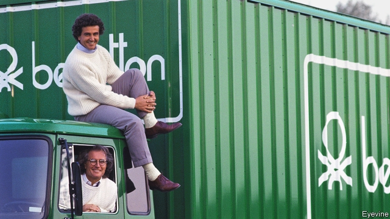

###### When I’m 84

# Octogenarians are shaking up Italian business 

 

> print-edition iconPrint edition | Business | Nov 14th 2019 

CARLO DE BENEDETTI is fond of high drama. When he resigned after only three months as chief executive of Fiat in 1976, rumours swirled that he was cobbling together a bid for the then-ailing carmaker with the help of Swiss financiers. Mr De Benedetti denied ever having such designs. But he seemed to relish all the attention. 

Mr De Benedetti, who turned 85 on November 14th, is back centre-stage of Italian business with another unorthodox bid. Last month he offered €38m ($42m) to buy a 29.9% stake of GEDI Gruppo Editoriale, publisher of newspapers including La Stampa and La Repubblica, as part of a plan to relaunch the business, which is currently run by his sons, Marco and Rodolfo. His offspring have “neither the skills nor the passion required to be publishers”, he lamented in an interview with Corriere della Sera, a rival daily. GEDI was a ship without a captain, at the mercy of high waves, according to the patriarch. On October 28th he resigned as honorary chairman of GEDI. (Exor, a holding company whose chairman sits on the board of The Economist’s parent company, has a 6% stake in GEDI.) 

Mr De Benedetti’s return may be particularly operatic, but other Italian Methuselahs are also in the spotlight. Stefano Pessina, the 78-year-old billionaire who is both the boss and the biggest shareholder of Walgreens Boots Alliance is exploring a deal to take the struggling American drugstore chain private. On November 11th KKR, an American private-equity giant which teamed up with Mr Pessina in 2007 to buy Alliance Boots, made a formal offer for Walgreens. The $70bn buy-out would be the largest in history. Days earlier data from Consob, an Italian securities regulator, revealed that Leonardo Del Vecchio, founder of Luxottica, a maker of spectacles (including Ray-Ban and Oakley sunglasses), who is 84, has just boosted to nearly 10% his stake in Mediobanca, an influential investment bank. Mr Del Vecchio is expected to increase his stake further. Italy’s second-richest man is challenging Mediobanca to build up its investment-banking business and to rely less on income from its stake in Generali, Italy’s biggest insurer (of which Mr Del Vecchio also owns a chunk). 

Another 84-year-old, Luciano Benetton, is again getting involved in the business of making colourful clothes that first made his family’s name. A revival of the fashion business may help divert attention from the clan’s infrastructure business. This was hurt by the tragic collapse last year of a bridge in Genoa managed by Autostrade, a toll-road operator owned by a holding company the Benettons control. 

Ageing patriarchs who are reluctant to bow out, or so much as plan for the day when nature will eventually force them to, are a feature of Italian capitalism. Giorgio Armani is running his fashion empire at the age of 85. Silvio Berlusconi, Italy’s 83-year-old former prime minister, remains the power behind the throne at Mediaset, Italy’s biggest commercial broadcaster (which is run by his son, Pier Silvio). When Bernardo Caprotti died three years ago aged 90 he was still managing Esselunga, a supermarket chain he founded. 

In the past ten years the leadership of companies has been rejuvenated, observes Franceso Giavazzi at Bocconi University in Milan. But, as Raffaella Sadun of Harvard Business School points out, that may be because founders put younger family members in charge as a way of retaining control. “It is not clear their relations are the best people for the job,” she says. Plenty of talented managers are reluctant to join firms where their career prospects would be subordinated to feckless scions. The mid-sized companies of Germany’s Mittelstand could teach corporate Italy a thing or two about how to handle succession, Ms Sadun says. 

The younger De Benedettis were taken aback by the paternal foray. Despite a sharp decline in third-quarter profits, they insist that the group needs no restructuring. At least the fatherly bid, however hurtful, could be lucrative. In 2012 Mr De Benedetti gave Rodolfo, Marco and his third son, Edoardo, his stake in CIR, a holding company which owns 44% of GEDI. Each would pocket millions if he bought it back.■ 

