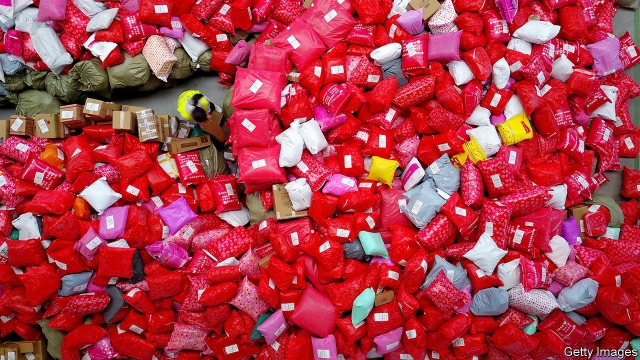
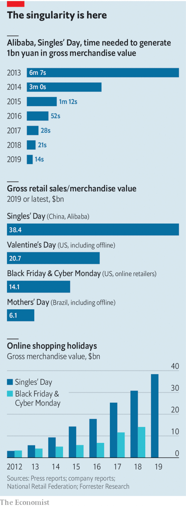

###### Internet shopping frenzies

# One for the money 

 

> print-edition iconPrint edition | Business | Nov 16th 2019 

IN 1993 A group of male students at Nanjing University in China decided to celebrate their singledom. The annual date would be November 11th, comprised of four lonely 1s. The story may be apocryphal. But since 2009 Alibaba, China’s e-commerce giant, has turned Singles’ Day into a very real shopping frenzy. It has long since eclipsed America’s Black Friday and Cyber Monday online sales combined. This year Taylor Swift performed at the countdown. In the next 24 hours Alibaba sold $38.4bn-worth of merchandise. Competitors like jd.com and Pinduoduo have piled in. Some people worry that what began as a lighthearted excuse to treat oneself has turned into a high-pressure version of Valentine’s Day. Others decry the harsh conditions workers face in order to meet demand and the holiday’s environmental impact. But shoppers certainly seem to like it. 

 

■ 

