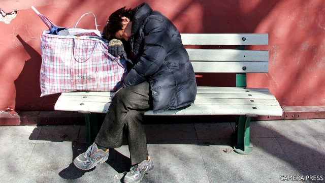

###### No shelter for some

# Homelessness has become a problem in China’s cities 

 

> print-edition iconPrint edition | China | Nov 14th 2019 

EVERY EVENING around nine o’clock, dozens of homeless people start to trickle into Sanlian Taofen, a 24-hour bookshop in Beijing. Early arrivals jostle for one of the comfy chairs. Latecomers have to sleep on the cold floor. Guan Zhong, a homeless man from the eastern province of Shandong, calls the shop his “Wednesday home”. On other days the unemployed 42-year-old sleeps on benches in round-the-clock cafes. Mr Guan says he frequently changes venues to avoid “abusing the generosity” of managers. The bookshop is his favourite, not least because it is warm and quiet at night. “Burger King outlets are the worst—they expel people like me,” he says. 

Thirty years ago homeless people were a rare sight in China’s cities. Strict controls on internal migration made it difficult for rural residents to move to urban areas. Most city-dwellers lived in housing supplied by the government, for which they paid peppercorn rents. Since then much has changed. Migration controls have eased. Most urban housing has been privatised. Villages have been flattened to make way for growing cities. Street-sleepers are still less visible than they are in the centres of some rich-world cities. But they are far more common than before. 

Most of the homeless arrived from the countryside, as did Mr Guan. In the cities they cannot access local welfare, including social housing. That is because of the hukou, or household-registration, system. This usually allows people to receive such benefits only in their place of birth. So if they cannot afford to rent a home, they often have little choice but to sleep rough. 

That is a problem for officials, who often regard visible homelessness as an eyesore that reflects badly on their cities. Only a few years ago, street-sleepers and beggars were routinely rounded up, detained and forcibly sent back to their home towns in the name of maintaining “social order and stability”. But the law allowing this was abolished in 2003 after a public outcry over the death of a migrant who was being detained in the southern city of Guangzhou for lacking the documents that were then required to live legally in an urban area. Since then officials have become less heavy-handed. They appear to accept that urbanisation will cause some homelessness, and that this will not threaten stability as much as they once feared. 

The 800-odd “custody and repatriation” centres, where homeless people were once detained, have been turned into “relief stations”. The police are no longer involved in managing them. That work is now entirely undertaken by the Ministry of Civil Affairs, which is responsible for aid and charitable work. The stations—now numbering about 1,500—offer food, clothing and temporary accommodation, without charge. They are prohibited from doing anything to street-sleepers against their will. Admission is supposed to be voluntary. 

As Mr Guan’s sleeping habits suggest, however, homeless people often stay clear of the government’s shelters. Last year the relief stations received 1.6m visitors, about the same number as a decade ago. But Yu Yanping of Wuhan University of Technology estimates that only 30-40% of homeless people use them. 

Some street-sleepers fear that, if they were to use such shelters, officials might coerce them into returning to their home towns. Relief stations are required by law to “persuade” those they assist to go back. They often do this by offering a free train or bus ticket, and asking relatives to take them in. Some people, like Mr Guan, do not want relatives to know their whereabouts. Mr Guan owes his extended family in Shandong 20,000 yuan ($2,850). He worries what would happen should a relief station contact them. A Chinese academic says homeless people who are “professional beggars” see a day spent at a shelter as a day of lost earnings. 

Those who are wary of the shelters can find little help from NGOs. That is because the government still regards homelessness as sensitive and is reluctant to let NGOs get involved. In 2017 the government of Beijing evicted many migrants from poor-quality housing and ordered volunteers who tried to shelter the newly homeless from freezing temperatures to stop doing so. During politically important events, street-sleepers are often corralled inside government shelters to keep them from tarnishing the Communist Party’s image. “Vagrants and beggars are not allowed to appear on the streets,” said a directive issued in September by one district of Beijing. It told officials to “collect” such people for the sake of “stability” during the lead-up to festivities marking the 70th anniversary of Communist rule on October 1st. 

In the eastern city of Nanjing the manager of a government relief station offers your correspondent a rare glimpse inside, on condition she and the facility not be named. It looks like a medium-priced hotel. Its spacious rooms have flat-screen televisions and en-suite bathrooms. Its yard is lined with exercise equipment. “Some people abuse our hospitality,” the manager says. Every year before the lunar new-year festival, “people come to us pretending to be homeless just so they can spend a night here and get a free train ticket home.” She is getting better at checking. Any one with a pricey phone is probably a fraud, she says. Those admitted who want to return to the streets are “free to do so”. 

The government allows a few NGOs to provide limited aid. One is He Feng, a charity in Beijing that receives funding from the Ministry of Civil Affairs. Zhang Xiao, its founder, leads a team of eight people who criss-cross Beijing every day, offering food and other necessities to the homeless. He Feng sends regular reports to the ministry. These include the charity’s estimates of the total number of long-term homeless people in central Beijing (several hundred, by its last count) and the main reasons people give for sleeping rough. The NGo does not tell the ministry the names of the homeless or their precise locations, Mr Zhang says. 

A few of the street-sleepers are petitioners who have travelled to the capital to seek redress for local injustices. The authorities are especially nervous of such people, fearing they might stage protests. Government-run shelters are not for them. Those caught (their sheaves of papers, including court documents and letters of complaint, give them away) are often whisked to “black jails” where they are held until officials arrange to have them escorted back to their home towns. Vagrants are tolerated, but not the wrong sort. ■ 

