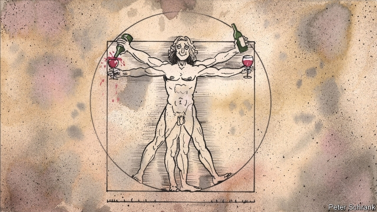

###### Old wine in new bottles

# Leonardo da Vinci’s personal vineyard has been re-created 

 

> print-edition iconPrint edition | Europe | Nov 14th 2019 

LEONARDO DA VINCI is remembered as many things—artist, inventor, scientist. “Boozer”, however, is rarely included on the archetypal polymath’s astonishing CV. That might change now that scientists have resurrected da Vinci’s own vineyard. 

Da Vinci was a great lover of wine, “the divine liquor of the grape”, as he called it. So much so that Ludivoco Sforza, the Duke of Milan, offered him a vineyard as payment for “The Last Supper”, which he painted for the refectory of the Convent of Santa Maria delle Grazie in Milan in 1498. It survived for centuries after his death, until it was destroyed by a fire started by Allied bombs in 1943. With it was lost any hope of seeking inspiration from the same liquid source that once fuelled the painter of “Mona Lisa” and the inventor of the helicopter. 

That is, until 2007, when Luca Maroni, an oenologist, decided to excavate the site in the hope that some vine-roots had survived the fire. He recruited Attilio Scienza, an expert on viniculture, and Serena Imazio, a geneticist, and they began to dig. Finding some roots intact, the team subjected them to extensive genetic testing at the Università degli Studi in Milan. In 2009 they identified da Vinci’s grapes as Malvasia di Candia Aromatica, a variety that is still grown in Italy today. 

That discovery set off a painstaking recreation of da Vinci’s vineyard. Dr Imazio scoured Italy to find grapes similar to the DNA profile of the roots, bringing them back to Milan and copying the original layout of the vineyard as exactly as possible. Located in the gardens of the Casa degli Atellani, just two minutes’ walk from “The Last Supper”, it has been open to visitors since 2015. 

The vineyard produced its first harvest in September 2018. Now, after a long wait, da Vinci’s wine is ready to drink. A first 330 bottles, based on a design found in da Vinci’s Codex Windsor, will be auctioned later this year. For those not lucky enough to grab a bottle, the vineyards of the nearby Castello di Luzzano, also thought to have been the property of the Duke of Milan, produce a wine made from the same type of grape and inspired by da Vinci. You can enjoy a glass after a pleasant stroll through his vineyard. Light and floral, you can almost taste in it a hint of Leonardo’s renaissance. 

