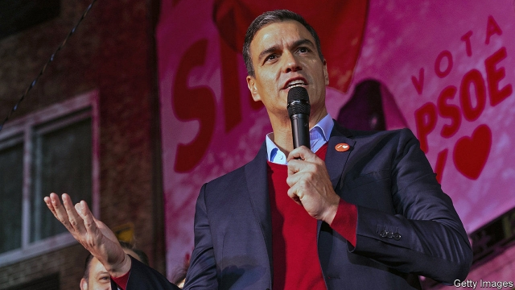
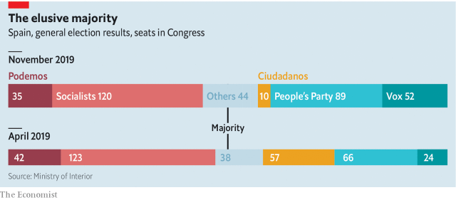

###### An electio-shock

# Pedro Sánchez again falls short of a majority in Spain’s election 

 

> print-edition iconPrint edition | Europe | Nov 14th 2019 

IN SEPTEMBER Pedro Sánchez, Spain’s acting prime minister, said that if he agreed to a coalition between his Socialists and Podemos, a farther-left party, he “wouldn’t sleep at night”. Two months later, just hours after an election on November 10th in which both parties lost ground while the hard right surged, Mr Sánchez and Pablo Iglesias, Podemos’s leader, signed an outline agreement to form Spain’s first coalition government since the 1930s. Many details are lacking and the deal is not itself enough to guarantee a majority in Congress. But after their fourth general election in as many years, Spaniards may be spared a fifth, at least for a couple of years. 

The Socialists have emerged again as the largest party, but with only 120 of the 350 seats in Congress, down three on the previous vote in April. Podemos lost seven seats (two to a splinter party). Between them, the pair mustered almost 1.4m fewer votes, partly because turnout fell by six points and partly because of continuing fragmentation, as an unprecedented 16 parties won seats in Congress. 

The big change was that Vox, a hard-right Spanish nationalist party, surged into third place with 15% of the vote. Its rise came partly at the expense of Ciudadanos, a rudderless formerly centrist party, which was almost wiped out. Albert Rivera, its founding leader, resigned. The voters thus punished, to varying degrees, those they held responsible for failing to form a government after the April poll. That was when Mr Rivera deprived the country of its only realistic prospect of a strong, reformist administration by setting his face against an agreement with Mr Sánchez. 

Chastened by his pyrrhic victory, Mr Sánchez chose to eat his words and accept a coalition in which Mr Iglesias would probably be a deputy prime minister and have two or three other ministries. The two have disagreed about the economy and about Catalonia, the biggest issues facing Spain. Mr Iglesias wants to squeeze the rich and repeal a labour reform which made firms more competitive. Mr Sánchez has attempted to assuage the concerns of business folk by saying he will put Nadia Calviño, his fiscally sober economy minister, in overall charge of economic matters. Podemos may kick against her. 

 

The campaign was dominated by the conflict in Catalonia, after the Supreme Court last month imposed swingeing prison sentences on nine Catalan separatist leaders for their role in the illegal referendum and declaration of independence in October 2017. That prompted sometimes violent protests which continued this week with the blocking of motorways in Catalonia. The separatists’ threat to national unity has fuelled the rise of Vox, which wants to limit Spain’s sweeping regional autonomy. It also loudly complains about illegal immigrants claiming welfare benefits (though few do). 

Podemos has hitherto backed the separatists’ demand for a referendum on independence. The draft coalition agreement calls for the government merely to promote talks “always within the constitution”, which does not recognise a right to self-determination. To scrape together the majority needed to form a government, Mr Sánchez must now rely on the support of regional parties and, probably, the abstention of some Catalan separatists. Given the climate in Catalonia, that will not be easy. 

For now, the prime minister appears to have rejected a second option, to seek an agreement with the mainstream conservative People’s Party, the Socialists’ age-old rivals. That is not clearly on offer, but most leaders accept that the country’s political deadlock needs to be broken. To resort to yet another election would be “dangerously badly received by Spanish society” and would lead to even greater fragmentation and stir up still more support for Vox, says José Luis Ayllón of Llorente y Cuenca, a political consultancy. That prospect should concentrate minds. ■ 

