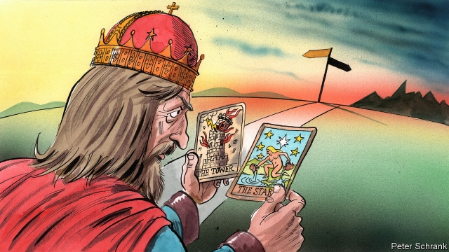

###### Charlemagne

# Reading the cards 

 

> print-edition iconPrint edition | Europe | Nov 14th 2019 

LITTLE ABOUT Europe is simple. The EU is a sprawling, labyrinthine, many-centred thing. It tends to move either very slowly or very fast, with shifts creeping forwards over years or suddenly flashing past in hours at late-night summits. National capitals can feel like different universes, with their own electoral and economic cycles, personalities, in-jokes, taboos, histories, myths and ideological constellations. So it can be tricky to identify and explain continent-wide trends, and even more so to anticipate them. No wonder that confidently sweeping analyses of Europe often get the big calls wrong. 

Early in the new millennium, the EU’s eastward expansion, transatlantic rifts and a mild economic climate together produced a wave of grandiose claims about the European model’s sunny future. Books with titles like “The European Dream” and “Why Europe Will Run the 21st Century” hit the shelves. A convention of grandees drew up a blueprint for the EU called a Constitution for Europe. But then the blueprint was rejected at two referendums, economic crisis set in, the euro zone started to wobble, migration soared and the union ended the decade much less struttingly than almost anyone had predicted. 

Primary-coloured prognostications about the current decade have proven even more wrong. The peak of the euro crisis around 2012 saw a surge of premature obituaries for the European project, which were reprinted when migration crises, terror attacks and Britain’s vote to leave struck over the following years. The EU was said to be paralysed by its divisions and doomed to extremism, destitution and collapse. Yet today, in the twilight of the decade, the picture is cheerier. Economies have recovered, support for the union is at record levels and the last European elections saw turnout rise for the first time in decades. Chilly international winds may even be toughening it up. The EU leads the world in trade liberalisation and technology regulation and its incoming executive calls itself the first “geopolitical” commission. In Emmanuel Macron it has a far-sighted statesman—even if his bold urgings to other leaders are as much exasperated as hopeful. 

And what of the next decade? It is highly unlikely that the EU will end the 2020s either as the smouldering wreck of Brexiteer reveries or as the muscular mega-power of Macroniste dreams. As your columnist hands on Charlemagne’s crown, he can more easily imagine two distinct but more nuanced possibilities. 

In the first, mildly positive, one the EU muddles its way towards a multi-tier structure in which overlapping and concentric circles of states can better co-operate. Different “coalitions of the willing” within the EU emerge to do different things. A group centred on France and Germany creates a common asylum system, the Nordics and the Baltics build a deep digital-services union, and militarily adventurous states like France and Italy complement NATO with midsized interventions close to Europe. An accommodation combining the reduction and pooling of risk in the euro zone paves the way for modest resilience-boosting progress on banking union and closer fiscal co-ordination. Populists remain disruptive, but the centre holds. Europe enters the 2030s as a more hard-nosed figure, with a patchwork of shared interests. Though not comparable in military or technological power to America or China, it is a relevant broker between them. 

In the second, more negative, scenario the EU’s relative decline is sharper. An economic slowdown in the early 2020s causes more near-death experiences for the euro, hardens the mood against further integration and increases economic divergence. A split between a “northern” and a “southern” euro is seriously discussed. Anaemic growth also sidelines long-term geopolitical and industrial considerations at the expense of short-term fixes and narrow national advantage-seeking. The grind of outside challenges, from technological disruption and migration to terrorism and meddling foreign powers, turns states inward and against each other. As the bloc fails to deal with its problems, public support for the EU drops, although no state actually follows Britain out of the club. Populists paralyse fragmented legislatures, blur into the mainstream and shape a more nationalist, less co-operative agenda. The EU enters the 2030s in one piece, but divided and less relevant, its high relative living standards fraying as Europe falls behind economic rivals and its population ages and shrinks. 

The difference between these two outcomes, and the spectrum of sub-scenarios between them, is measured in the answers to several big questions. Will European leaders find the capacity and political capital to focus on improving their project, even outside moments of high drama? Will they use crises (and there will inevitably be crises) to shove it forward? Will ordinary voters elect politicians who promise only to ease the process of decline, or ones offering vigorous reforms that boost growth? Will the continent become more realistic about the difficult choices it faces over the course of the 21st century, and therefore strive towards the first, imperfect but happier, of the scenarios? The default and probably more likely outcome is the second and unhappier of the two. Mr Macron’s recent doom-laden warnings to this newspaper about Europe’s need to wake up may have raised eyebrows, but it is much less clear that they will have the desired result. 

Europe’s muddled complexity is matched by its simple virtues. It remains, thanks in no small part to the EU, the largest cluster of people living in freedom, prosperity and peace on the planet. It is capable of renewal and of verve—and often of combining these things with enlightened approaches to work, health, society, civic rights and the environment. It has much to teach and to otherwise contribute to the rest of the world. None of those things will change overnight if its relative decline proves steeper than necessary. But they will make it that much more of a tragedy. ■ 

