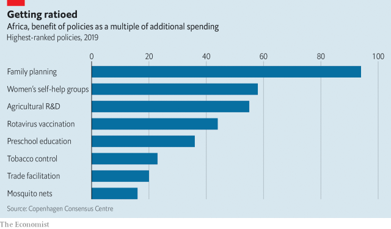

###### Free exchange

# Cost-benefit analyses offend against the notion that life is priceless 

 

> print-edition iconPrint edition | Finance and economics | Nov 16th 2019 

THE AIRLESS nooks under a man’s foreskin are a cosy spot for microbes. These can inflame the surrounding skin, helping viruses such as HIV to spread. In places where the disease is common and treatment is patchy, removing foreskins can be a cost-effective way to fight it. In parts of Africa, the benefits of circumcising adolescents can outweigh the costs by about 10 to 1, according to the Copenhagen Consensus Centre (CCC), a think-tank. The ratio rises above 40 to 1 in the worst-hit countries. 

Circumcision is not an obvious vote-winner. But policymakers cannot afford to be squeamish in the fight against one of history’s greatest killers. Nor should they flinch at another off-putting, but essential, step in the war against poverty and disease: putting a dollar value on human life. Without one, it is impossible to compare efforts to vanquish HIV, malaria or diarrhoea with other outlays, such as building railways, electrifying villages, conserving mangroves or educating preschoolers. Quantifying the worth of all these good causes is the aim of a new CCC report evaluating 27 policies to promote African health and prosperity. 

Such exercises often get a bad press because they offend against the deeply held feeling that life is priceless. This sacred principle is constantly breached in practice, of course: whenever a government sets a health-care budget or a commuter takes the small risk of a fatal car crash to earn money. But societies go to great lengths to hide the grisly process of pricing life from themselves. There is a “cost to costing”, as Guido Calabresi and Philip Bobbitt put it in their classic book, “Tragic choices”. 

This cost is even harder to stomach when evaluating policies across borders. The same unflinching logic that allows economists to put a dollar figure on a life in a rich country obliges them to put a lower one on a life in a poor country. That breaches another sacred principle: that all lives are equal. How can economists justify their impiety? 

They start their defence by pointing out that they do not impose their own valuation on life; rather, they infer one from the risks people are prepared to run in their own lives, for the sake of money or convenience. In America, government agencies often look at the extra pay workers demand to do dangerous jobs. Moreover, economists are usually valuing small changes in the risk to life: 1 in 1m, say. These marginal risks translate into a fatality only when aggregated over long periods or large populations. (Some euphemistic economists have tried dividing their results by 1m and reporting them as the value of a “micromort” rather than a life.) Unsurprisingly, the amount people are willing to pay to reduce the risks they face depends on their income. In America the department of health calculates that the value of a life is over $9m. In Africa, where national income per person averages only 6% of that in America, people are willing to pay $145,000 (at purchasing-power parity), the CCC reckons. 

Although this Gradgrindian logic can be off-putting, it can also be mind-opening. Costing comes not just with costs, but also with benefits. It allows governments to compare policies that affect mortality with others that affect prosperity. Priorities can then be set on a sounder basis than gut instinct, sentimental appeal or the political clout of the people hurt or helped. That matters because some good causes are not nearly as good as others. 

Extending a pan-African high-speed rail network to Mozambique, for example, yields only three cents-worth of benefits per dollar spent, the CCC calculates. And a lot of dollars would have to be spent: the upfront capital cost for a ten-nation network could amount to $878bn. A more modest policy, such as building latrines in villages (and shaming people into using them rather than defecating in the open) can bring $3.40-worth of benefits for every dollar spent, thanks to the diseases prevented and the time saved. But the gains decline to 60 cents if, as often happens, the new social norms fail to take hold and the latrines fall into disuse. 

Circumcision does not quite make it into the CCC’s top-ranked policies (see chart). The winners are those with a deafening bang for the buck. Vaccinating Nigerian infants against rotavirus can yield benefits worth a whopping $126 per dollar spent, thanks to the reduced toll of diarrhoea. In countries where vaccines already cover more people (or incomes are lower), the ratio is less impressive. But in the median African country, it is still 44 to 1. 

 

The gap between the good and the best projects is mind-bogglingly wide. One implication is that many efforts to improve Africans’ lot risk being penny-wise but pound-foolish—fretting more about whether a policy is well implemented than whether it was well chosen. If this report’s numbers are to be believed, a government could spend 10% of any additional infusion of aid on the best initiatives, squander the rest and still do more good than if it spent all the extra money on a middling policy. 

The CCC’s report is, by its own admission, a rough-and-ready effort, rushed out in three months before a big donor meeting in Addis Ababa in October. The individual policy evaluations, prepared by independent economists with varying enthusiasm for grand thought experiments, are not always wholly consistent with each other. Some of the proposals, such as self-help groups among women, would be hard for governments to conjure up or “purchase” off the shelf. Others, such as an effort to create a macroeconomic “demographic dividend” through family planning, are so grand that they would move prices and incomes, changing the cost-benefit calculus in unpredictable ways. 

But the refinement of cost-benefit calculations is itself a costly activity. Where the need is great, the dangers are urgent and policymakers know enough to proceed, haste can be a virtue. And even heroic assumptions need not be villainous. Over 930,000 adults were newly infected with HIV last year in Africa, according to the UN’s estimates. That is more than 2,500 people every day. Both life and time are precious. Chop, chop. ■ 

