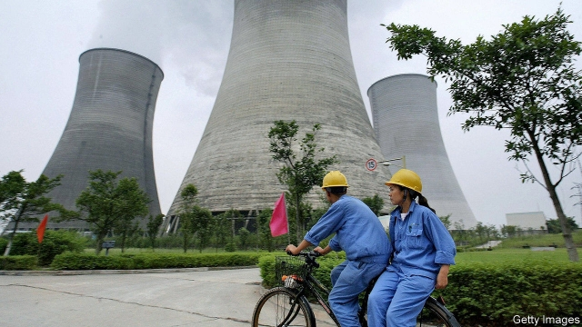

###### Fake it till you break it

# Some Chinese firms turn out to have lied about their state pedigree 

 

> print-edition iconPrint edition | Finance and economics | Nov 14th 2019 

IT CERTAINLY SOUNDS pretty powerful: China Nuclear Engineering Construction Group. Once controlled by the People’s Liberation Army, it is now, it says, part of a “central state-owned enterprise (SOE)”, an elite class of firms belonging to the Chinese government. Its website is full of pictures of its executives signing deals around the country. Like any good state-run giant, it is politically correct, its statements echoing Communist Party slogans. There is just one snag: China Nuclear Engineering Construction Group is not a central SOE. 

As China’s economy slows, defaults have risen sharply. Such failures, though painful, separate strong companies from also-rans, a process other countries know well. In China there is an extra wrinkle: the downturn is also exposing fake SOEs. These are companies that misled creditors about their state connections to suggest they would be supported if they ran into trouble. But when trouble arises, the government is nowhere to be found. 

Last month Huarong, a firm that handles non-performing loans, put 610m yuan ($87m) of China Nuclear Engineering Construction’s assets up for sale, consisting of property in the province of Anhui. Despite its name, China Nuclear focused on property, like several other fake SOEs. It also benefited from confusion with a real SOE, China Nuclear Engineering and Construction Corporation (eagle-eyed readers will spot two differences in their names). 

It has plenty of peers. China Huayang Economic and Trade Group claimed to be one of China’s first SOEs, but a subsidiary said in a recent filing that it is in fact a non-state entity. Huayang has defaulted on 7bn yuan in bonds. China City Construction sold 99% of its shares in 2016 to a private investor, but kept calling itself an SOE. It has since had a string of defaults. Other firms have embellished their connections. China Energy Reserve and Chemicals Group Overseas Capital Company reassured rating agencies with its structure, supposedly traceable to a powerful SOE. It defaulted on a $350m bond last year. 

Such stories have become common enough that Gelonghui, a financial-information company, published a tongue-in-cheek guide on how to become a fake SOE. Find a long-forgotten government institution; target an official with no hope of promotion; then “be a shameless toady” to get the institution’s seal to register your company. Finally, build a maze of subsidiaries. 

Fake SOEs are only a small part of China’s economic landscape. But they highlight two pathologies. First, private firms struggle to get financing. Banks are more willing to lend to (real) SOEs, knowing that they are less likely to go bust. 

The second is poor due diligence. The belief that the government will prop up SOEs is a substitute for assessing their true value. Chinese investors are not the only ones who fall prey to this. When China Energy Reserve defaulted, South Korean brokerages made large losses. Barclays, a British bank, was one of its underwriters. 

Red flags are often obvious. A recent visit to the registered address of the state firm listed as the owner of China Nuclear revealed another, apparently unrelated company. “Ultimately the problem is that investors aren’t sufficiently rational,” says Zhang Licong of CITIC Securities. “They have their natural biases, and some firms take full advantage of them.” ■ 

