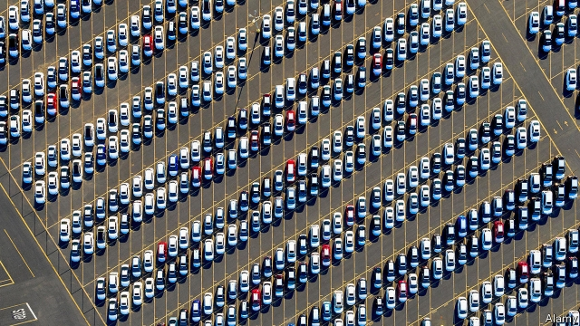

###### Parked trade policy

# The Trump administration is trying to reforge carmakers’ supply chains 

 

> print-edition iconPrint edition | Finance and economics | Nov 14th 2019 

“YOU WOULD need a magic wand to bring back manufacturing jobs,” said President Donald Trump on November 12th, quoting someone from a past administration. “Well, we brought them back.” The world’s carmakers could be forgiven for wishing he had not bothered. They have been thwacked with tariffs on steel, aluminium and components from China, and threatened with broader levies on cars and car parts in the name of national security. A tariff deadline was looming as The Economist went to press. And they have new rules of the road, in the form of the USMCA, a trade deal with Mexico and Canada. 

But despite being pressed to bulk up their American manufacturing presence, there is little sign so far that foreign carmakers are leading an American investment boom. According to Kristin Dziczek of the Centre for Automotive Research, their investments in American facilities have been fairly steady since the recession. 

Meanwhile the value of American imports of passenger vehicles and light trucks continues to grow, by 6% in the first three quarters of 2019 compared with a year earlier. Though European car executives were hauled in for a meeting with Mr Trump last December to discuss their American production plans, the value of imported vehicles from the European Union rose over the same period by 2%. 

The trade data may be distorted by stockpiling: in its third-quarter earnings call Volkswagen, a big European carmaker, mentioned this as a defence against threatened tariffs. And Ms Dziczek cautions that trade policies are just one of many considerations when companies are deciding where to locate new plants. American demand for cars is sagging, and production is shifting from saloon cars to other larger vehicles such as SUVs, as well as electric cars. 

Behind the scenes, however, car companies are planning to rework their supply chains to meet the USMCA’s stricter content requirements. Ann Wilson of the Motor and Equipment Manufacturers’ Association, an industry group, says members are drawing up plans to manufacture more in America. “You will see structural changes,” says Dietmar Ostermann, who works with car companies at PwC, an accountancy. Plans are being hatched but have not yet been executed, he says. Plants in Mexico owned by international carmakers have the most changes to make. 

The delay is in part because reforging supply chains is a slow and costly affair. Plants and production lines are planned years in advance. Finding new suppliers requires lengthy certification processes. 

But politicians also bear some of the blame. Congressional haggling over the USMCA means that there is still uncertainty about whether and when it will come into force. And until legislation is passed, the details will remain unclear. One parts-maker grouses about “inconsistency in the application and interpretation of the rules”, having received a variety of requests for information from different manufacturers, each seeking to find out whether a product would be compliant. Such vagueness makes planning even harder. 

Then there are Mr Trump’s other trade-related threats: to put further tariffs on imported components from China, and to slap duties on imported cars and parts from the EU. Executives have faced up to the fact that tensions with China could be long-lasting, but are struggling to work out how high tariffs could end up. Threatened duties on imported car parts, ostensibly to protect America’s national security, have come under such intense criticism that company bosses hope they will never be applied. But Mr Trump’s obsession with cars is too great for them to bet on it. 

The president’s critics will complain that his meddling in car companies’ supply chains comes with costs, and that he is both bringing higher prices for consumers and sapping the competitiveness of America as an export base. All true. But if his chief desire is that more auto production is done in America than would have been without his measures, it is too soon to declare that he has failed. ■ 

