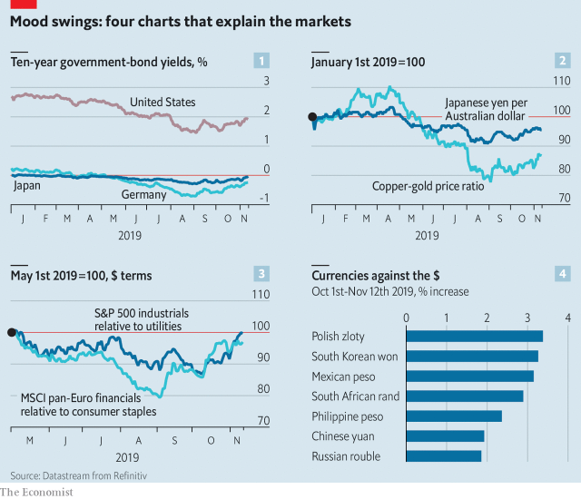

###### Sentimental journey

# The improved mood in financial markets 

 

> print-edition iconPrint edition | Finance and economics | Nov 14th 2019 

IT HAS BEEN a year of mood swings in financial markets. In the spring and summer, anxious investors piled into the safety of government bonds, driving yields down sharply. Yields have recovered in recent weeks (see chart 1). This is not the only sign that investor sentiment has improved. 

In general, safe assets have been sold in favour of cyclical ones. The Australian dollar, a cyclical currency, is up against the yen, a haven for the fearful. Something similar is happening in commodity markets, where the price of copper, a barometer of global industry, has risen against the price of gold (see chart 2). 

Equity prices in America have reached a new peak. But what is more striking is the performance of cyclical stocks relative to defensive ones. Within America’s market the prices of industrial stocks, which do well in business-cycle upswings, have risen relative to the prices of utility stocks, a safer bet in hard times. In Europe the stocks of financial firms, the fortunes of which are tied to the business cycle, have risen relative to those of firms that make consumer staples—food, beverages, household goods and so on—which are more resilient in bad times (see chart 3). 

Investors have also begun to embrace assets at the riskier end of the spectrum. A host of emerging-market currencies have gained against the dollar since the start of October (see chart 4). 

