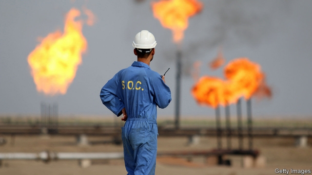
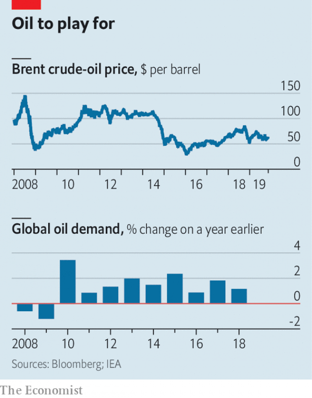

###### OPEC’s waning power

# Tighter production targets have failed to lift the price of oil 

 

> print-edition iconPrint edition | Finance and economics | Nov 14th 2019 

MEMBERS OF THE Organisation of the Petroleum Exporting Countries, or OPEC, live in a state of uneasy anticipation. Concern about climate change may mean demand for oil wanes in the coming decades. OPEC’s power in oil markets is fading fast. On November 13th the International Energy Agency (IEA), an intergovernmental forecaster, predicted that by 2030 OPEC and Russia, an ally, would pump just 47% of the world’s crude. Yet OPEC has a more immediate problem at hand.  

Global demand for oil has been unexpectedly anaemic this year (see chart ). Sanford C. Bernstein, a research firm, estimates that it may have risen by just 0.8%, the slowest pace since the financial crisis. OPEC and its allies, led by Russia, are due to meet in Vienna on December 5th and 6th. The first question is whether they will announce a new plan to support the oil price. If they do, the second question is whether they will stick to it.  

 

Technically, a plan is already in place. In December 2018 the broadened OPEC alliance announced a cut in production of 1.2m barrels a day, with the intention of pushing up the price of crude. That agreement has been extended to March 2020. But several OPEC members, including Iraq and Nigeria, have frequently pumped more oil than allowed by last year’s deal. 

Russia was supposed to help OPEC move into a new era. But the starting point from which it agreed to cut production was unusually high—and output this year has exceeded its quota even so. The country’s oil industry “is really chafing under these production cuts”, says Aaron Brady of IHS Markit, a data and research firm. The result is that Russia’s average daily production so far in 2019, after the OPEC deal to lower output, is higher than the average in 2018, before the deal was struck. Saudi Arabia has adjusted accordingly. In July and August, for instance, the kingdom cut output by more than twice the amount required by last year’s agreement. 

But such efforts have proved insufficient to lift oil prices. On the face of it, they should have been buoyant. American sanctions have clamped down on exports from Venezuela and Iran, respectively the possessors of the world’s largest and fourth-largest proved oil reserves. Tankers have been seized in the Gulf. Iraq, OPEC’s second-largest producer, is at risk of being engulfed by protests. Most notably, in September a drone attack knocked out more than half of Saudi Arabia’s production. The loss was more severe than that caused by the Iranian revolution in 1979 or Iraq’s invasion of Kuwait in 1990.  

Yet oil markets have shrugged it all off. “In the past such geopolitical tensions gave a boost to oil prices,” says Fatih Birol, the head of the IEA. The price of Brent crude has subsided from a high of nearly $75 in April to around $60 today.  

One reason is that America’s frackers have continued to pump more oil. The country’s daily output in September was 12% above last year’s average. It is also because economic growth has slowed, with oil demand suffering not just in Japan but in India and South-East Asia, where it was expected to grow strongly. 

Next year economic growth may tick up. Investors are pressing American shale companies to reduce spending and boost profits. That would result in flatter production and, in turn, help nudge prices higher. 

But new supply elsewhere looks set to push prices in the other direction. ExxonMobil is ramping up production off the coast of Guyana. Brazil’s attempt to auction new offshore leases this month was a failure—supermajors, such as ExxonMobil and BP, declined to bid. Yet investments already made offshore mean that by 2021 Brazil’s crude production may be 18% higher than this year, according to IHS Markit.  

Norway will also see a surge in output. Notwithstanding its announcement in October that its sovereign-wealth fund would sell its holdings in oil exploration and production companies, the country itself is expected to increase production markedly in the coming years. Its state-backed energy giant, Equinor, said in October that Johan Sverdrup, a giant new oilfield in the North Sea, had begun producing crude.  

The broadened OPEC alliance must now decide whether to hold at the reductions agreed to last year, or to cut harder. The current arrangement may be insufficient to keep Brent crude above $60 a barrel. Yet there may be little appetite for dramatically lower production targets. 

Aramco, Saudi Arabia’s state-backed oil company, plans to list some of its shares in mid-December, shortly after OPEC’s meeting. Any agreement for a big cut in the kingdom’s output would lower estimates for Aramco’s earnings, which would suppress its valuation, points out Neil Beveridge of Bernstein. On the other hand, he says, “the worst thing that could happen to Aramco would be to see the listing go ahead and see the oil price collapse.” This has been a dramatic year on oil markets. December could bring further plot twists. ■ 

