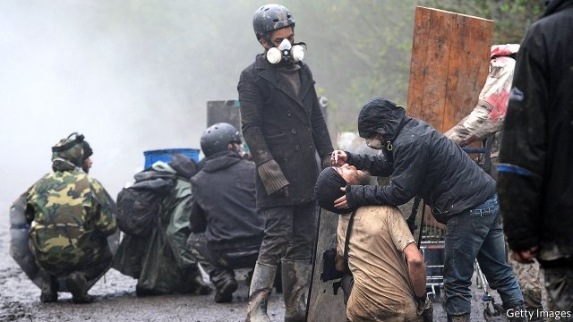

###### A crying shame

# Banned in warfare, tear-gas is the default response to controlling protests 

 

> print-edition iconPrint edition | International | Nov 14th 2019 

AS THE PROTESTS in Hong Kong drag on, rituals are coalescing. One oft-repeated rite might be dubbed “the unfurling of the banner”. As confrontation looms, from the masked ranks of police two step forward bearing a sign reading “Warning: Tear Smoke”, in Chinese and English. Then the firing starts, and clouds swirl, stinging and choking. Aside from a few wearing masks, the crowd scatters, with the police in pursuit. 

Many demonstrators have experienced something like it. Indeed, Hong Kong is a relatively modest user. In the first five months of protests, its police fired nearly 6,000 rounds of tear-gas—far fewer than were used in Paris in a single day last December against gilets jaunes (yellow-jacket) protesters. 

The term “tear-gas” covers a range of chemicals, of which the most widely used include o-chlorobensylidene malononitrile (CS), oleoresin capsicum (OC, or pepper spray) and 1-chloroacetophenone (CN). The gases are in fact powders. New variants are designed to disperse slowly. 

Defenders claim that it saves lives. Tired, twitchy, scared cops armed with tear-gas will kill fewer people than those carrying only lethal weapons. After months of growing violence, only on November 8th did the protests in Hong Kong lead to a death. Alex Chow, a student, perished after falling from a ledge in a car park while fleeing tear-gas. By contrast, in Iraq more than 300 people have died since October, largely because the authorities are more willing to use live ammunition. 

Even so, tear-gas is controversial. Anna Feigenbaum of the University of Bournemouth, author of a history of the stuff, argues that it is “bad for democracy”. She says it “allows the threshold of acceptable violence to be lowered and so avoids a deliberative process.” 

Bizarrely, chemicals that are so often used on civilians are banned for military use. Tear-gas was first used in battle during the first world war. The use of such gases in that conflict led to their outlawing under the Geneva Protocol of 1925. Armies skirted the ban at times—America used CS gas in Vietnam. But the ban on military use was also part of the Chemical Weapons Convention of 1993. 

After the first world war, tear-gas became a popular “riot-control agent” in America and the British empire. Hong Kong police are following procedures devised by British colonial administrators. The War Office required a “declared intention to use tear-gas and adequate warnings” be given to opponents. The obfuscatory term “smoke” was promoted. In the words of Henry Duffield Craik, a governor of Punjab under the British Raj from 1938 to 1941, “Gas is a much more alarming term, as it suggests something resembling the poison gas used by the Germans in the last war.” 

The short-term effects of tear-gas are unpleasant, but diminish quickly. Little is known about the long-term impact (clinical trials are impossible). But the dangers come more from its misuse than from the gas itself. Brian Castner, a weapons investigator for Amnesty International, a human-rights watchdog, says certain conditions must be met: that there is a way for a crowd to disperse; that the area is well ventilated; and that the gas is fired into the ground in front of protesters, not in the air or at their heads—especially when the canisters are large and may be lethal, as in Iraq. 

Even if these guidelines are followed, and they often are not, tear-gas is indiscriminate. In Hong Kong it is estimated that 88% of the population have been exposed to gas in recent weeks. Many of them presumably have asthma, lung disease and other ailments, and thus suffer more than others from the effects of tear-gas. The use of tear-gas is, to say the least, riskier than it first appears. 

