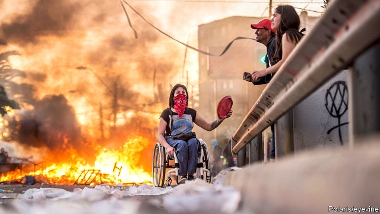

###### We all want to change the world

# Economics, demography and social media only partly explain the protests roiling so many countries today 

 

> print-edition iconPrint edition | International | Nov 14th 2019 

IT IS HARD to keep up with the protest movements under way around the world. Large anti-government demonstrations, some peaceful, some not, have in recent weeks clogged roads on every continent: Algeria, Bolivia, Britain, Catalonia, Chile, Ecuador, France, Guinea, Haiti, Honduras, Hong Kong, Iraq, Kazakhstan, Lebanon, Pakistan and beyond. 

Not since a wave of “people power” movements swept Asian and east European countries in the late 1980s and early 1990s has the world experienced such a simultaneous outpouring of popular anger. Before that, only the global unrest of the late 1960s was similar in scope. 

Those earlier waves of protest were not nearly as coherent and connected as they are sometimes portrayed. The unrest of the late 1960s ranged from intraparty power struggles in China to the civil-rights movement to protests against the Vietnam war and Soviet domination of eastern Europe. And the people-power revolutions of 20 years later—in countries as contrasting as Burma and Czechoslovakia were as marked by their differences as their similarities. 

Even so, today’s movements seem strikingly unconnected and spontaneous. Some themes crop up repeatedly—such as economic discontent, corruption and alleged electoral fraud—but this seems more like coincidence than coherence. The initial causes of the protests could hardly be more varied: in Lebanon, a tax on phone calls via services such as WhatsApp; in Hong Kong, proposed laws allowing the extradition of criminal suspects to China; in Britain, a government bent on Brexit. 

Anxious to impose a pattern on these seemingly random events, analysts have come up with three categories of explanation. These are economic, demographic and conspiratorial. 

Economic explanations make much of the way in which seemingly minor knocks to living standards (a 4% rise in metro fares in Chile, for example) proved the final straw for people struggling to get by in increasingly unequal societies. For the left, this is just the latest paroxysm of a dysfunctional and doomed capitalism. As an Australian socialist journal puts it: “For more than four decades, country after country has been ravaged by neoliberal policies designed to make the mass of workers and the poor pay for what is a growing crisis in the system.” Even fans of free markets see growing inequality as a cause of concerted anger—with Chile, one of the world’s most unequal better-off countries, often cited as an example. 

The demographic explanation notes that the young are most likely to protest, and the world is still fairly youthful, with a median age of 30 and a third of people aged under 20. Niall Ferguson, a historian, has drawn parallels with the 1960s when, as now, there was an “excess of educated young people” because of a boom in tertiary education, producing more graduates than there were jobs for them. 

As for conspiracies, governments like to hint that sinister outside forces are stirring things up. The Chinese foreign ministry has suggested that the protests in Hong Kong were “somehow the work of the US”. In Latin America it is whispered that socialist regimes in Cuba and Venezuela have fomented unrest elsewhere to distract attention from their own troubles. 

Economic and demographic factors and even outside meddling have sparked some protests. But none of these theories is universally helpful. The world economy faces nothing like the troubles of a decade ago—when fewer people took to the streets. And, to return to the example of Chile, Tyler Cowen, an economist at George Mason University, has pointed out that income inequality there has actually been narrowing. Nor is a youth bulge a satisfactory explanation. Many of the marchers (in Britain and Hong Kong, for example) are greying. As for the foreign meddling, nobody seriously blames a global mastermind for the unrest. 

Three other factors fill some of the gaps left by these explanations. One, little mentioned, is that, for all its dangers, protest can be more exciting than the drudgery of daily life—and when everybody else is doing it, solidarity becomes the fashion. Another is that ubiquitous smartphones make it easier to organise and sustain protests. Encrypted messaging apps enable protesters to stay one roadblock ahead of the authorities. As soon as a specially written “anthem” for Hong Kong’s demonstrators went online, shopping malls were brought to a halt by apparently unplanned mass renditions. 

The third factor is the obvious reason for demonstrating, that conventional political channels seem barren. In the late 1980s protesters’ usual targets were autocratic governments that allowed at best sham elections. Without a free vote, the street was the only way to exercise “people power”. Some of this year’s protests—against Abdelaziz Bouteflika in Algeria and Omar al-Bashir in Sudan, for example—are similar. But apparently well-functioning democracies have also been affected. 

For a number of reasons, people may feel unusually powerless these days, believing that their votes do not matter. One is an increasing focus on climate change. The Extinction Rebellion movement of disruptive civil-disobedience campaigns has struck a nerve in countries from Britain to Australia. Carbon emissions demand international solutions beyond the reach of one government, let alone one vote. 

Moreover, social media, besides facilitating protests, may be fuelling political frustration. Its use tends to create echo chambers and thus heighten the feeling that the powers-that-be “never listen”. A perhaps related phenomenon is the weakening of the bargain at the heart of Western-style democracy—that losers, who may represent a majority of the popular vote, will accept rule by the winners until the next election. The millions on the streets do not accept the patience that trade-off demands. 

None of these trends is likely to reverse itself soon. So unless demonstrators give up in frustration, this wave of protest may be less the harbinger of a global revolution than the new status quo.■ 

