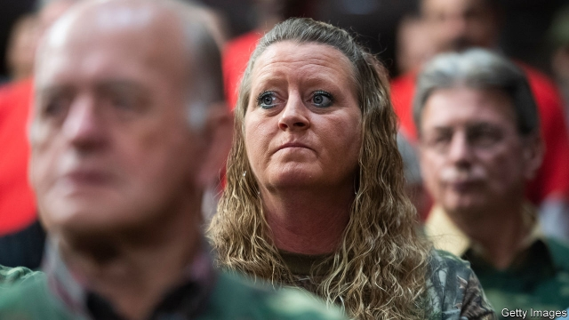

###### America’s multi-trillion dollar pension hole

# Public pensions are woefully underfunded 

 

> print-edition iconPrint edition | Leaders | Nov 16th 2019 

MANY WORKERS in the private sector no longer have them. But most public-sector employees in America are still entitled to a valuable benefit: a pension linked to their final salary. A long-standing problem is that states and cities, which fund their plans differently from the federal government, have been lax about putting aside enough money to cover these promises. 

The resulting black hole is becoming ever more alarming (see article). Although the American stockmarket has been hitting record highs, the average public-sector pension fund has a bigger deficit in percentage terms than it did in either 2000, or the start of this decade. In some states and cities schemes are less than 50% funded; Illinois has six of the worst. 

The cost of pension promises has risen because people are living longer, so they end up taking more out of the pot. Some states and cities have responded by trying to wriggle out of their obligations and cut the benefits retirees get, but courts have often decided against them, ruling that a contract is a contract. As a result states, cities and other public bodies are being forced to funnel ever more into pension schemes. Having chipped in the equivalent of 5.3% of their ordinary payroll bills in 2001, public-sector employers now pay in, on average, 16.5% a year. 

Even those contributions have not been enough. Politicians have often failed to pay in as much as the actuaries recommend. In 2009 the actuaries for the Illinois Teachers scheme asked the state to cough up $2.1bn; it paid just $1.6bn. By 2018 the annual bill had risen to $7.1bn but the state paid only $4.2bn. The hole in the pension scheme deepened to $75bn in 2018, or about $6,000 for every citizen in the state. And that is just for teachers. 

The problem could yet worsen. Pension schemes are vulnerable to a market downturn and many were left reeling after the global financial crisis of 2008-09. Even if markets do not tumble, they would suffer in a long period of sluggish returns. That looks plausible given that 30-year Treasury bond yields are just 2.4% and American equity valuations are stretched relative to their historical average. Some schemes are betting on “alternative assets” like hedge funds and private equity to fill the gap. But hedge-fund returns have been disappointing over the past decade, and the private-equity industry is not large enough to absorb $4trn of public-sector pension assets. 

And there is a final problem: the schemes’ accounting. When working out how much they need to put aside today, all funded schemes must calculate how much they are likely to pay out in future. This means using a rate to discount the cost of tomorrow’s pension payments. The higher the rate used, the lower the cost seems to be. Public-sector pension schemes are allowed to use the assumed rate of investment return as their discount rate, even though they will still have to pay pensions whether they earn that return or not. This has naturally led to a degree of optimism about future returns: many assume 7-7.5% a year. 

In the private sector, a pension promise is seen as a debt and has to be discounted at corporate-bond yields, which are at historically low levels. This makes pensions look more expensive and explains why many companies have closed their final-salary schemes. If the public sector had to use the same approach, its average funding ratio would be a lot lower than today’s 72% and the resulting hole, currently $1.6trn in total would be a lot bigger. 

Public bodies are going to have to boost their contributions even further. A study by the Centre for Retirement Research found that in the worst-affected states—Connecticut, Illinois and New Jersey—pension costs in 2014 were already 15% of total revenues. That will trigger a squeeze on the public finances, as other spending has to be cut or taxes have to be cranked up. Either will be especially hard on younger people and workers in the private sector, who do not get the same benefits. 

The pensions crisis has been rumbling on for years, but some states and cities will soon enter a downward spiral, in which pension costs lead to bad public services or tax rises, in turn encouraging workers and firms to move out, which then shrinks the tax base, making promises even less affordable. When that happens some states and cities will tumble into a black hole. ■ 

Correction (November 15th): A previous version of this article stated that the hole in public-sector pensions is $1.6bn. It is in fact $1.6trn. Sorry. 

