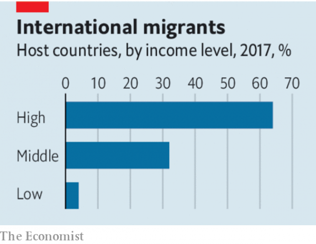

###### Unlock that door

# Voters could make the world twice as rich. Why don’t they? 

 

> print-edition iconPrint edition | Leaders | Nov 16th 2019 

IMAGINE YOU are offered a job at triple your salary. But first you must pass through a locked door, and someone with the key won’t open it. You might be willing to pay them to let you through. Whether this is fair or not is beside the point. They have the key and you don’t. If you gave them a portion of the increase in your wages, you would both be better off. 

This is not a bad analogy for global immigration policy. When migrants move from a poor country to a rich one, they typically make three to six times as much money as before (see our Special report in this issue). If everyone who wanted to migrate were allowed to do so, the world would by one estimate be twice as rich. Yet this vast gain cannot be realised, because most would-be migrants are forced to stay where they are. The door is locked, and voters in rich countries hold the key. 

Is there a way to open that door? Hardly anyone is considering it. Instead, the debate in rich countries veers between fearmongering and moralising. Nationalists, from Donald Trump, America’s president, to Viktor Orban, Hungary’s prime minister, portray immigrants as a threat to the culture, wages and even lives of the native-born. Pro-migration liberals, by contrast, are quick to dismiss those who disagree with them as racists, and mouth slogans that seem almost designed to alienate voters. Several Democrats in America talk not of reforming but of abolishing ICE, the agency enforcing immigration laws. 

 

A more pragmatic approach would be to think in terms of costs, benefits and how they might be distributed. The biggest beneficiaries of migration are the migrants themselves, who earn far more and in many cases escape from oppression or sexism. Their birthplaces benefit from the money they send home and the knowledge they bring back when they return, which usually more than makes up for any “brain drain”. 

The benefits to host countries are hefty, too. Skilled immigrants check pulses, write code and help local firms do business with their homelands. Migrants are twice as likely as the native-born to start a business and three times as likely to patent an idea. Blue-collar immigrants provide cheaper plumbing, child care and parcel deliveries. By one estimate, 83% of native-born rich-country workers benefit from immigration. Migrants may drag down the wages of native workers with similar skills, but the effect is so small that economists are not sure it exists. 

The biggest cost of migration is the hardest to measure. It is cultural. Many people like their societies the way they are. Some bristle when they hear foreign languages on the bus, or when a mosque replaces a pub. Since migrants tend to cluster, some places change uncomfortably fast. Such feelings are inflamed by demagogues, who wildly exaggerate the threat from a tiny minority of migrants—especially from crime. 

Overcoming these objections will be hard. But not impossible, if policymakers observe four principles. First, border control matters. Voters, perfectly reasonably, cannot abide chaos; governments must set and enforce the rules for who comes. Second, migrants must pay their way. Most already do, but it is crucial to design policies that encourage this, by making it easy for them to work and hard, at least for a while, to claim welfare benefits. 

Third, be creative. Australia’s “points-based” system is often praised, not least by some Brexiteers. It favours migrants who are young, English-speaking and have useful skills. It is quick, transparent and welcoming. At the same time Australia pitilessly excludes anyone who tries to enter without permission. Australians mostly support this system because they feel in charge of it. 

More market-based systems are also worth trying. Countries could auction visas to the well-heeled. In addition, for those who cannot yet afford to bid, they could allow more migrants in but apply surtaxes to their wages for a period, and transfer the money to citizens. If this is the price of entry, many migrants will choose to pay it. And if voters see an immigration dividend, they may find that new mosque does not bother them as much. 

Fourth, pace matters more than absolute levels. Political resistance to migrants spikes with sudden surges in immigration. In 2015 net immigration to Germany more than doubled to almost 1.2m, leading to a backlash. Yet the share of the population that is foreign-born is 16%, compared with 29% in Australia. This shows that a country with sensible policies can be almost two times as open to migration as Germany without even a hint of the disaster that nativists predict. On the contrary, Australia has a lower homicide rate than Germany, its people live longer and it has not had a recession since 1991. Many Australians grumble about congestion in the cities most popular with migrants, but this is fixable with the taxes those migrants pay. 

If the flow is steady and orderly, and if the newcomers are encouraged to support themselves and adapt to the host culture, immigration can be higher than most rich countries allow today. Singapore is 45% foreign-born, and a byword for prosperous tranquility. Countries can open up incrementally, with conditions, and reverse course if they choose. 

Today’s anti-migrant mood makes all this seem unlikely. Far from opening the door, many Western governments are double-locking it. Yet this creates an opportunity for others to snaffle the best brains repelled by chauvinism, to lure the most enterprising migrants, and once again to become lands of opportunity. ■ 

