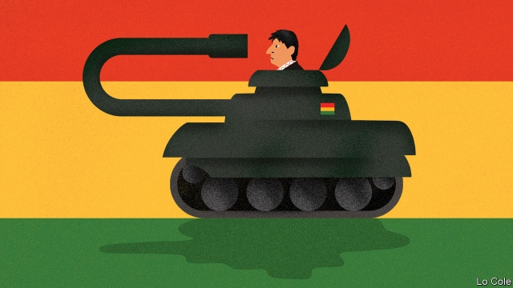

###### The end of Evo Morales

# Was there a coup in Bolivia? 

 

> print-edition iconPrint edition | Leaders | Nov 16th 2019 

THERE ARE few more emotive words in Latin America than “coup”, and for good reason. From 1930 to the 1970s, the region suffered the frequent overthrow of civilian governments in often bloody military putsches. The victims were usually of the left. In 1954 a moderate reforming government in Guatemala was ousted in the name of anti-communism by the CIA. Other coups followed, including that of General Augusto Pinochet against Salvador Allende, a radical socialist, in Chile in 1973. 

Since the democratisation of the region in the 1980s, coups have been rare. But the very idea has become a potent propaganda tool, especially for leftists. Scarcely a week goes by without Nicolás Maduro, Venezuela’s fraudulently elected dictator, claiming that he is threatened by one. Daniel Ortega in Nicaragua says the same. Dilma Rousseff, a leftist president in Brazil who spent her way to a second term in violation of the country’s fiscal responsibility law, also claims that her impeachment in 2016 was “a coup” even though it followed strict constitutional procedures. 

The latest claim involves the fall of Evo Morales, Bolivia’s leftist president since 2006. He resigned on November 10th, fleeing into exile in Mexico. This prompted a chorus of denunciations of a coup from the Latin American left and even some European social democrats. This time, at least, the critics are wrong. 

True, Mr Morales’s term was not due to end until January. His fall followed violent protests and a mutiny by the police, who failed to suppress them. The final straw came when the head of the armed forces “suggested” that he quit. But that is to tell only a fraction of the story. 

Mr Morales, who is of Aymara indigenous descent, long enjoyed broad popular support. He imposed a new constitution, which limited presidents to two terms. Thanks to the commodity boom and his pragmatic economic policy, poverty fell sharply. He created a more inclusive society. 

But he also commandeered the courts and the electoral authority and was often ruthless with opponents. In his determination to remain in power he made the classic strongman’s mistake of losing touch with the street. In 2016 he narrowly lost a referendum to abolish presidential term limits. He got the constitutional court to say he could run for a third term anyway. He then claimed victory in a dubious election last month. That triggered the uprising. An outside audit upheld the opposition’s claims of widespread irregularities. His offer to re-run the election came too late. 

Mr Morales was thus the casualty of a counter-revolution aimed at defending democracy and the constitution against electoral fraud and his own illegal candidacy. The army withdrew its support because it was not prepared to fire on people in order to sustain him in power. How these events will come to be viewed depends in part on what happens now (see article). An opposition leader has taken over as interim president and called for a fresh election to be held in a matter of weeks. There are two big risks in this. One is that ultras in the opposition try to erase the good things Mr Morales stood for as well as the bad. The other is that his supporters seek to destabilise the interim government and boycott the election. It may take outside help to ensure a fair contest. 

That the army had to play a role is indeed troubling. But the issue at stake in Bolivia was what should happen, in extremis, when an elected president deploys the power of the state against the constitution. In Mr Morales’s resignation and the army’s forcing of it, Bolivia has set an example for Venezuela and Nicaragua, though it is one that is unlikely to be heeded. In the past it was right-wing strongmen who refused to leave power when legally obliged to do so. Now it is often those on the left. Their constant invocation of coups tends to be a smokescreen for their own flouting of the rules. It should be examined with care.■ 

