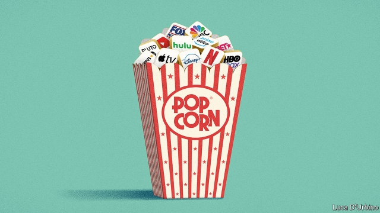

###### Netflix, Disney and the battle to control eyeballs

# Who will win the media wars? 

 

> print-edition iconPrint edition | Leaders | Nov 14th 2019 

AMERICA HAS seen some spectacular investment booms: think of the railways in the 1860s, Detroit’s car industry in the 1940s or the fracking frenzy in this century. Today the latest bonanza is in full swing, but instead of steel and sand it involves scripts, sounds, screens and celebrities. This week Disney launched a streaming service which offers “Star Wars” and other hits from its vast catalogue for $6.99 a month, less than the cost of a DVD. As the business model pioneered by Netflix is copied by dozens of rivals, over 700m subscribers are now streaming video across the planet. Roughly as much cash—over $100bn this year—is being invested in content as it is in America’s oil industry. In total the entertainment business has spent at least $650bn on acquisitions and programming in the past five years. 

This binge is the culmination of 20 years of creative destruction (see Briefing). New technologies and ideas have shaken up music, gaming and now television. Today many people associate economic change with deteriorating living standards: job losses, being ripped-off, or living under virtual monopolies in search and social networks. But this business blockbuster is a reminder that dynamic markets can benefit consumers with lower prices and better quality. Government has so far had little to do with the boom, but when it inevitably peaks the state will have a part to play, by ensuring that the market stays open and vibrant. 

The entertainment business is fast-moving by its very nature. It has few tangible assets, it relies on technology to distribute its wares and its customers crave novelty. The emergence of sound in the 1920s cemented Hollywood as the centre of the global film business. But by the end of the 20th century the industry had grown as complacent as a punchline in a repeat episode of “Friends”. It relied on old technologies—analogue broadcasting, slow internet connections and the storage of sounds and sights on fiddly CDs, DVDs and hard drives. And the commercial approach was to rip off consumers by overcharging for stale content packaged into oversized bundles. 

The first shudder came in music in 1999, with internet services soon putting established music firms such as EMI and Warner Music under pressure. In television Netflix broke the mould in 2007 by using broadband connections to sell video subscriptions, undercutting the cable firms. When the smartphone took off it tailored its service to hand-held devices. The firm has acted as a catalyst for competition, forcing the old guard to slash prices and innovate, and sucking in new contenders. The boom has seen star writers paid as if they were Wall Street titans, sent rents for Hollywood studio lots into the stratosphere and overtook the 20th century’s media barons, including Rupert Murdoch, who sold much of his empire to Disney in March. 

Amid the debris and deals the outlines of a new business model are becoming clear. It relies on broadband and devices, not cable-packages, and overwhelmingly on subscriptions, not advertising. Unlike in search or social media, no firm in television and video streaming has more than a 20% market share by revenues. The contenders include Netflix, Disney, AT&T-Time Warner, Comcast and smaller upstarts. Three tech firms are active, too—YouTube (owned by Alphabet), Amazon and Apple, although their collective market share is still small. The music industry is also contested, with the biggest firm, Spotify, having a 34% market share in America. 

Disruption has created an economic windfall. Consider consumers, first. They have more to choose from at lower prices and can pick from a variety of streaming services that cost less than $15 each compared with $80 or more for a cable bundle. Last year 496 new shows were made, double the number in 2010. Quality has also risen, judged by the crop of Oscar and Emmy nominations for streamed shows and by the rising diversity of storytelling. Workers have done reasonably. The number of entertainment, media, arts and sports jobs in America has risen by 8% since 2008 and wages are up by a fifth. Investors, meanwhile, no longer enjoy abnormally fat profits, but those who backed the right firms have done well. A dollar invested in Viacom shares a decade ago is worth 95 cents today. For Netflix the figure is $37. 

Many booms turn to bust. Unlike, say, WeWork, most entertainment firms have a plausible strategy, but too much cash is now chasing eyeballs. Netflix is burning $3bn a year and would need to raise prices by 15% to break even—tricky when there are over 30 rival services. It hopes that its fast-growing international markets will create economies of scale. As well as saturation, the other danger is debt. Deals and high spending have caused American media firms to build up $500bn of borrowing. 

When the shake-out comes, history offers two dispiriting examples of how a consumer-friendly boom can turn into a stitch-up. Telecoms and airlines in America saw a riot of competition in the 1990s only to become financially stretched and then reconsolidated into oligopolies that are known today for poor service and high prices. 

This is why government has a role in keeping the entertainment business competitive. First, it should prevent any firm—including the tech giants—from acquiring a dominant share in the content business. Second, it should require the companies that own the gateways to content, such as telecoms firms or handset providers such as Apple that can control what screens show—to have an open-access policy and not discriminate against particular content firms. Last, it should make sure subscribers can move their personal data from one firm to another, so they do not become locked in to one service. 

Few people look to Hollywood for economics lessons. But the entertainment epic has featured vibrant capital markets. Buy-out firms, stockmarkets and junk bonds have all financed the industry’s reinvention. The stars have been billionaire entrepreneurs such as Reed Hastings, Netflix’s boss. And open borders have set the scene, since talent comes from around the world and a majority of streaming subscribers now live outside America. Across the economy, these elements are at risk as politicians and voters veer away from open trade and free markets. For a reminder of why they matter, turn on your screen and press play.■ 

