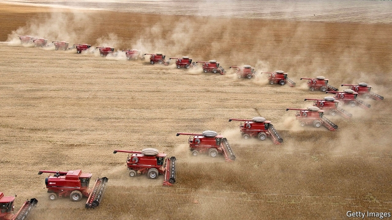

###### Stony ground

# Brazil and Japan plotted a farming revolution in Mozambique 

 

> print-edition iconPrint edition | Middle East and Africa | Nov 14th 2019 

SQUINT AT THE grasslands of northern Mozambique and they look a bit like the cerrado, a savannah in central Brazil. Could they be transformed by intensive farming, just as the thickets of the cerrado have given way to fields of soya that transformed Brazil from a food importer to one of the world’s great breadbaskets? That was the thought behind Prosavana, a programme bringing Brazilian and Japanese expertise to Mozambique. Initiated in 2009, it aimed to lift agricultural production across an area of 107,000 square kilometres, roughly the size of Bulgaria. 

Politicians heralded Prosavana as a landmark example of “South-South” co-operation. Few farming projects in Africa could match its ambition. It painted a future of which many agronomists on the continent dream: productive and commercially astute smallholder farmers and large plantations exporting to the world. Yet it became a study in hubris, and an illustration of why top-down schemes so often fall short of expectations. 

Some 60% of people in sub-Saharan Africa earn a living from their fields. Most of them do not use improved seeds or fertiliser. A typical farm in Kenya or Uganda produces about one-third as much maize per hectare as one in China, and about one-sixth as much as an American one. Africa also has much of the world’s remaining uncultivated land. Stories of untapped potential are drawing commercial farming to the continent. Some agri-businesses cultivate vast holdings of their own. Others enter arrangements to buy cash crops from locals. They often run into opposition, not least over land. Many quietly retreat. 

Prosavana encountered similar suspicion. A decade on there is nothing to show for it except a small research lab and a few model farms. In a field outside Ribaue, a northern town, farmers have been helped by technicians to check market prices and start a savings group. Onions grow in neat rows. But this is merely a scratch on an immense landscape. With the main phase of Prosavana not yet begun, the project has mostly had the effect of planting the seeds of a civil-society movement. 

The first that many Mozambicans heard of Prosavana was an article in a Brazilian newspaper in 2011. “Mozambique offers land to Brazilian soya”, ran the headline. The story described Mozambique as “Brazil’s next agricultural frontier” and cited a claim by a Brazilian agronomist that half of northern Mozambique was “unpopulated”. In 2013 a Prosavana planning document was leaked. Although it stressed the importance of small farmers, it also envisaged linking them to corporate farming clusters. A private-equity fund hoped to raise $2bn for related agri-business projects. 

Activists denounced the scheme as a “massive land grab”. They went on a study trip to the cerrado and joined forces with movements in Brazil and Japan, in a mirror of Prosavana’s trilateral structure. An open letter calling for the suspension of the project was signed by 23 organisations in Mozambique and 43 abroad. Each side of the argument saw the other as out of touch and vaguely foreign—shills of evil corporations or dupes of clueless NGOs. 

A gulf opened between two irreconcilable world-views. Many farmers in northern Mozambique practise shifting cultivation, moving to new lands when the soil needs a rest. Agronomists say that rapid population growth is making this impossible. Antonio Limbau, the Mozambican civil servant who oversees Prosavana, argues that farmers must use hybrid seeds and synthetic fertilisers to farm more intensively, so that “the same piece of land feeds more people”. 

Farmers call this argument patronising. “We are not children,” says Costa Estevao, who leads the peasant union in Nampula province. He says, accurately, that Prosavana aims to eliminate traditional ways of cultivation. He worries too about costly fertiliser and poisonous pesticides. Anabela Lemos, an environmental activist, says that governments and corporations want “to destroy the campesina”, or peasant class. “That’s a big mistake, because they’re the ones who feed the world,” she says. 

This kind of rhetoric reflects a “persistent misunderstanding” of the project, sighs Hiroaki Endo, who heads the Japanese aid agency in Mozambique. Technocrats are still redrafting their master plan, which they say will benefit small farmers. But whatever emerges from endless consultations will fulfil neither the hopes nor the fears invested in it. Brazilian farmers lost interest in Mozambique when they discovered the land was less empty than they thought. And they have since opened a new agricultural frontier back home, where the government of Jair Bolsonaro is letting the forest burn. 

An unintended outcome of Prosavana has been the strengthening of Mozambique’s civil society, which forged new bonds through its campaign. Meanwhile in the northern grasslands, farmers invoke the ghost of the project to explain all kinds of unrelated mischief. Beside a road in Nampula province villagers recount the visit of a strange man who gave no name but asked for 50 hectares of their land. The tracks of his bulldozer are still imprinted in the earth. Who is he? Will he come back? Locals have no idea, but the word on their lips is “Prosavana”. ■ 

