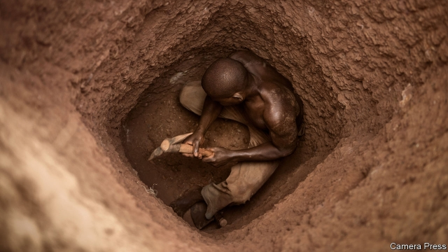
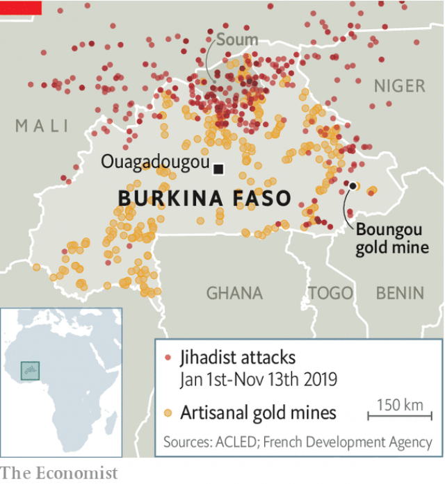

###### The resource curse

# How west Africa’s gold rush is funding jihadists 

 

> print-edition iconPrint edition | Middle East and Africa | Nov 14th 2019 

FOREIGN STAFF working in Burkina Faso for a Canadian gold-mining company, Semafo, have the option of flying in helicopters over roads infested with bandits and jihadist. Local employees at its Boungou mine are less fortunate. On November 6th five buses carrying 241 workers drove straight into a massacre. A survivor told news agencies that men shouting “Allahu akbar” (Arabic for “God is great”) overwhelmed their small security escort. The gunmen sprayed the vehicles with bullets before boarding and murdering those on them. At least 39 people were killed and another 60 were wounded. 

The attack was but the latest outrage in Burkina Faso, which is struggling to contain a fast-growing jihadist insurgency. Along with Mali and Niger, it has become the main front line against terrorists in the Sahel, a dry strip of land that runs along the edge of the Sahara. This year alone the conflict has killed more than 1,600 people and forced half a million from their homes in Burkina Faso. But the latest incident hints at a worrying new trend: a battle by jihadists and other armed groups to take control of the region’s gold rush. 

Although gold has long been mined in the region—Mali is thought to have been the world’s biggest producer of the precious metal in the 13th century—it has boomed in recent years with the discovery of shallow deposits that stretch from Sudan to Mauritania. International mining companies have invested as much as $5bn in west African production over the past decade, but the rush has also lured hundreds of thousands of unsophisticated “artisanal” miners. The International Crisis Group (ICG), an NGO, reckons that more than 2m people are involved in small-scale mining in Burkina Faso, Mali and Niger. In total they dig up 40-95 tonnes of gold a year, worth some $1.9bn-4.5bn. 

 

This rush—in a region where states are already weak and unable to provide security—has sucked in a variety of armed groups and jihadists, including the likes of Ansar Dine and Islamic State in the Greater Sahara, which killed four American soldiers in an ambush in Niger in 2017. 

The jihadists probably have direct control of fewer than ten mines, reckons Mathieu Pellerin of the ICG. But they have influence over many more. In some areas artisanal miners are forced to pay “taxes” to the jihadists. In others, such as Burkina Faso’s Soum province, the miners hire jihadists to provide security, says the ICG. Other armed groups such as ethnic militias are also in on the bonanza and collect cash to guard mines. International mining firms may also be funding the jihadists by paying ransoms for abducted employees or “protection” money to keep mining, according to a study published by the OECD, a club of mostly rich countries. 

Informal mines also provide a recruitment pool for extremists, since they are full of fit young men who know how to use explosives. Researchers say they have heard about several instances of radical preachers going to artisanal miners to recruit fighters. They also provide a ready source of explosives for bombs. 

Just as panning for gold takes time and patience, so too will be the process of extracting jihadist groups from the mining boom. This should be done at both ends of the supply chain. States could start by providing tax incentives to miners who agree to sell through official channels, which would reduce the amount that jihadists and criminals earn from smuggling. For the moment much of Burkina Faso’s artisanal production is sneaked into Togo, which barely taxes the shiny stuff. Togo does not produce much gold domestically but it sent more than 12 tonnes of gold to Dubai in 2016. Gold is also taken out of the Sahel through major airports in hand luggage. 

Another step would be for the region’s police and army chiefs to prioritise guarding mines and their environs. With security could come services such as schools and clinics as well as the governance needed to formalise the industry and prise it away from extremists. 

France, which already has some 4,500 troops across the region, said earlier this month that it would expand its mission by deploying significant ground forces to Burkina Faso for the first time. It is also trying to form a new contingent of European commandos to reinforce its fight against jihadists. Neither move suggests that the end is in sight. ■ 

